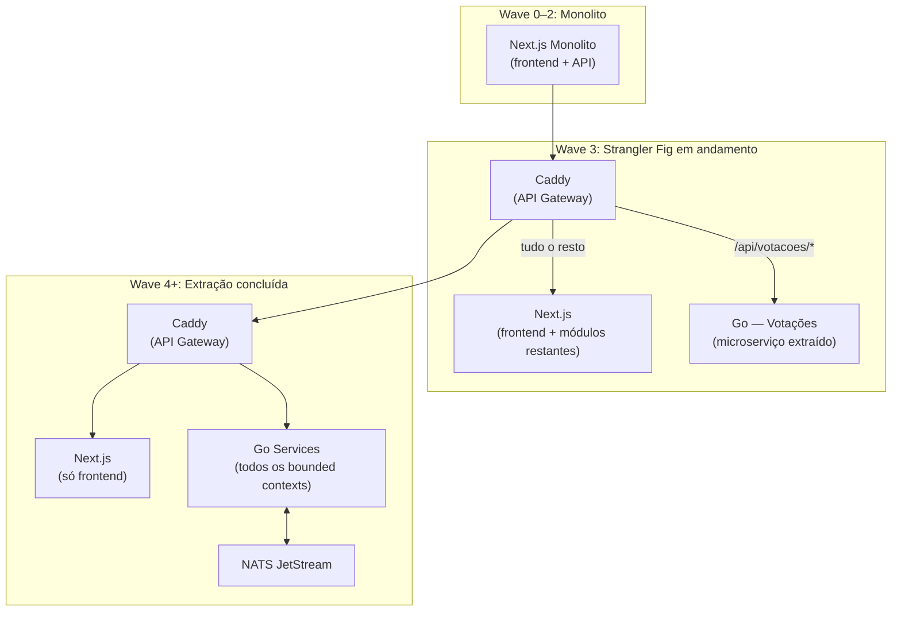

# ADR-007: Estratégia Monolith First

> Brasil a Vera · Arquitetura · v0.3
> Última atualização: 2026-05-13
> Status: superseded em parte por [ADR-020](020-permanencia-monolito-typescript.md)

---

> **Atualização (2026-05-13):** a parte deste ADR sobre **extração futura
> para Go via Strangler Fig** foi superseded pelo
> [ADR-020](020-permanencia-monolito-typescript.md). A stack
> TypeScript/Next.js/Neon/Cloudflare Workers é permanente até evidência
> empírica em contrário, conforme
> [ADR-019](019-disciplina-arquitetural-sem-gargalo.md).
>
> A **parte "monolith first" permanece válida** — o princípio de começar
> monolito e extrair só se necessário continua orientando o projeto.
> Apenas o alvo "Go via Strangler Fig" como inevitabilidade futura foi
> descartado.
>
> A parte sobre deploy na Vercel foi superseded pelo
> [ADR-009](009-cloudflare-pages.md) (Cloudflare Workers) em 2026-05.

---

## Sumário

- [Contexto](#contexto)
- [Decisão](#decisão)
- [Regras de Modularização](#regras-de-modularização)
- [Critérios de Trigger para Migração](#critérios-de-trigger-para-migração)
- [Sequência de Extração](#sequência-de-extração)
- [O que não é afetado](#o-que-não-é-afetado)
- [Alternativas Consideradas](#alternativas-consideradas)
- [Consequências](#consequências)
- [Referências](#referências)

---

## Contexto

O Brasil a Vera está na Wave 0 com:

- **Equipe pequena** — 1-2 desenvolvedores iniciais
- **Zero funding** — infraestrutura deve custar o mínimo possível (idealmente R$3,30/mês: só o domínio)
- **Workload read-heavy** — ingestão em batch, serving de leitura, sem escrita em tempo real do usuário
- **Hipóteses não validadas** — ainda não sabemos se o produto terá tração com as personas definidas

Escalar prematuramente para microserviços Go com NATS JetStream, Neo4j e VPS dedicado introduz:

- Custo de infraestrutura (~R$59/mês mínimo) sem usuários para justificar
- Complexidade de CI/CD para múltiplos serviços
- Overhead de operação (múltiplos bancos, message broker, API gateway)
- Tempo de desenvolvimento maior para features equivalentes

O padrão Monolith First de Martin Fowler recomenda começar com um monolito bem estruturado e extrair microserviços apenas quando a necessidade é comprovada com dados reais.

## Decisão

**Adotamos o padrão Monolith First**: monolito Next.js modular nas Waves 0–2, com migração planejada para microserviços Go via Strangler Fig na Wave 3+.

### Stack por fase

| Componente | Waves 0–2 | Wave 3+ |
|-----------|-----------|---------|
| Serving (frontend + API) | Next.js monolito (Cloudflare Workers) | Next.js frontend + Go microserviços (VPS + Caddy) |
| Ingestão | Scripts TypeScript (GitHub Actions) | Scripts TypeScript ou Go (GitHub Actions) |
| Banco de dados | PostgreSQL (Neon free) | PostgreSQL (Neon Launch ou VPS) |
| Graph database | SQL simples (PostgreSQL) | NetworkX + Apache AGE |
| Mensageria | Chamada de função TypeScript | NATS JetStream |
| CDN | Cloudflare (free) | Cloudflare (free) |
| Custo mensal | ~R$3,30 (domínio) | ~R$62/mês (domínio + VPS) |

### Estratégia de migração: Strangler Fig

Na Wave 3, um API Gateway (Caddy) é colocado na frente. Módulos Go são extraídos um a um:

O monolito "murcha" enquanto os microserviços crescem. A migração é incremental e reversível.

## Regras de Modularização

Estas 7 regras são **inegociáveis** — garantem que o monolito possa ser decomposto no futuro sem reescrita:

1. **Um módulo por bounded context** — cada contexto em `src/modules/<contexto>/` com domain, repository, service e routes. Nunca um módulo importa implementação de outro.

2. **Biome `noRestrictedImports` no CI** — bloqueia imports cruzados entre módulos desde o dia 1. Ver [ADR-006](006-frontend-stack.md#import-boundaries-biome).

3. **Schema por módulo no banco** — `parlamentares.*`, `votacoes.*`, etc. Nenhuma query faz JOIN cross-schema.

4. **Migrations em SQL puro** — `.sql` versionados em `src/shared/db/migrations/`. Nunca geradas por ORM. Drizzle/Prisma pode ser usado para queries, nunca para gerar migrations. SQL puro é compatível com Go na migração.

5. **API routes mapeiam 1:1** — `/api/parlamentares/*` só chama `src/modules/parlamentares/`. Facilita rotear para o microserviço Go via Caddy.

6. **Trust level persistido e obrigatório** — `trust_level` como campo obrigatório em toda entidade, retornado na API, renderizado no frontend. Igual ao design original da [Pirâmide de Confiança](../TRUST-PYRAMID.md).

7. **Zero lógica de negócio nas pages** — pages e components só chamam API routes ou usam React Server Components para buscar dados via módulos. Toda lógica vive nos services.

## Critérios de Trigger para Migração

Um módulo só é extraído do monolito para Go quando **ao menos um** destes critérios é atingido:

| Critério | Indicador | Evidência necessária |
|----------|----------|---------------------|
| **Performance** | Latência mensurável impactando SLA | Métricas de p95/p99 acima do target por > 1 semana |
| **Deploy independente** | Dois devs precisam deployar o mesmo módulo independentemente | Conflito de deploy documentado > 3 vezes |
| **Runtime diferente** | Módulo precisa de Python (NLP) ou processamento CPU-bound | Benchmark demonstrando que TypeScript é gargalo |

**Antes de atingir esses critérios, não migrar.** Complexidade prematura é o risco maior para projetos open-source sem funding.

## Sequência de Extração

Ordem recomendada, baseada em volume de dados e probabilidade de atingir triggers:

1. **Votações** — maior volume de dados, maior frequência de sync (4x/dia)
2. **Parlamentares** — aggregate root central, muitas queries
3. **Proposições** — volume moderado, dependência de Coerência
4. **Gastos** — volume moderado
5. **Coerência** — módulo analítico, pode precisar de Python (NLP)

## O que não é afetado

A decisão Monolith First muda **como** e **com que tecnologia** o sistema é construído. Não muda:

- **Produto** — Product Vision, personas, funcionalidades: inalterados
- **Domínio** — bounded contexts, aggregates, entities, domain events: inalterados
- **Pirâmide de Confiança** — L1–L4, regras, disclaimers: inalterados
- **Motor de Coerência** — pipeline, classificação, princípios: inalterados
- **Grafo Legislativo** — tipos de aresta, métricas, algoritmos: inalterados (a tecnologia de persistência muda, a spec não)
- **Fontes de dados** — endpoints, frequência de sync: inalterados

## Alternativas Consideradas

### Microserviços Go desde o início

- **Prós**: arquitetura final desde o dia 1, performance máxima, sem custo de migração futura
- **Contras**: VPS necessário (~R$59/mês), CI/CD para múltiplos serviços, NATS JetStream para operar, Neo4j para operar, tempo de desenvolvimento maior — tudo isso sem um único usuário
- **Veredicto**: overhead de infraestrutura e desenvolvimento desproporcional para Wave 0 sem validação de hipóteses

### SPA puro (React + Vite) + API separada

- **Prós**: separação clara frontend/backend
- **Contras**: sem SSR (SEO comprometido), sem ISR, preview de links sociais requer serviço extra, hosting separado para API (custo)
- **Veredicto**: incompatível com custo zero e requisito de SEO/compartilhamento social

### Monolito sem modularização interna

- **Prós**: mais simples no início, sem overhead de Biome rules e schemas separados
- **Contras**: coupling cresce silenciosamente, extração futura requer reescrita em vez de migração incremental
- **Veredicto**: a modularização é barata no dia 1 e cara depois — Biome rules e schemas separados são investimentos mínimos com retorno alto

## Consequências

### Positivas

- **Custo zero nas Waves 0/1** — Cloudflare Workers + Neon free tier viabiliza o projeto sem funding
- **Velocidade de desenvolvimento** — uma linguagem, um deploy, um banco
- **Porta aberta para escalar** — as 7 regras de modularização garantem que a migração para Go é viável
- **Validação de hipóteses primeiro** — o produto prova valor antes de investir em infraestrutura complexa

### Negativas

- **Custo de migração na Wave 3** — extrair módulos para Go requer trabalho de engenharia — mitigação: Strangler Fig é incremental, cada módulo é independente
- **TypeScript não é ideal para tudo** — NLP e processamento de grafo são mais naturais em Python/Go — mitigação: Python pode coexistir no monorepo para pipelines específicos
- **Risco de nunca migrar** — se o monolito funcionar bem, pode haver resistência a migrar — mitigação: se funciona, não migrar é a decisão correta

### Neutras

- A decisão de migrar (ou não) para Go será tomada na Wave 3 com dados reais de performance e tração

## Referências

- [Monolith First — Martin Fowler](https://martinfowler.com/bliki/MonolithFirst.html)
- [Strangler Fig Application — Martin Fowler](https://martinfowler.com/bliki/StranglerFigApplication.html)
- [Don't Start with Microservices — Sam Newman](https://samnewman.io/blog/2015/04/07/microservices-for-greenfield/)
