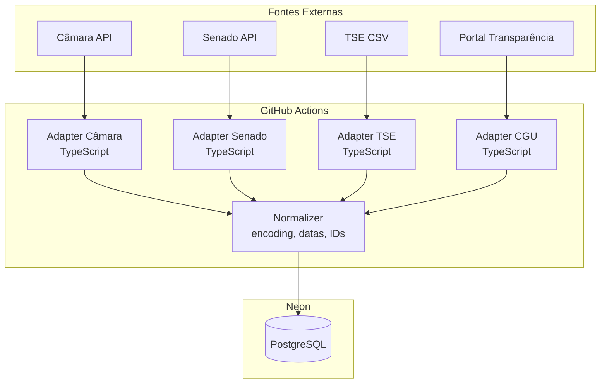

# Fontes de Dados

> Brasil a Vera · Arquitetura · v0.2
> Última atualização: 2026-04-14
> Status: accepted

---

## Sumário

- [Princípio de Rastreabilidade](#princípio-de-rastreabilidade)
- [Fontes Primárias](#fontes-primárias)
- [Fontes Complementares](#fontes-complementares)
- [Estratégia de Ingestão](#estratégia-de-ingestão)
- [Tratamento de Falhas](#tratamento-de-falhas)
- [Reconciliação](#reconciliação)

---

## Princípio de Rastreabilidade

O Brasil a Vera consome **exclusivamente fontes oficiais e públicas**. Cada registro ingerido carrega:

- `source_url` — URL direta para o dado na fonte oficial (trust_level L1)
- `source_name` — nome da fonte (ex: "Câmara dos Deputados API v2")
- `ingested_at` — timestamp do momento da ingestão
- `source_updated_at` — timestamp da última atualização na fonte (quando disponível)

Esse metadado permite que qualquer cidadão verifique independentemente cada dado exibido na plataforma.

## Fontes Primárias

### Câmara dos Deputados

| Atributo | Valor |
|----------|-------|
| **URL base** | `https://dadosabertos.camara.leg.br/api/v2` |
| **Formato** | REST JSON |
| **Autenticação** | Nenhuma (acesso público) |
| **Rate limit** | Não documentado oficialmente; respeitar ~5 req/s |
| **Trust level** | L1 |

#### Endpoints consumidos

| Endpoint | Dados | Bounded Context | Prioridade |
|----------|-------|-----------------|------------|
| `GET /deputados` | Lista de deputados com perfil básico | Parlamentares | Wave 0 |
| `GET /deputados/{id}` | Perfil detalhado do deputado | Parlamentares | Wave 0 |
| `GET /deputados/{id}/despesas` | Gastos CEAP por deputado | Gastos | Wave 0 |
| `GET /deputados/{id}/orgaos` | Comissões e órgãos do deputado | Parlamentares | Wave 0 |
| `GET /deputados/{id}/frentes` | Frentes parlamentares | Parlamentares | Wave 1 |
| `GET /votacoes` | Lista de votações | Votações | Wave 0 |
| `GET /votacoes/{id}/votos` | Votos nominais de uma votação | Votações | Wave 0 |
| `GET /votacoes/{id}/orientacoes` | Orientação de bancada | Votações | Wave 1 |
| `GET /proposicoes` | Lista de proposições | Proposições | Wave 0 |
| `GET /proposicoes/{id}` | Detalhes da proposição | Proposições | Wave 0 |
| `GET /proposicoes/{id}/tramitacoes` | Tramitação da proposição | Proposições | Wave 0 |
| `GET /proposicoes/{id}/autores` | Autores da proposição | Proposições | Wave 0 |
| `GET /proposicoes/{id}/temas` | Temas da proposição | Proposições | Wave 0 |
| `GET /referencias/proposicoes/codTema` | Tabela de temas oficial | Proposições | Wave 0 |

#### Paginação

A API da Câmara usa paginação por offset: `pagina` (1-based) e `itens` (max 100). Resposta inclui header `Link` com `rel="next"` e `rel="last"`.

#### Particularidades

- Votações: nem toda proposição tem votação nominal. Proposições com tramitação conclusiva nas comissões podem não ter votos nominais em Plenário.
- CEAP: gastos podem levar semanas para aparecer na API após a despesa.
- A API pode retornar dados da legislatura atual e anteriores. O filtro `idLegislatura` é essencial para limitar escopo.

### Senado Federal

| Atributo | Valor |
|----------|-------|
| **URL base** | `https://legis.senado.leg.br/dadosabertos` |
| **Formato** | REST JSON/XML (JSON via `Accept: application/json`) |
| **Autenticação** | Nenhuma |
| **Rate limit** | Não documentado; respeitar ~3 req/s |
| **Trust level** | L1 |

#### Endpoints consumidos

| Endpoint | Dados | Bounded Context | Prioridade |
|----------|-------|-----------------|------------|
| `GET /senador/lista/atual` | Lista de senadores em exercício | Parlamentares | Wave 0 |
| `GET /senador/{codigo}` | Perfil detalhado do senador | Parlamentares | Wave 0 |
| `GET /senador/{codigo}/votacoes` | Votações do senador | Votações | Wave 0 |
| `GET /materia/pesquisa` | Pesquisa de matérias (proposições) | Proposições | Wave 0 |
| `GET /materia/{codigo}` | Detalhes da matéria | Proposições | Wave 0 |
| `GET /plenario/lista/votacao/{ano}` | Votações em plenário por ano | Votações | Wave 0 |

#### Particularidades

- API do Senado frequentemente retorna XML por default; sempre enviar header `Accept: application/json`.
- Estrutura de resposta difere da Câmara — necessário adapter separado.
- Algumas matérias têm código numérico e código de identificação textual (ex: `PEC 00045/2023`).

### TSE — Tribunal Superior Eleitoral

| Atributo | Valor |
|----------|-------|
| **URL base** | `https://dadosabertos.tse.jus.br` |
| **Formato** | CSV/bulk download |
| **Autenticação** | Nenhuma |
| **Trust level** | L1 |

#### Datasets consumidos

| Dataset | Dados | Bounded Context | Prioridade |
|---------|-------|-----------------|------------|
| Candidatos | Nome, partido, cargo, número, situação | Eleitoral | Wave 2 |
| Prestação de contas | Doações recebidas: doador, valor, CNPJ/CPF, data | Eleitoral | Wave 2 |
| Bens de candidato | Bens declarados: descrição, valor, ano | Eleitoral | Wave 2 |
| Resultados | Votos por candidato, situação (eleito/não eleito) | Eleitoral | Wave 2 |

#### Particularidades

- Dados disponibilizados como **CSV compactado em ZIP**, por ano de eleição.
- Encoding: geralmente Latin-1 (ISO-8859-1) — necessário conversão para UTF-8.
- Arquivos são grandes (centenas de MB por eleição).
- Vinculação parlamentar-candidato: não há ID compartilhado entre TSE e Câmara/Senado. A vinculação é feita por CPF (quando disponível) ou heurística de nome + partido + UF.

### Portal da Transparência (CGU)

| Atributo | Valor |
|----------|-------|
| **URL base** | `https://portaldatransparencia.gov.br/api-de-dados` |
| **Formato** | REST JSON |
| **Autenticação** | API key (gratuita, cadastro obrigatório) |
| **Rate limit** | Documentado por endpoint |
| **Trust level** | L1 |

#### Endpoints consumidos

| Endpoint | Dados | Bounded Context | Prioridade |
|----------|-------|-----------------|------------|
| `GET /emendas` | Emendas parlamentares | Gastos | Wave 2 |
| `GET /viagens` | Viagens a serviço | Gastos | Wave 2 |
| `GET /contratos` | Contratos firmados | Gastos | Wave 3 |

#### Particularidades

- Requer cadastro e API key — documentar no guia de contribuição.
- Rate limits variam por endpoint.
- Dados complementam (não substituem) os gastos CEAP da API da Câmara.

## Fontes Complementares

| Fonte | URL | Formato | Dados | Prioridade |
|-------|-----|---------|-------|------------|
| LexML | `lexml.gov.br` | SRU/XML | Normas jurídicas, textos de proposições | Wave 2 |
| IBGE | `servicodados.ibge.gov.br` | REST JSON | Indicadores demográficos, PIB, emprego | Wave 3 (L3/L4) |
| IPEA Data | `ipeadata.gov.br` | REST JSON | Indicadores socioeconômicos | Wave 3 (L3/L4) |
| Base dos Dados | `basedosdados.org` | BigQuery/CSV | Agregador de dados já normalizados | Avaliação contínua |

Fontes complementares são usadas em contextos analíticos (L3/L4). A indisponibilidade de qualquer fonte complementar não afeta o core (L1/L2).

## Estratégia de Ingestão

### Arquitetura dos pipelines

Os pipelines de ingestão são **scripts TypeScript standalone** (`tsx`) executados via **GitHub Actions scheduled workflows** — nunca em Cloudflare Workers (limites de CPU time e ausência de processos persistentes inviabilizam jobs longos). Ver [ADR-007](ADR/007-monolith-first-strategy.md) e [ADR-009](ADR/009-cloudflare-pages.md).



### Cron schedules (GitHub Actions)

```yaml
# .github/workflows/ingestion.yml
on:
  schedule:
    - cron: '0 */6 * * *'   # votações: 4x por dia
    - cron: '0 2 * * *'     # parlamentares/comissões: diário
    - cron: '0 3 * * 0'     # gastos CEAP: semanal
    - cron: '0 4 1 * *'     # reconciliação: mensal
  workflow_dispatch:         # trigger manual para re-sync
```

GitHub Actions para repositórios open-source tem **minutos ilimitados** — sem custo adicional.

### Princípios dos pipelines

1. **Um adapter por fonte** — cada API tem suas particularidades (paginação, formato, encoding). Adapters são independentes e isolados em `ingestion/` (ver [ADR-001](ADR/001-monorepo-strategy.md)).
2. **Normalização centralizada** — após extração, dados passam por normalização (encoding UTF-8, formato de datas ISO 8601, IDs unificados) antes de persistir.
3. **Idempotência** — re-executar um pipeline com os mesmos dados não gera duplicatas. Upsert por ID da fonte.
4. **Incremental por default** — pipelines buscam apenas dados alterados desde o último sync (`dataInicio`/`dataFim` nas APIs). Full sync sob demanda.
5. **Observabilidade** — cada execução de pipeline registra: timestamp, registros processados, erros, duração.

### Frequência de sync

| Fonte | Frequência | Justificativa |
|-------|-----------|---------------|
| Câmara — deputados/comissões | Diário | Mudanças raras (posse, remanejamento) |
| Câmara — votações | 4x ao dia | Votações ocorrem ao longo do dia legislativo |
| Câmara — gastos CEAP | Semanal | Gastos demoram a aparecer na API |
| Senado — senadores/matérias | Diário | Similar à Câmara |
| Senado — votações | 4x ao dia | Similar à Câmara |
| TSE | Por eleição (bulk) | Dados publicados pós-eleição |
| Portal da Transparência | Semanal | Dados atualizados com menor frequência |

## Tratamento de Falhas

| Cenário | Estratégia |
|---------|-----------|
| API temporariamente indisponível | Retry com backoff exponencial (3 tentativas, delay: 1s → 5s → 30s) |
| API retorna erro 5xx | Retry com backoff; após 3 falhas, registrar incidente e usar último snapshot |
| API retorna dados inesperados (schema change) | Log de alerta, rejeitar registros inválidos, notificar mantedores |
| Rate limit excedido (429) | Respeitar header `Retry-After`; reduzir concorrência |
| Timeout de conexão | Retry com backoff; timeout default: 30s por request |
| Dados parciais (paginação incompleta) | Marcar sync como parcial; re-executar na próxima janela |

Princípio: **dados antigos são melhores que dados ausentes**. Se um sync falhar, o sistema continua servindo os dados do último sync com sucesso, com `last_sync_at` visível na API.

## Reconciliação

Periodicamente (semanal), um job de reconciliação compara os dados no PostgreSQL com a fonte oficial para detectar:

- **Divergências** — dado local difere do dado na fonte (ex: mudança retroativa na API)
- **Gaps** — registros existem na fonte mas não no local (ex: sync falhou silenciosamente)
- **Orphans** — registros locais sem correspondência na fonte (ex: dado removido na fonte)

A reconciliação gera relatório e, opcionalmente, corrige automaticamente divergências L1. Gaps são preenchidos via re-sync. Orphans são marcados (não deletados) para investigação.
