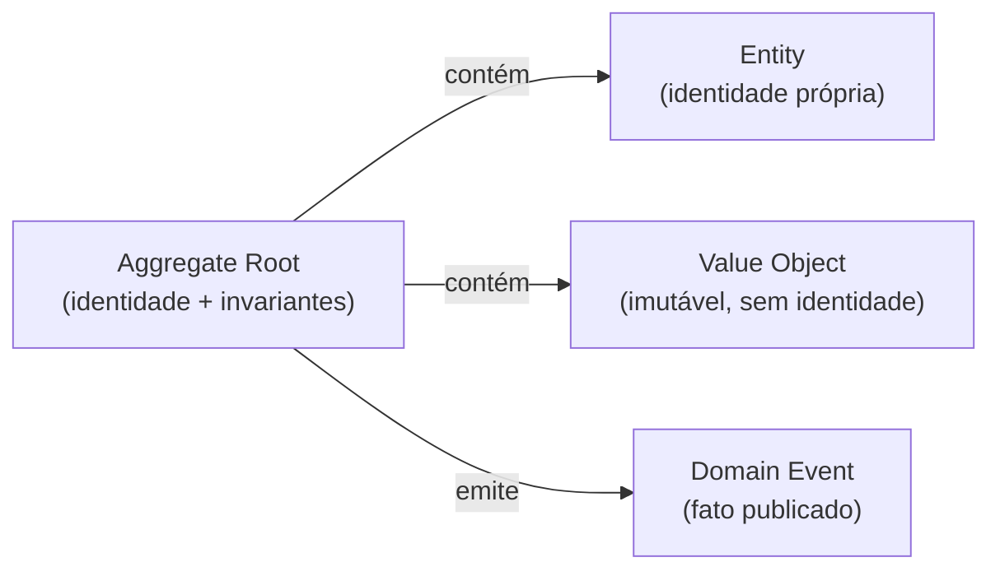
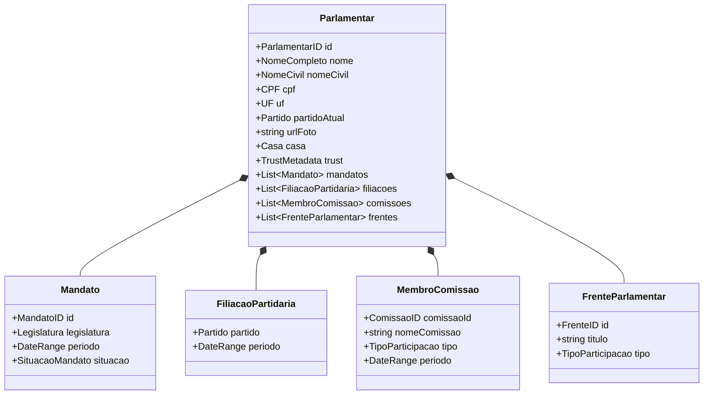
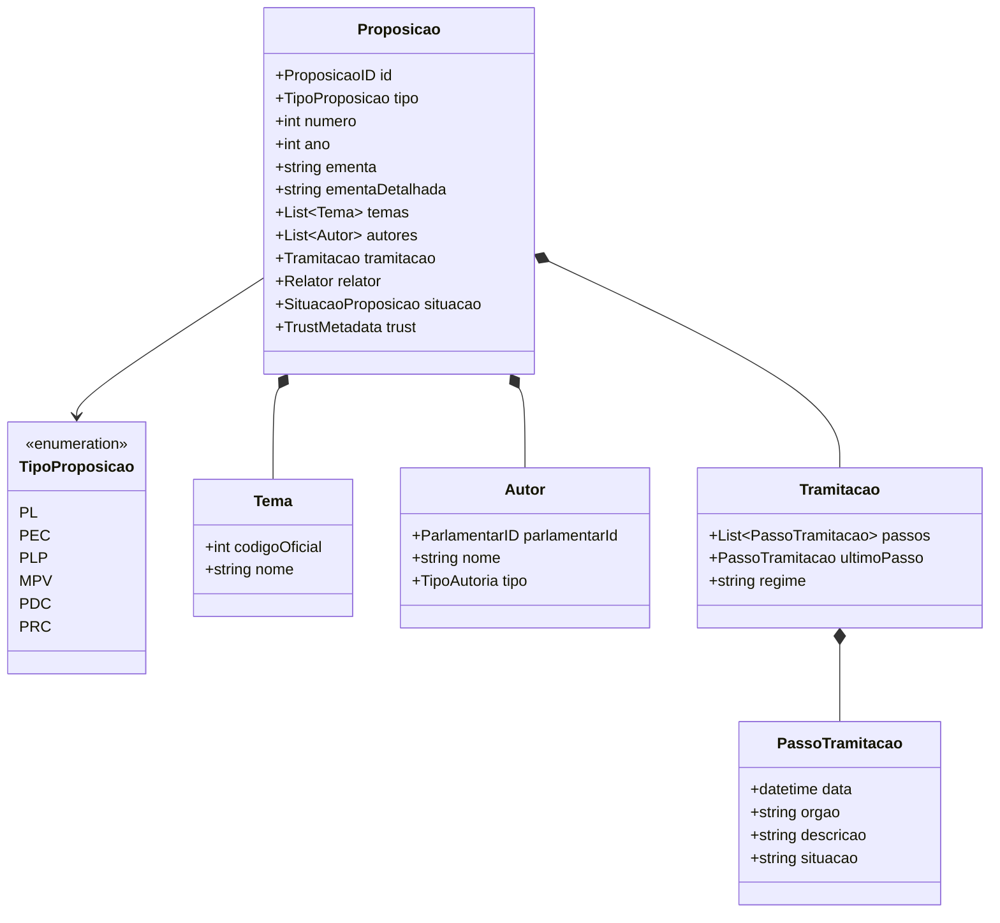
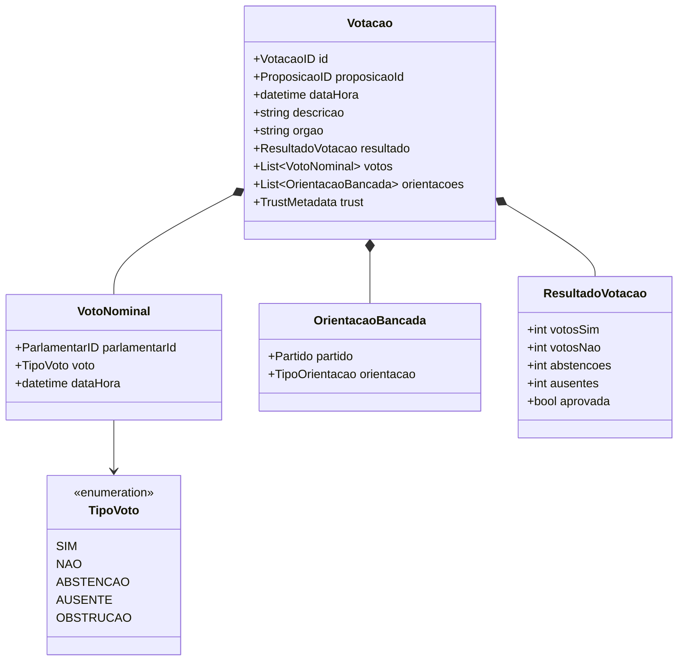
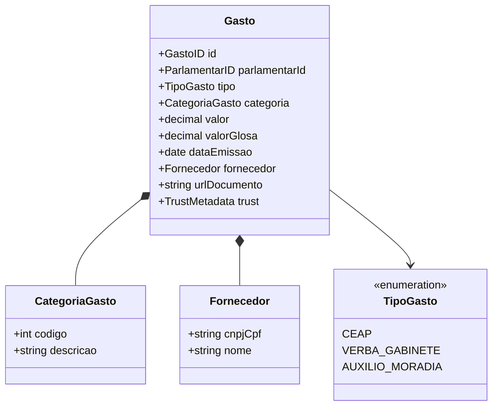
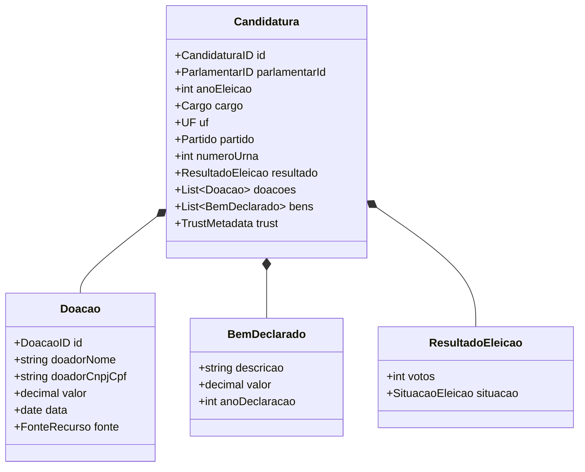
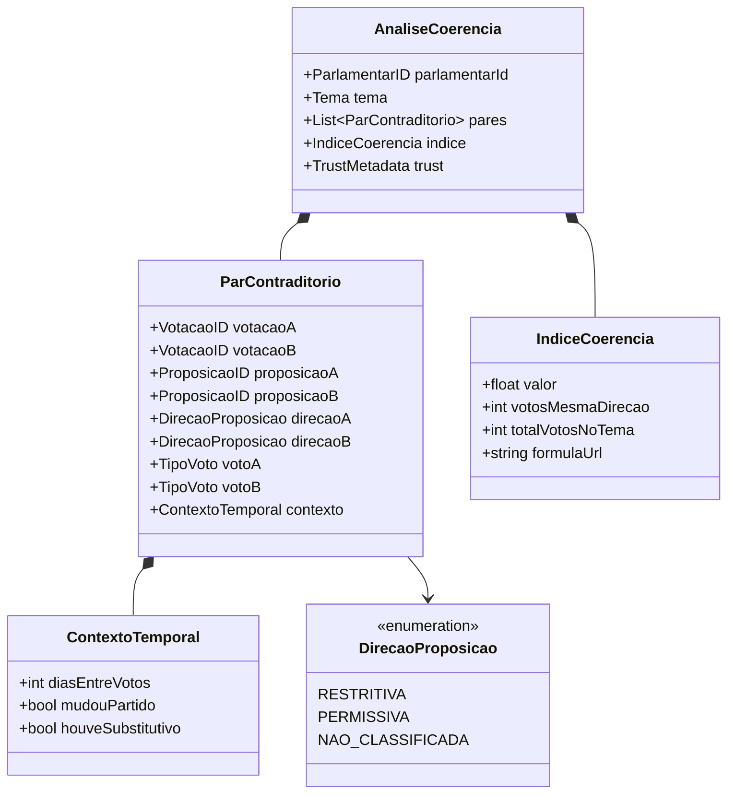
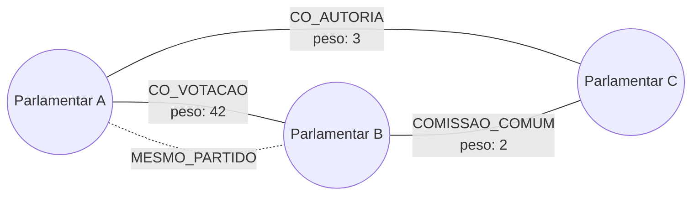

# Modelo de Domínio

> Brasil a Vera · Arquitetura · v0.2
> Última atualização: 2026-04-14
> Status: draft

---

## Sumário

- [Visão Geral](#visão-geral)
- [Parlamentares](#parlamentares)
- [Proposições](#proposições)
- [Votações](#votações)
- [Gastos](#gastos)
- [Eleitoral](#eleitoral)
- [Coerência](#coerência)
- [Grafo Legislativo](#grafo-legislativo)
- [Domain Events](#domain-events)

---

## Visão Geral

Este documento detalha aggregates, entities, value objects e domain events de cada bounded context (ver [Bounded Contexts](BOUNDED-CONTEXTS.md)). Todos os modelos carregam `trust_level` como metadado obrigatório (ver [Pirâmide de Confiança](TRUST-PYRAMID.md)).

Convenções:

- **Aggregate Root** — entidade principal do contexto, ponto de entrada para toda manipulação
- **Entity** — objeto com identidade própria dentro do aggregate
- **Value Object** — objeto imutável sem identidade, definido por seus atributos
- **Domain Event** — fato que ocorreu no domínio, publicado para outros contextos



---

## Parlamentares

### Aggregate Root: `Parlamentar`



### Value Objects

| Value Object | Atributos | Descrição |
|-------------|-----------|-----------|
| `ParlamentarID` | `string` | Identificador único (ID da API oficial) |
| `NomeCompleto` | `string` | Nome parlamentar (como é conhecido) |
| `CPF` | `string` | CPF (dados TSE) |
| `UF` | `string` (2 chars) | Unidade federativa |
| `Partido` | `sigla`, `nome` | Partido político |
| `Casa` | enum: `CAMARA`, `SENADO` | Casa legislativa |
| `Legislatura` | `numero`, `DateRange` | Legislatura (ex: 57ª, 2023-2027) |
| `DateRange` | `inicio`, `fim?` | Período com data de início e fim opcional |
| `TipoParticipacao` | enum: `TITULAR`, `SUPLENTE`, `COORDENADOR`, `PRESIDENTE` | Tipo de participação em comissão/frente |
| `SituacaoMandato` | enum: `EXERCICIO`, `AFASTADO`, `SUPLENCIA`, `LICENCA` | Situação atual do mandato |

---

## Proposições

### Aggregate Root: `Proposicao`



### Value Objects

| Value Object | Atributos | Descrição |
|-------------|-----------|-----------|
| `ProposicaoID` | `string` | Identificador único |
| `TipoProposicao` | enum | PL, PEC, PLP, MPV, PDC, PRC (ver [Processo Legislativo](../domain/LEGISLATIVE-PROCESS.md)) |
| `Tema` | `codigoOficial`, `nome` | Tema oficial da Câmara/Senado |
| `TipoAutoria` | enum: `AUTOR`, `COAUTOR` | Tipo de autoria |
| `SituacaoProposicao` | enum: `TRAMITANDO`, `APROVADA`, `REJEITADA`, `ARQUIVADA`, `TRANSFORMADA_EM_NORMA` | Estado atual |

---

## Votações

### Aggregate Root: `Votacao`



### Value Objects

| Value Object | Atributos | Descrição |
|-------------|-----------|-----------|
| `VotacaoID` | `string` | Identificador único |
| `TipoVoto` | enum | SIM, NAO, ABSTENCAO, AUSENTE, OBSTRUCAO |
| `TipoOrientacao` | enum: `SIM`, `NAO`, `LIBERADO`, `OBSTRUCAO` | Orientação da bancada |
| `ResultadoVotacao` | contadores + aprovada | Resultado agregado |

---

## Gastos

### Aggregate Root: `Gasto`



---

## Eleitoral

### Aggregate Root: `Candidatura`



---

## Coerência

### Aggregate Root: `AnaliseCoerencia`



Detalhes do pipeline no [Motor de Coerência](../future/COHERENCE-ENGINE.md).

---

## Grafo Legislativo

O modelo de domínio do Grafo Legislativo é persistido no PostgreSQL nas Waves 0–2 (SQL simples para afinidade de voto) e migra para Apache AGE + NetworkX na Wave 3 (ver [ADR-003](ADR/003-database-neon.md) e [ADR-004](../future/adr/004-graph-database-choice.md)). A representação conceitual:



### Tipos de Aresta

| Tipo | Definição | Peso | Trust Level |
|------|-----------|------|-------------|
| `CO_VOTACAO` | Votaram igual em N proposições | Frequência de voto coincidente | L1 |
| `CO_AUTORIA` | Co-assinaram a mesma proposição | Número de proposições co-assinadas | L1 |
| `COMISSAO_COMUM` | Compartilham comissões | Número de comissões em comum | L1 |
| `MESMO_PARTIDO` | Relação formal declarada | Binário | L1 |

### Métricas Calculadas (L2)

| Métrica | Definição | Fórmula |
|---------|-----------|---------|
| Degree centrality | Número de conexões do parlamentar | `grau / (N-1)` |
| Betweenness centrality | Frequência com que o parlamentar é ponte entre outros | Algoritmo de Brandes |
| Closeness centrality | Proximidade média a todos os outros parlamentares | `(N-1) / soma_distancias` |
| Community ID | Cluster detectado por algoritmo | Louvain/Leiden com resolução documentada |

Detalhes dos algoritmos no [Grafo Legislativo](../future/LEGISLATIVE-GRAPH.md).

---

## Domain Events

Todos os eventos seguem o contrato base definido em `src/shared/domain-events/` (ver [ADR-005](../future/adr/005-event-driven-communication.md)). Nas Waves 0–2, domain events são interfaces TypeScript — a transmissão é via chamada de função síncrona no monolito. Na Wave 3+, migram para mensagens NATS JetStream.

```typescript
// src/shared/domain-events/types.ts
export type TrustLevel = 'L1' | 'L2' | 'L3' | 'L4'

export interface DomainEvent<T = unknown> {
  id: string
  type: string
  source: string
  occurredAt: Date
  trustLevel: TrustLevel
  correlationId: string
  payload: T
}
```

Eventos por contexto:

### Eventos de Parlamentares

| Evento | Trigger | Payload |
|--------|---------|---------|
| `ParlamentarAtualizado` | Sync detecta mudança no perfil | `{parlamentar_id, campos_alterados}` |
| `MandatoIniciado` | Início de nova legislatura | `{parlamentar_id, legislatura, casa}` |
| `ComissaoAlterada` | Mudança de composição de comissão | `{parlamentar_id, comissao_id, tipo, acao}` |

### Eventos de Proposições

| Evento | Trigger | Payload |
|--------|---------|---------|
| `ProposicaoRegistrada` | Nova proposição ingerida | `{proposicao_id, tipo, temas, autores}` |
| `TramitacaoAtualizada` | Novo passo na tramitação | `{proposicao_id, passo}` |
| `RelatorDesignado` | Relator designado | `{proposicao_id, parlamentar_id}` |

### Eventos de Votações

| Evento | Trigger | Payload |
|--------|---------|---------|
| `VotacaoRegistrada` | Nova votação ingerida | `{votacao_id, proposicao_id, votos[], resultado}` |
| `VotoNominalRegistrado` | Voto individual registrado | `{votacao_id, parlamentar_id, voto}` |

### Eventos de Gastos

| Evento | Trigger | Payload |
|--------|---------|---------|
| `GastoRegistrado` | Novo gasto ingerido | `{gasto_id, parlamentar_id, categoria, valor}` |

### Eventos de Eleitoral

| Evento | Trigger | Payload |
|--------|---------|---------|
| `CandidaturaRegistrada` | Candidatura ingerida | `{candidatura_id, parlamentar_id, ano, cargo}` |
| `DoacaoRegistrada` | Doação ingerida | `{doacao_id, candidatura_id, doador, valor}` |

### Eventos de Coerência

| Evento | Trigger | Payload |
|--------|---------|---------|
| `ParContraditórioDetectado` | Par de votos contraditórios detectado | `{parlamentar_id, tema, votacao_a, votacao_b}` |
| `IndiceCoerenciaCalculado` | Índice recalculado | `{parlamentar_id, tema, valor, formula}` |
