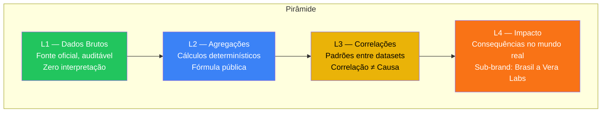
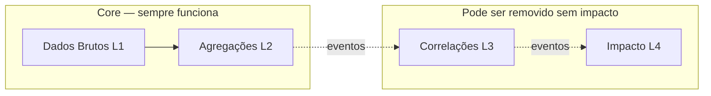

# Pirâmide de Confiança — Arquitetura de Credibilidade

> Brasil a Vera · Arquitetura · v0.2
> Última atualização: 2026-04-14
> Status: accepted

---

## Sumário

- [Princípio Fundacional](#princípio-fundacional)
- [As Quatro Camadas](#as-quatro-camadas)
- [Contrato de Confiança](#contrato-de-confiança)
- [Implementação Técnica](#implementação-técnica)
- [Regras por Camada](#regras-por-camada)
- [Isolamento Arquitetural](#isolamento-arquitetural)

---

## Princípio Fundacional

O princípio mais importante do Brasil a Vera é a **separação rigorosa entre dados factuais e análises derivadas**. Cada dado no sistema carrega um metadado de `trust_level` que é:

- **Persistido** no banco de dados
- **Retornado** na API como campo obrigatório
- **Renderizado** no frontend com tratamento visual diferenciado

A pesquisa em civic tech é clara: plataformas de transparência devem ser desenhadas para que fatos sejam reportados separadamente, enquanto impactos e opiniões emergem depois. A Pirâmide de Confiança é a implementação arquitetural desse princípio.

## As Quatro Camadas



### L1 — Dados Brutos

| Atributo | Descrição |
|----------|-----------|
| **Definição** | Fonte oficial, auditável, link direto. Zero interpretação. |
| **Exemplo** | "Dep. X votou SIM na PL 1234/2025 em 12/03/2025" |
| **Salvaguarda** | Cada registro carrega URL da fonte primária |
| **Fontes** | APIs oficiais da Câmara, Senado, TSE, Portal da Transparência |
| **Bounded contexts** | Parlamentares, Proposições, Votações, Gastos, Eleitoral |

### L2 — Agregações

| Atributo | Descrição |
|----------|-----------|
| **Definição** | Cálculos determinísticos sobre dados L1. Reproduzíveis por qualquer pessoa. |
| **Exemplo** | "Dep. X votou 73% alinhado com o governo em 2025" |
| **Salvaguarda** | Fórmula publicada e open-source no repositório |
| **Cálculos** | Índice de coerência, alinhamento governo/oposição, métricas de centralidade do grafo |
| **Bounded contexts** | Coerência (índice), Grafo Legislativo (centralidade, pesos) |

### L3 — Correlações

| Atributo | Descrição |
|----------|-----------|
| **Definição** | Padrões observados entre datasets diferentes. Correlação não implica causa. |
| **Exemplo** | "Dep. X recebeu R$Y do setor Z e votou favoravelmente em 80% das proposições do setor" |
| **Salvaguarda** | Seção isolada visualmente com disclaimer permanente não dispensável |
| **Análises** | Correlação doações × votos, detecção de comunidades no grafo |
| **Bounded contexts** | Grafo Legislativo (comunidades), Impacto (correlações) |

### L4 — Impacto

| Atributo | Descrição |
|----------|-----------|
| **Definição** | Consequências no mundo real. Requer contexto externo e interpretação. |
| **Exemplo** | "PL 1234 pode afetar 2M de trabalhadores (estimativa IBGE)" |
| **Salvaguarda** | Sub-brand "Brasil a Vera Labs", identidade visual distinta, crowd + especialistas |
| **Fontes externas** | IBGE, IPEA Data, especialistas |
| **Bounded contexts** | Impacto |

## Contrato de Confiança

O contrato de confiança é o compromisso que o Brasil a Vera assume com seus usuários:

### Na Interface (Frontend)

| Trust Level | Tratamento Visual |
|-------------|-------------------|
| L1 | Exibição padrão, badge verde discreto, link para fonte oficial |
| L2 | Exibição padrão, badge azul, link para fórmula/metodologia |
| L3 | Seção visualmente separada, disclaimer permanente **não dispensável**, badge amarelo |
| L4 | Sub-marca "Brasil a Vera Labs", identidade visual distinta, badge laranja |

### Na API

Cada registro retorna `trust_level` como campo obrigatório:

```json
{
  "parlamentar_id": "178957",
  "nome": "Dep. Exemplo",
  "alinhamento_governo": 0.73,
  "trust_level": "L2",
  "formula_url": "https://github.com/brasil-a-vera/docs/architecture/DOMAIN-MODEL.md#alinhamento",
  "source_url": null,
  "disclaimer": null
}
```

Para dados L3:

```json
{
  "parlamentar_id": "178957",
  "correlacao_doacao_voto": {
    "setor": "Agronegócio",
    "doacao_total": 150000,
    "votos_favoraveis_pct": 0.80,
    "trust_level": "L3",
    "disclaimer": "Correlação observada entre doações e votos. Correlação não implica causalidade.",
    "formula_url": "https://github.com/brasil-a-vera/docs/future/LEGISLATIVE-GRAPH.md"
  }
}
```

### Em Exports (CSV)

A coluna `trust_level` acompanha cada linha do export, garantindo que dados retirados do contexto da plataforma mantenham sua classificação.

## Implementação Técnica

### Trust Level como Shared Kernel

O vocabulário de trust level é definido no shared kernel `src/shared/trust/` (ver [ADR-001](ADR/001-monorepo-strategy.md) e [Bounded Contexts](BOUNDED-CONTEXTS.md)):

```typescript
// src/shared/trust/types.ts

export type TrustLevel = 'L1' | 'L2' | 'L3' | 'L4'

export interface TrustMetadata {
  trustLevel: TrustLevel
  sourceUrl?: string    // URL da fonte (L1)
  formulaUrl?: string   // URL da fórmula (L2)
  disclaimer?: string   // Disclaimer (L3/L4)
}

export const TRUST_LEVELS = {
  L1: { label: 'Dados Brutos', description: 'Fonte oficial, auditável' },
  L2: { label: 'Agregações', description: 'Cálculos determinísticos' },
  L3: { label: 'Correlações', description: 'Padrões observados' },
  L4: { label: 'Impacto', description: 'Consequências no mundo real' },
} as const
```

### No Banco de Dados (PostgreSQL)

```sql
-- Tipo enum para trust_level
CREATE TYPE trust_level AS ENUM ('L1', 'L2', 'L3', 'L4');

-- Exemplo: tabela de votações
CREATE TABLE votacoes.votos_nominais (
    id              UUID PRIMARY KEY,
    votacao_id      UUID NOT NULL,
    parlamentar_id  UUID NOT NULL,
    voto            VARCHAR(20) NOT NULL,
    trust_level     trust_level NOT NULL DEFAULT 'L1',
    source_url      TEXT NOT NULL,
    created_at      TIMESTAMPTZ NOT NULL DEFAULT NOW()
);
```

### No grafo (Wave 3+)

Quando o graph database for introduzido (Apache AGE ou Neo4j — ver [ADR-004](../future/adr/004-graph-database-choice.md)), nós e arestas carregarão `trust_level` como propriedade:

```sql
-- Apache AGE (openCypher sobre PostgreSQL)
SELECT * FROM cypher('legislativo', $$
  CREATE (p:Parlamentar {id: '178957', nome: 'Dep. Exemplo', trust_level: 'L1'})
$$) AS (v agtype);
```

A implementação específica será definida quando a decisão de graph database for retomada na Wave 3.

## Regras por Camada

### L1 — Regras

1. Cada registro **deve** ter `source_url` apontando para a fonte oficial
2. Nenhuma transformação de conteúdo — o dado é armazenado exatamente como recebido da fonte
3. Normalização de formato (datas, encoding) é permitida; interpretação não
4. Se a fonte estiver indisponível, o dado permanece com base no último sync (timestamp do sync visível)
5. Usuário pode clicar no link da fonte para verificar independentemente

### L2 — Regras

1. Cada métrica **deve** ter `formula_url` apontando para a fórmula publicada no repositório
2. A fórmula deve ser determinística — mesmos inputs geram sempre o mesmo output
3. A fórmula é open-source e versionada no Git
4. Qualquer alteração na fórmula gera recalculação completa e registro de changelog
5. Parâmetros da fórmula (ex: período, threshold) são documentados e, quando possível, configuráveis pelo usuário

### L3 — Regras

1. **Disclaimer permanente e não dispensável** em toda exibição de dado L3
2. Disclaimer mínimo: "Correlação observada. Correlação não implica causalidade."
3. Seção visualmente separada do conteúdo L1/L2 — nunca misturado na mesma listagem
4. Metodologia publicada no repositório com discussão explícita de limitações
5. Parâmetros de algoritmos (ex: resolução do Louvain) documentados e, idealmente, ajustáveis

### L4 — Regras

1. Opera sob **sub-brand "Brasil a Vera Labs"** com identidade visual distinta
2. Nunca é exibido como se fosse dado factual (L1/L2)
3. Fontes externas (IBGE, IPEA, especialistas) são citadas explicitamente
4. Aberto a contribuição de especialistas e crowd review
5. Pode ser desativado completamente sem afetar L1/L2/L3

## Isolamento Arquitetural

O isolamento entre camadas é **estrutural, não convencional**:



- Bounded contexts L3/L4 são **consumidores** de eventos de L1/L2, nunca produtores para eles
- Se todo o código de L3 e L4 for removido do repositório, L1 e L2 continuam funcionando perfeitamente
- Nenhum import de código L3/L4 existe em módulos L1/L2
- No banco de dados, schemas de contextos analíticos são separados dos schemas core
- Este isolamento é a **garantia de que a camada factual jamais será comprometida por uma análise contestada**
