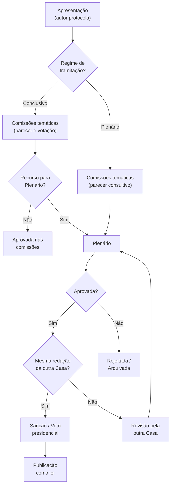

# Processo Legislativo Brasileiro

> Brasil a Vera · Domínio · v0.1
> Última atualização: 2026-04-14
> Status: accepted

---

## Sumário

- [Visão Geral](#visão-geral)
- [Tipos de Proposição](#tipos-de-proposição)
- [Tramitação](#tramitação)
- [Votação](#votação)
- [Glossário](#glossário)

---

## Visão Geral

Este documento é o glossário de referência do domínio legislativo brasileiro para o projeto Brasil a Vera. Cada termo técnico utilizado na plataforma deve ser consistente com as definições aqui. A acessibilidade de linguagem é princípio do produto (ver [Product Vision](../product/PRODUCT-VISION.md#acessibilidade-de-linguagem)), mas a precisão técnica não pode ser sacrificada.

O Congresso Nacional brasileiro é bicameral:

| Casa | Membros | Mandato | Renovação |
|------|---------|---------|-----------|
| **Câmara dos Deputados** | 513 deputados federais | 4 anos | Total a cada eleição |
| **Senado Federal** | 81 senadores | 8 anos | 1/3 e 2/3 alternadamente a cada 4 anos |

Uma **legislatura** dura 4 anos e corresponde ao mandato dos deputados. A 57ª legislatura vai de 2023 a 2027.

## Tipos de Proposição

O Brasil a Vera modela os seguintes tipos de proposição (trust_level: L1 — dados da fonte oficial):

### PEC — Proposta de Emenda à Constituição

| Atributo | Valor |
|----------|-------|
| **Sigla** | PEC |
| **O que faz** | Altera a Constituição Federal |
| **Quem pode propor** | 1/3 dos deputados ou senadores, Presidente da República, ou mais da metade das assembleias estaduais |
| **Quórum de aprovação** | 3/5 dos membros (308 deputados, 49 senadores) |
| **Votação** | Dois turnos em cada Casa |
| **Linguagem acessível** | "Proposta para mudar a Constituição — precisa de apoio muito amplo para ser aprovada" |

### PLP — Projeto de Lei Complementar

| Atributo | Valor |
|----------|-------|
| **Sigla** | PLP |
| **O que faz** | Regulamenta matérias que a Constituição reservou para lei complementar |
| **Quórum de aprovação** | Maioria absoluta (257 deputados, 41 senadores) |
| **Linguagem acessível** | "Projeto de lei para assuntos que a Constituição exige aprovação reforçada" |

### PL — Projeto de Lei Ordinária

| Atributo | Valor |
|----------|-------|
| **Sigla** | PL |
| **O que faz** | Cria regras gerais que não contrariem a Constituição |
| **Quórum de aprovação** | Maioria simples (50% + 1 dos presentes) |
| **É o tipo mais comum de proposição** | |
| **Linguagem acessível** | "Projeto de lei comum — precisa da maioria dos presentes na votação" |

### MPV — Medida Provisória

| Atributo | Valor |
|----------|-------|
| **Sigla** | MPV (ou MP) |
| **O que faz** | Tem força de lei imediata; editada pelo Presidente da República |
| **Prazo** | 60 dias, prorrogáveis por mais 60. Se não votada, perde eficácia |
| **Quórum de aprovação** | Maioria simples |
| **Particularidade** | Já está valendo quando chega ao Congresso — o Congresso decide se mantém ou rejeita |
| **Linguagem acessível** | "Decisão do Presidente com efeito imediato — o Congresso precisa aprovar para virar lei permanente" |

### PDC — Projeto de Decreto Legislativo

| Atributo | Valor |
|----------|-------|
| **Sigla** | PDC |
| **O que faz** | Regulamenta matérias de competência exclusiva do Congresso (ex: aprovar tratados internacionais, sustar atos do Executivo) |
| **Quórum de aprovação** | Maioria simples |
| **Linguagem acessível** | "Decisão exclusiva do Congresso — não precisa de sanção presidencial" |

### PRC — Projeto de Resolução

| Atributo | Valor |
|----------|-------|
| **Sigla** | PRC |
| **O que faz** | Regulamenta assuntos internos de cada Casa legislativa (regimento interno, criação de comissões) |
| **Quórum de aprovação** | Maioria simples |
| **Linguagem acessível** | "Regras internas da Câmara ou do Senado" |

## Tramitação

A tramitação é o caminho que uma proposição percorre desde a apresentação até a votação final (ou arquivamento).

### Fluxo simplificado

### Tramitação conclusiva (poder conclusivo das comissões)

A maioria das proposições na Câmara tem **tramitação conclusiva** — são votadas apenas nas comissões temáticas, sem chegar ao Plenário. A Câmara tem cerca de 30 comissões permanentes.

**Implicação para o Brasil a Vera**: se o produto só mostrar votações de Plenário, perde a maior parte da atividade legislativa real. O MVP deve, no mínimo, indicar em quais comissões cada proposição tramitou e quem foi o relator.

### Substitutivo

Um **substitutivo** é uma nova versão do texto de uma proposição, elaborada pelo relator na comissão. O substitutivo pode alterar completamente o conteúdo original.

**Implicação para o Brasil a Vera**: um parlamentar pode ter votado SIM numa versão do projeto completamente diferente da versão final. O [Motor de Coerência](../future/COHERENCE-ENGINE.md) deve levar isto em conta ao detectar pares contraditórios.

### Emendas

Emendas são alterações pontuais ao texto de uma proposição. Podem ser apresentadas por qualquer parlamentar durante a tramitação.

### Regime de urgência

Proposições em regime de urgência pula etapas da tramitação normal e vai direto ao Plenário. MPs têm urgência constitucional após 45 dias.

## Votação

### Tipos de votação

| Tipo | Descrição | Registra voto individual? |
|------|-----------|--------------------------|
| **Votação nominal** | Cada parlamentar registra seu voto eletronicamente | Sim — é o dado L1 do Brasil a Vera |
| **Votação simbólica** | Presidente pede que favoráveis permaneçam sentados e contrários se levantem | Não — sem registro individual |
| **Votação secreta** | Voto registrado mas não identificável | Não — sem registro individual público |

O Brasil a Vera opera **exclusivamente sobre votações nominais** para dados L1. Votações simbólicas e secretas podem ser mencionadas contextualmente, mas sem dados individuais.

### Orientação de bancada

Antes de cada votação nominal, os líderes partidários podem orientar suas bancadas:

| Orientação | Significado |
|-----------|-------------|
| SIM | Líder orienta bancada a votar SIM |
| NÃO | Líder orienta bancada a votar NÃO |
| LIBERADO | Bancada livre para votar como quiser |
| OBSTRUÇÃO | Bancada deve se retirar do plenário (impedir quórum) |

**Dado L1**: a orientação é registrada pela Câmara/Senado.
**Dado L2**: comparar voto individual com orientação do partido ("votou com/contra o partido").

### Tipos de voto individual

| Voto | Significado |
|------|-------------|
| SIM | Favorável à proposição |
| NÃO | Contrário à proposição |
| ABSTENÇÃO | Presente, mas optou por não votar |
| AUSENTE | Não estava presente na votação |
| OBSTRUÇÃO | Seguiu orientação de obstrução do líder |

### Quórum

| Tipo | Definição | Quando |
|------|-----------|--------|
| Maioria simples | 50% + 1 dos **presentes** | PL, MPV, PDC, PRC |
| Maioria absoluta | 50% + 1 dos **membros totais** (257 dep., 41 sen.) | PLP |
| Maioria qualificada (3/5) | 3/5 dos membros totais (308 dep., 49 sen.) | PEC |

## Glossário

| Termo | Definição | Linguagem acessível |
|-------|-----------|---------------------|
| **Assembleia Legislativa** | Poder legislativo estadual | Câmara do estado |
| **Bancada** | Conjunto de parlamentares de um partido ou bloco | Grupo do partido |
| **Bloco parlamentar** | Aliança formal entre partidos | Aliança de partidos |
| **CEAP** | Cota para Exercício da Atividade Parlamentar | Verba de trabalho do parlamentar |
| **Comissão permanente** | Órgão temático da Casa (ex: Comissão de Educação) | Grupo que analisa leis de um tema |
| **CPI** | Comissão Parlamentar de Inquérito | Investigação do Congresso |
| **Emenda** | Alteração pontual a uma proposição | Mudança no texto da lei |
| **Frente parlamentar** | Grupo suprapartidário temático | Grupo de parlamentares de vários partidos focado num tema |
| **Inteiro teor** | Texto completo da proposição | Texto completo |
| **Legislatura** | Período de 4 anos correspondente ao mandato dos deputados | Mandato de 4 anos |
| **Mesa Diretora** | Órgão administrativo da Casa | Diretoria da Câmara/Senado |
| **Obstrução** | Tática para impedir quórum | Sair do plenário para impedir votação |
| **Parecer** | Opinião formal do relator sobre a proposição | Análise do relator |
| **Plenário** | Sala de votação com todos os membros | Sala de votação geral |
| **Relator** | Parlamentar designado para analisar a proposição na comissão | Parlamentar responsável pela análise |
| **Sanção** | Aprovação do Presidente da República à lei votada | Assinatura do Presidente |
| **Tramitação** | Percurso da proposição pelas comissões e plenário | Caminho da lei no Congresso |
| **Tramitação conclusiva** | Proposição votada apenas nas comissões, sem plenário | Votação só nos grupos temáticos |
| **Veto** | Recusa do Presidente a parte ou totalidade da lei | Presidente recusa a lei |
