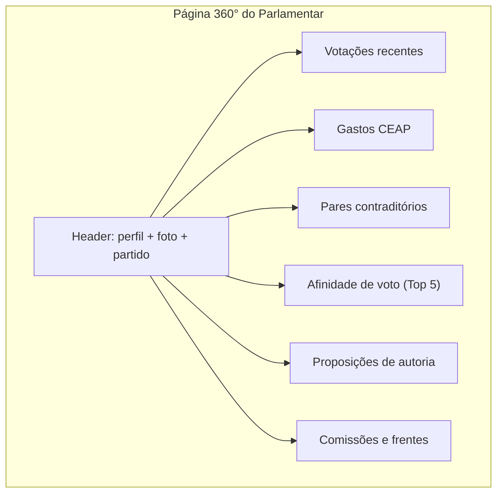

# Parlamentar 360°

> Brasil a Vera · Feature · v0.1
> Última atualização: 2026-04-14
> Status: draft

---

## Sumário

- [Visão Geral](#visão-geral)
- [Seções da Página](#seções-da-página)
- [Dados e Trust Level](#dados-e-trust-level)
- [Compartilhamento Social](#compartilhamento-social)
- [Responsividade](#responsividade)

---

## Visão Geral

A Página 360° do Parlamentar é a **funcionalidade central do MVP** (Wave 1). Responde à pergunta principal do cidadão: "O que meu deputado/senador anda fazendo?"

Unifica numa única página: perfil, votações, gastos, proposições e pares contraditórios. Cada dado carrega seu trust_level visível (ver [Pirâmide de Confiança](../architecture/TRUST-PYRAMID.md)).

URL pattern: `/parlamentares/{id}`

### Personas atendidas

- **Cidadão Consciente** (primário) — visão simples e compartilhável
- **Jornalista Investigativo** — ponto de entrada para investigação aprofundada
- **Ativista/ONG** — referência rápida por parlamentar

## Seções da Página



### 1. Header — Perfil

| Campo | Fonte | Trust Level |
|-------|-------|-------------|
| Foto | API Câmara/Senado | L1 |
| Nome parlamentar | API Câmara/Senado | L1 |
| Partido atual | API Câmara/Senado | L1 |
| UF | API Câmara/Senado | L1 |
| Casa (Câmara/Senado) | API Câmara/Senado | L1 |
| Legislatura | API Câmara/Senado | L1 |
| Situação do mandato | API Câmara/Senado | L1 |

Inclui botão "Seguir" (Wave 2: habilita alertas) e botão "Compartilhar".

### 2. Votações Recentes

Lista paginada das **últimas votações nominais** em que o parlamentar participou:

| Campo | Trust Level |
|-------|-------------|
| Data da votação | L1 |
| Proposição (tipo + número + ementa resumida) | L1 |
| Voto do parlamentar (SIM/NÃO/Abstenção/Ausente/Obstrução) | L1 |
| Resultado da votação (aprovada/rejeitada) | L1 |
| Orientação do partido | L1 |
| Alinhamento com a orientação (votou com/contra o partido) | L2 |

Cada votação linka para a página da proposição e para a fonte oficial.

**Filtros disponíveis**: período, tema, tipo de voto (SIM/NÃO), alinhamento com partido.

### 3. Gastos CEAP

Resumo de gastos da Cota para Exercício da Atividade Parlamentar:

| Elemento | Trust Level |
|----------|-------------|
| Total gasto no período | L2 (soma de L1) |
| Gasto por categoria (gráfico de barras/pizza) | L2 |
| Maiores fornecedores | L1 |
| Lista detalhada com nota fiscal | L1 |
| Comparação com mediana da Casa | L2 |

**Filtros**: período (mês, ano), categoria.

Cada gasto linka para o documento na fonte oficial quando disponível.

### 4. Pares Contraditórios

Exibe pares de votos em direções opostas no mesmo tema, detectados pelo [Motor de Coerência](COHERENCE-ENGINE.md).

- Exibição conforme descrito no [Motor de Coerência — Exibição na UI](COHERENCE-ENGINE.md#exibição-na-ui)
- Apenas pares com classificação inequívoca (trust_level: L2)
- Contexto temporal sempre presente
- Sem adjetivação

Se não houver pares detectados, a seção exibe: "Nenhum par de votos em direções opostas detectado com os critérios atuais. [Ver metodologia]"

### 5. Afinidade de Voto — Top 5

Lista dos 5 parlamentares com **maior frequência de voto coincidente** (co-votação normalizada):

| Campo | Trust Level |
|-------|-------------|
| Parlamentar | L1 |
| % de votos coincidentes | L2 |
| Número de votações em comum | L1 |
| Mesmo partido? | L1 |

Cada parlamentar linka para sua própria página 360°. No Wave 3, linka para o Grafo Legislativo centrado neste parlamentar.

### 6. Proposições de Autoria

Lista de proposições de autoria ou co-autoria do parlamentar:

| Campo | Trust Level |
|-------|-------------|
| Tipo (PL, PEC, etc.) | L1 |
| Número e ano | L1 |
| Ementa | L1 |
| Situação (tramitando, aprovada, arquivada) | L1 |
| Temas | L1 |

**Filtros**: tipo, situação, tema.

### 7. Comissões e Frentes

| Campo | Trust Level |
|-------|-------------|
| Comissões (titular/suplente) | L1 |
| Frentes parlamentares | L1 |
| Período de participação | L1 |

## Dados e Trust Level

Todos os dados na página 360° são **L1** (dados brutos) ou **L2** (agregações), com exceção da seção de pares contraditórios que é **L2**.

Nenhum dado L3 ou L4 aparece na página 360° do MVP. No Wave 3, uma seção separada com disclaimer poderá exibir dados do Grafo Legislativo (L2/L3).

### Badges visuais

Cada seção tem badge discreto indicando trust level:
- `L1` — badge verde: "Fonte oficial"
- `L2` — badge azul: "Cálculo verificável"

## Compartilhamento Social

### Card OG (Open Graph)

Cada parlamentar tem um card OG dinâmico para compartilhamento em redes sociais:

```
┌─────────────────────────────────────┐
│  [Foto]  Dep. Exemplo (PT-SP)       │
│                                     │
│  73% alinhado com o governo         │
│  R$ 123.456 em gastos CEAP (2025)   │
│  2 pares de votos em direções       │
│  opostas detectados                 │
│                                     │
│  Brasil a Vera · Transparência      │
│  Legislativa                        │
└─────────────────────────────────────┘
```

Gerado dinamicamente via `@vercel/og` ou similar (ver [ADR-006](../architecture/ADR/006-frontend-stack.md)).

### URL compartilhável

Formato limpo: `brasilavera.org/parlamentares/178957`

Preview no WhatsApp, Twitter, Telegram e Facebook com título, descrição e imagem.

## Responsividade

### Mobile (persona primária: Cidadão Consciente)

- Layout single-column
- Seções colapsáveis (accordion) — Header e Votações expandidos por default
- Swipe entre seções
- Botão de compartilhar fixo no bottom bar
- Cards de votação otimizados para leitura em tela pequena

### Desktop (persona: Jornalista)

- Layout multi-column onde faz sentido (gastos por categoria + lista)
- Filtros visíveis no sidebar
- Tabelas completas com mais colunas
- Export CSV acessível em cada seção

### Performance targets

| Métrica | Mobile 3G | Desktop |
|---------|-----------|---------|
| LCP | < 2.5s | < 1.5s |
| CLS | < 0.1 | < 0.1 |
| FID | < 100ms | < 100ms |

Estratégia: SSR/SSG via Next.js (ver [ADR-006](../architecture/ADR/006-frontend-stack.md)). Dados do parlamentar podem ser statically generated com ISR (revalidação diária).
