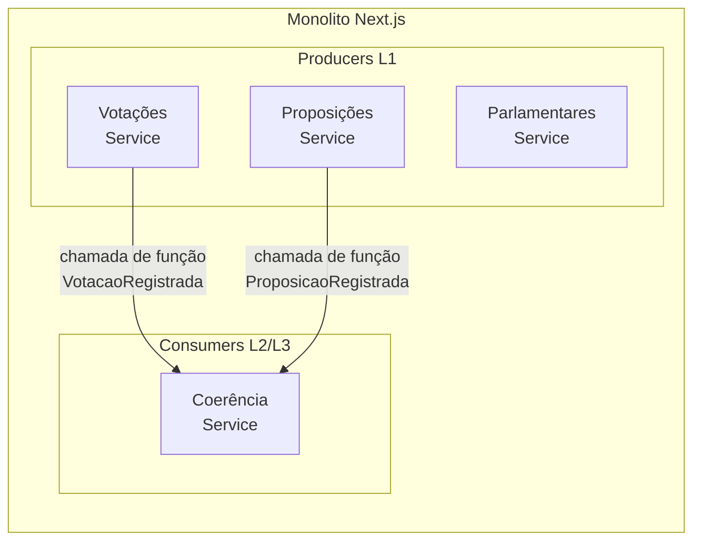
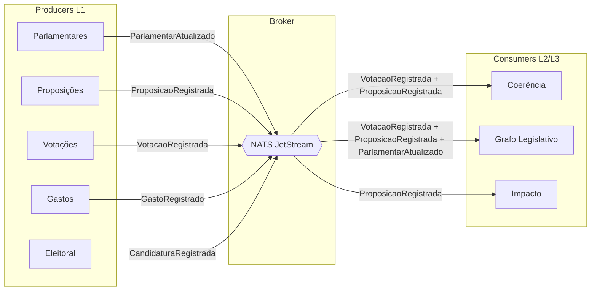

# ADR-005: Comunicação entre Bounded Contexts — Estratégia em Fases

> Brasil a Vera · Arquitetura · v0.2
> Última atualização: 2026-05-11
> Status: deferred

---

> **Status: Deferred (Wave 3+).** Este ADR foi movido para `docs/future/` e
> não representa compromisso de implementação. Será revalidado quando a wave
> correspondente for ativada.

---

## Sumário

- [Contexto](#contexto)
- [Decisão](#decisão)
- [Fase 1 — Chamada de Função no Monolito (Waves 0–2)](#fase-1--chamada-de-função-no-monolito-waves-02)
- [Fase 2 — NATS JetStream (Wave 3+)](#fase-2--nats-jetstream-wave-3)
- [Contratos de Domain Events](#contratos-de-domain-events)
- [Alternativas Consideradas](#alternativas-consideradas)
- [Consequências](#consequências)
- [Referências](#referências)

---

## Contexto

O Brasil a Vera é composto por 9 bounded contexts (ver [Bounded Contexts](../../architecture/BOUNDED-CONTEXTS.md)) que precisam trocar informações sem acoplamento direto. Especificamente:

- **Coerência** consome dados de Votações e Proposições para detectar pares contraditórios
- **Grafo Legislativo** consome dados de Votações, Proposições e Parlamentares para construir a rede de vínculos
- **Impacto** consome dados de Proposições para correlacionar com indicadores externos

O princípio arquitetural da [Pirâmide de Confiança](../../architecture/TRUST-PYRAMID.md) exige que contextos de L3/L4 (Impacto) nunca contaminem contextos de L1 (Parlamentares, Votações). O isolamento deve ser estrutural, não convencional.

## Decisão

**A comunicação entre bounded contexts evolui em duas fases**, acompanhando a migração do monolito para microserviços (ver [ADR-007](../../architecture/ADR/007-monolith-first-strategy.md)):

| Fase | Waves | Mecanismo | Broker |
|------|-------|-----------|--------|
| 1 | 0–2 | Chamada de função TypeScript direta entre services | Nenhum |
| 2 | 3+ | Domain events assíncronos via NATS JetStream | NATS JetStream |

## Fase 1 — Chamada de Função no Monolito (Waves 0–2)

No monolito Next.js, bounded contexts comunicam via **chamada de serviço TypeScript direta**. Domain events existem como interfaces TypeScript em `src/shared/domain-events/` para documentar os contratos, mas a transmissão é síncrona dentro do processo.

### Arquitetura (Waves 0–2)



### Isolamento no monolito

O isolamento entre bounded contexts é garantido por **tooling, não por infraestrutura**:

1. **Biome `noRestrictedImports`** — bloqueia imports diretos entre módulos no CI
2. **Schemas separados no PostgreSQL** — nenhum JOIN cross-schema
3. **Interface de serviço** — módulos que precisam de dados de outro módulo chamam a interface de serviço do shared kernel, nunca importam a implementação

### Como preparar para a migração

Services devem ser escritos para facilitar a extração futura:

```typescript
// src/modules/votacoes/service/votacao-service.ts

// O service recebe e retorna tipos de domain event,
// mesmo que a transmissão seja direta no monolito.
// Na Wave 3, esta chamada vira publicação no NATS.

import type { VotacaoRegistrada } from '@/shared/domain-events'

export class VotacaoService {
  async registrarVotacao(/* ... */): Promise<VotacaoRegistrada> {
    // ... lógica de negócio ...
    const event: VotacaoRegistrada = {
      type: 'votacao.registrada',
      occurredAt: new Date(),
      trustLevel: 'L1',
      payload: { votacaoId, proposicaoId, votos, resultado }
    }
    // Wave 0–2: retorna o evento para o caller (síncrono)
    // Wave 3+: publica no NATS
    return event
  }
}
```

## Fase 2 — NATS JetStream (Wave 3+)

Quando os primeiros módulos Go são extraídos do monolito (ver [ADR-002](../../architecture/ADR/002-backend-language-and-framework.md)), NATS JetStream é introduzido como message broker.

### Arquitetura (Wave 3+)



### Por que NATS JetStream

| Critério | NATS JetStream |
|----------|---------------|
| Complexidade operacional | Binário único, config mínima, sem ZooKeeper/Kraft |
| Performance | Latência sub-milissegundo, throughput alto |
| Persistência | JetStream oferece persistência com replay e consumer groups |
| Garantia de entrega | At-least-once com ack explícito |
| Docker | Imagem oficial leve (~20MB) |
| Driver Go | Client oficial de primeira classe (`nats.go`) |
| Licença | Apache 2.0 |
| Custo | Zero — open-source, single binary |

### Tópicos (subjects)

Convenção: `bav.<context>.<aggregate>.<action>`

| Subject | Producer | Consumers |
|---------|----------|-----------|
| `bav.votacoes.votacao.registrada` | Votações | Coerência, Grafo |
| `bav.proposicoes.proposicao.registrada` | Proposições | Coerência, Grafo, Impacto |
| `bav.parlamentares.parlamentar.atualizado` | Parlamentares | Grafo |
| `bav.gastos.gasto.registrado` | Gastos | (futuro) |
| `bav.eleitoral.candidatura.registrada` | Eleitoral | (futuro) |

### Streams e consumers

- Um **stream** por bounded context produtor (ex: `VOTACOES`, `PROPOSICOES`)
- **Durable consumers** por bounded context consumidor (ex: `coerencia-votacoes`, `grafo-votacoes`)
- Retention policy: `WorkQueue` para consumers exclusivos, `Interest` para fan-out
- Replay: consumers podem ser reiniciados do início do stream para reprocessamento

## Contratos de Domain Events

Independente da fase, os contratos de eventos são definidos em `src/shared/domain-events/` como TypeScript interfaces. Na Wave 3+, estes mesmos contratos são transcritos para structs Go.

```typescript
// src/shared/domain-events/types.ts

export type TrustLevel = 'L1' | 'L2' | 'L3' | 'L4'

export interface DomainEvent<T = unknown> {
  id: string              // UUID v7
  type: string            // ex: "votacao.registrada"
  source: string          // bounded context de origem
  occurredAt: Date        // timestamp do fato
  trustLevel: TrustLevel  // L1, L2, L3, L4
  correlationId: string   // rastreabilidade
  payload: T              // dados específicos do evento
}

export interface VotacaoRegistradaPayload {
  votacaoId: string
  proposicaoId: string | null
  votos: Array<{ parlamentarId: string; voto: string }>
  resultado: { sim: number; nao: number; aprovada: boolean }
}

export type VotacaoRegistrada = DomainEvent<VotacaoRegistradaPayload>
```

## Alternativas Consideradas

### NATS JetStream desde o início

- **Prós**: desacoplamento real desde o dia 1, replay nativo, idempotência forçada
- **Contras**: infraestrutura adicional sem benefício no monolito (bounded contexts já estão no mesmo processo), complexidade operacional, contribuidores precisam entender mensageria
- **Veredicto**: no monolito, o isolamento é garantido por Biome — mensageria adiciona complexidade sem benefício. Introduzir quando os primeiros módulos forem extraídos.

### RabbitMQ (Wave 3+)

- **Prós**: maduro, bem documentado, suporte a múltiplos protocolos
- **Contras**: mais complexo que NATS, Erlang runtime, consumo de memória maior
- **Veredicto**: viável, mas NATS é mais simples e leve

### Apache Kafka (Wave 3+)

- **Prós**: padrão da indústria, log imutável, replay nativo
- **Contras**: complexidade operacional muito alta, consumo de recursos desproporcional para o volume do Brasil a Vera
- **Veredicto**: sobredimensionado

### Comunicação síncrona permanente (HTTP entre serviços)

- **Prós**: simples, sem broker
- **Contras**: acoplamento temporal, cascading failures, viola isolamento da Pirâmide
- **Veredicto**: aceitável no monolito (Fase 1) onde é chamada de função; inaceitável entre serviços independentes (Fase 2)

## Consequências

### Positivas

- **Zero infraestrutura adicional nas Waves 0–2** — comunicação é chamada de função, sem broker
- **Contratos definidos desde o dia 1** — domain events como TypeScript interfaces documentam os contratos mesmo antes do NATS
- **Migração incremental** — ao extrair um módulo para Go, só precisa trocar a chamada de função por publicação/consumo no NATS
- **Isolamento da Pirâmide preservado** — Biome bloqueia imports cruzados no monolito; NATS garante isolamento físico nos microserviços

### Negativas

- **Sem replay nas Waves 0–2** — se o módulo de Coerência tiver bug, não pode reprocessar eventos passados automaticamente — mitigação: pode recalcular a partir de queries ao banco
- **Migração requer trabalho** — trocar chamadas de função por publicação no NATS não é automático — mitigação: services já usam tipos de domain event, facilitando a migração

### Neutras

- Se o volume crescer dramaticamente (assembleias estaduais, Wave 4), NATS JetStream escala horizontalmente com clustering

## Referências

- [NATS JetStream Documentation](https://docs.nats.io/nats-concepts/jetstream)
- [Domain Events — Martin Fowler](https://martinfowler.com/eaaDev/DomainEvent.html)
- [Monolith First — Martin Fowler](https://martinfowler.com/bliki/MonolithFirst.html)
