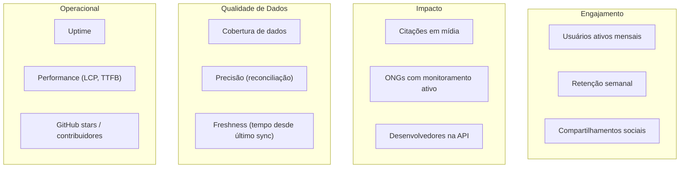

# Métricas de Sucesso

> Brasil a Vera · Produto · v0.2
> Última atualização: 2026-04-14
> Status: draft

---

## Sumário

- [Framework de Medição](#framework-de-medição)
- [Métricas por Categoria](#métricas-por-categoria)
- [Targets por Wave](#targets-por-wave)
- [Métricas de Qualidade de Dados](#métricas-de-qualidade-de-dados)
- [Como Medir](#como-medir)

---

## Framework de Medição

As métricas do Brasil a Vera são organizadas em quatro categorias que refletem os objetivos do produto:

Cada métrica indica seu **trust level**: métricas são dados sobre dados, portanto são L2 (agregações determinísticas).

## Métricas por Categoria

### Engajamento

| Métrica | Definição | Trust Level |
|---------|-----------|-------------|
| **Usuários ativos mensais (MAU)** | Visitantes únicos com ao menos 2 páginas vistas no mês | L2 |
| **Retenção semanal** | % de usuários que retornam na semana seguinte | L2 |
| **Compartilhamentos sociais** | Cards/links compartilhados via botão de share ou tracking de referrer | L2 |
| **Sessão média** | Duração média da sessão por persona | L2 |
| **Parlamentares seguidos** | Número total de parlamentares com ao menos 1 seguidor | L2 |

### Impacto

| Métrica | Definição | Trust Level |
|---------|-----------|-------------|
| **Citações em mídia** | Matérias jornalísticas que citam o Brasil a Vera como fonte | L2 |
| **ONGs com monitoramento ativo** | Organizações com ao menos 1 alerta temático configurado | L2 |
| **Desenvolvedores na API** | API keys ativas com ao menos 100 requests/mês | L2 |
| **Datasets baixados** | Número de bulk downloads realizados por mês | L2 |

### Qualidade de Dados

| Métrica | Definição | Trust Level |
|---------|-----------|-------------|
| **Cobertura — votações** | % de votações nominais ingeridas vs. total disponível na fonte | L2 |
| **Cobertura — parlamentares** | % de parlamentares em exercício com perfil completo | L2 |
| **Cobertura — gastos** | % de gastos CEAP ingeridos vs. total disponível | L2 |
| **Precisão** | % de registros que conferem com a fonte na reconciliação periódica | L2 |
| **Freshness** | Tempo médio entre atualização na fonte e disponibilidade na plataforma | L2 |
| **Pares contraditórios — precisão** | % de pares detectados confirmados como genuínos em revisão manual (amostra) | L2 |

### Operacional

| Métrica | Definição | Trust Level |
|---------|-----------|-------------|
| **Uptime** | Disponibilidade da plataforma (excluindo manutenção programada) | L2 |
| **LCP (Largest Contentful Paint)** | Tempo de carregamento do maior elemento visível | L2 |
| **TTFB (Time to First Byte)** | Tempo até o primeiro byte da resposta | L2 |
| **GitHub stars** | Estrelas no repositório principal | L1 (dado bruto) |
| **Contribuidores ativos** | Contribuidores com ao menos 1 PR mergeado no mês | L2 |
| **API latência p95** | Latência no percentil 95 das chamadas à API | L2 |

## Targets por Wave

| Métrica | Wave 1 (MVP) | Wave 2 | Wave 3 | Wave 4 |
|---------|-------------|--------|--------|--------|
| MAU | 5.000 | 20.000 | 50.000 | 200.000 |
| Retenção semanal | 15% | 20% | 30% | 35% |
| Compartilhamentos/mês | 500 | 2.000 | 10.000 | 50.000 |
| Citações em mídia | 5 | 20 | 50 | 100 |
| ONGs monitorando | — | 10 | 50 | 200 |
| API keys ativas | — | 10 | 100 | 500 |
| Cobertura votações | 95% | 98% | 99% | 99% |
| Precisão (reconciliação) | 98% | 99% | 99.5% | 99.5% |
| Uptime | 99% | 99.5% | 99.5% | 99.9% |
| GitHub stars | 200 | 500 | 2.000 | 5.000 |
| LCP (3G) | < 2.5s | < 2.0s | < 2.0s | < 1.5s |
| API latência p95 | < 500ms | < 300ms | < 200ms | < 100ms |

## Métricas de Qualidade de Dados

A qualidade dos dados é o ativo mais crítico do Brasil a Vera. Se os dados estiverem errados ou desatualizados, a plataforma perde credibilidade de forma irrecuperável.

### Dashboard de Saúde dos Dados

Cada pipeline de ingestão mantém um dashboard com:

| Indicador | Cálculo | Alerta |
|-----------|---------|--------|
| Último sync com sucesso | Timestamp do último pipeline executado sem erro | > 48h sem sync |
| Registros processados | Contagem do último batch | Queda > 50% vs. média |
| Taxa de erro | Registros rejeitados / total | > 5% |
| Latência de ingestão | Tempo entre publicação na fonte e persistência local | > 24h |
| Divergências na reconciliação | Registros que diferem da fonte na reconciliação semanal | > 1% |

### Métricas do Motor de Coerência

| Indicador | Cálculo | Trust Level |
|-----------|---------|-------------|
| Pares detectados | Total de pares contraditórios no sistema | L2 |
| Cobertura temática | % de temas com classificação de direção | L2 |
| Taxa de "não classificado" | % de proposições sem direção classificada | L2 |
| Falsos positivos (amostra) | % de pares rejeitados em revisão manual | L2 |

Princípio: uma taxa alta de "não classificado" é preferível a falsos positivos. A meta não é classificar tudo, mas classificar corretamente o que classifica.

## Como Medir

### Ferramentas

| Categoria | Ferramenta | Wave | Justificativa |
|-----------|-----------|------|---------------|
| Web analytics | Cloudflare Web Analytics ou Plausible | 0+ | Cloudflare Web Analytics é privacy-first, nativo no Pages; Plausible se self-hosted |
| API metrics | Cloudflare Workers Logs + Logpush | 0–2 | Logs dos Workers que servem as Route Handlers do Next.js no Cloudflare Workers |
| API metrics | Prometheus + Grafana | 3+ | Quando serviços Go tiverem métricas próprias em VPS |
| Pipeline health | GitHub Actions logs | 0+ | Logs nativos dos workflows de ingestão |
| Uptime | UptimeRobot ou similar | 1+ | Monitoramento externo |
| GitHub metrics | GitHub API | 0+ | Dados nativos |

### Princípios de Medição

1. **Privacy-first** — sem Google Analytics, sem tracking invasivo. Plausible/Umami respeitam LGPD sem cookies.
2. **Métricas são L2** — fórmulas de cálculo documentadas e reproduzíveis.
3. **Transparência** — métricas de saúde dos dados podem ser públicas (dashboard aberto).
4. **Ação sobre vaidade** — priorizar métricas que informam decisões (retenção, cobertura) sobre métricas de vaidade (pageviews brutas).
