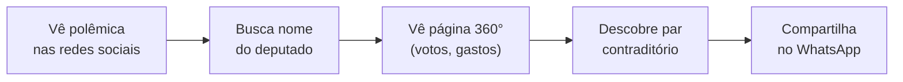
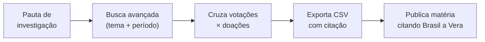
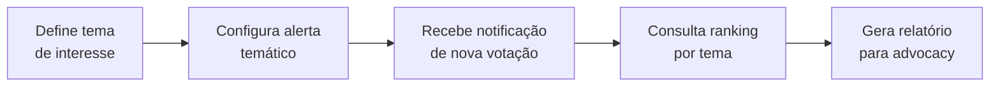

# Personas

> Brasil a Vera · Produto · v0.1
> Última atualização: 2026-04-14
> Status: accepted

---

## Sumário

- [Visão Geral](#visão-geral)
- [Personas Primárias](#personas-primárias)
- [Personas Secundárias](#personas-secundárias)
- [Matriz Persona × Funcionalidade](#matriz-persona--funcionalidade)

---

## Visão Geral

As personas do Brasil a Vera determinam prioridades de UX, funcionalidades e canais de distribuição. São organizadas em **primárias** (definem o MVP) e **secundárias** (expansão futura).

```mermaid
graph LR
    subgraph Primárias — definem o MVP
        CID[Cidadão Consciente]
        JOR[Jornalista Investigativo]
        ATI[Ativista / ONG]
    end

    subgraph Secundárias — expansão
        DEV[Desenvolvedor Cívico]
        PES[Pesquisador Acadêmico]
    end
```

---

## Personas Primárias

### Cidadão Consciente

| Atributo | Descrição |
|----------|-----------|
| **Perfil** | 25-45 anos, classe B/C, mobile-first, consome política via redes sociais |
| **Motivação** | "Votei nesse deputado e quero saber se ele está cumprindo o que prometeu." |
| **Dor principal** | Informação legislativa é críptica, dispersa e inacessível. Não sabe a diferença entre PEC e PL. Quer respostas simples: votou a favor ou contra? |
| **Comportamento** | Engaja em momentos de crise política. Quer notificações pontuais e conteúdo compartilhável |
| **Dispositivo** | Smartphone (80%), desktop (20%) |
| **Métrica de sucesso** | Retenção semanal e taxa de compartilhamento |

#### Jornada — "O que meu deputado fez?"



#### Funcionalidades-chave

- Seguir parlamentar
- Alertas de votação (push/email)
- Linguagem simplificada (termos técnicos com explicação inline)
- Compartilhamento social com cards OG ricos
- Página 360° do parlamentar (ver [Parlamentar 360°](../features/PARLAMENTAR-360.md))

#### Necessidades de Trust Level

- Consome primariamente L1 (votou SIM/NÃO) e L2 (% de alinhamento)
- Pares contraditórios (L2) devem ser autoexplicativos sem jargão
- Não é público-alvo de L3/L4

---

### Jornalista Investigativo

| Atributo | Descrição |
|----------|-----------|
| **Perfil** | 28-50 anos, redações e freelancers, desktop-first |
| **Motivação** | "Preciso cruzar dados de votação com doações de campanha para uma matéria." |
| **Dor principal** | Navega 4-5 portais, baixa CSVs, limpa dados manualmente. Cada API tem formato diferente |
| **Comportamento** | Uso intenso durante investigações (dias/semanas). Precisa citar fonte com precisão |
| **Dispositivo** | Desktop (90%), tablet (10%) |
| **Métrica de sucesso** | Matérias publicadas citando o Brasil a Vera |

#### Jornada — "Cruzamento de dados para matéria"



#### Funcionalidades-chave

- Busca avançada com filtros combinados (tema, período, partido, UF)
- Cruzamento multi-fonte: votações × doações × gastos
- Export CSV/JSON com metadados de fonte (citação automática)
- Comparativo entre parlamentares
- Dados L3 (correlações) com metodologia transparente

#### Necessidades de Trust Level

- Usa todos os níveis (L1 a L3), mas precisa de clareza sobre o que é fato vs. correlação
- Citação precisa: cada dado exportado deve carregar source_url e trust_level
- Disclaimers de L3 são importantes para credibilidade da matéria

---

### Ativista / ONG Temática

| Atributo | Descrição |
|----------|-----------|
| **Perfil** | Organizações da sociedade civil focadas em advocacy temático (meio ambiente, educação, saúde, direitos humanos) |
| **Motivação** | "Quero monitorar todas as proposições sobre meio ambiente e saber quem vota contra." |
| **Dor principal** | Monitoramento manual é exaustivo; precisa de alertas temáticos e relatórios para pressão institucional |
| **Comportamento** | Uso contínuo e sistemático. Relatórios periódicos para stakeholders |
| **Dispositivo** | Desktop (70%), mobile (30%) |
| **Métrica de sucesso** | Número de ONGs com monitoramento ativo |

#### Jornada — "Monitoramento temático"



#### Funcionalidades-chave

- Filtro por tema (tags oficiais da Câmara/Senado)
- Alertas temáticos (email, push) quando há nova votação ou proposição no tema
- Rankings por tema: quem mais votou a favor/contra
- Relatórios periódicos exportáveis
- Índice de coerência temática por parlamentar (ver [Motor de Coerência](../future/COHERENCE-ENGINE.md))

#### Necessidades de Trust Level

- Rankings são L2 — fórmula deve ser pública para credibilidade da ONG junto a stakeholders
- Alertas são L1 (fato novo: votação registrada)
- Relatórios podem incluir L3 se a ONG optar

---

## Personas Secundárias

### Desenvolvedor Cívico

| Atributo | Descrição |
|----------|-----------|
| **Perfil** | Desenvolvedores que constroem aplicações cívicas (bots, dashboards, integrations) |
| **Motivação** | "Quero construir um bot de Telegram que avise meu grupo quando o deputado X votar." |
| **Dor principal** | Cada API oficial tem formato diferente, paginação diferente, rate limits não documentados |
| **Disponível a partir de** | Wave 2 (API pública) |

#### Funcionalidades-chave

- API REST pública com documentação OpenAPI
- Webhooks para eventos em tempo real
- SDKs (Python, JavaScript)
- Rate limiting transparente e generoso para projetos open-source
- Cada endpoint retorna `trust_level` no response

---

### Pesquisador Acadêmico

| Atributo | Descrição |
|----------|-----------|
| **Perfil** | Cientistas políticos, sociólogos, data scientists em universidades |
| **Motivação** | "Preciso de datasets completos de votações nominais dos últimos 20 anos para minha tese." |
| **Dor principal** | Dados oficiais requerem limpeza extensiva; falta normalização temporal e vinculação entre fontes |
| **Disponível a partir de** | Wave 2 (bulk download) |

#### Funcionalidades-chave

- Bulk download de datasets completos (CSV, Parquet)
- Dados históricos normalizados (séries temporais consistentes)
- Metodologia aberta e documentada no repositório
- Dicionário de dados unificado (ver [Dicionário de Dados](../domain/DATA-DICTIONARY.md))
- Metadados de trust_level em cada linha do dataset

---

## Matriz Persona × Funcionalidade

| Funcionalidade | Cidadão | Jornalista | Ativista | Dev | Pesquisador | Wave |
|---------------|---------|-----------|----------|-----|-------------|------|
| Página 360° do parlamentar | **Principal** | Usa | Usa | — | — | 1 |
| Busca unificada | Usa | **Principal** | Usa | — | — | 1 |
| Pares contraditórios | **Principal** | Usa | Usa | — | — | 1 |
| Export CSV/JSON | — | **Principal** | Usa | — | Usa | 1 |
| Alertas temáticos | Usa | Usa | **Principal** | — | — | 2 |
| Índice de coerência | Usa | Usa | **Principal** | — | Usa | 2 |
| API pública | — | — | — | **Principal** | Usa | 2 |
| Integração TSE | Usa | **Principal** | Usa | Usa | Usa | 2 |
| Grafo legislativo | — | **Principal** | Usa | Usa | **Principal** | 3 |
| Correlações L3 | — | **Principal** | Usa | Usa | **Principal** | 3 |
| Bulk download | — | — | — | — | **Principal** | 2 |
| Compartilhamento social | **Principal** | — | Usa | — | — | 1 |
