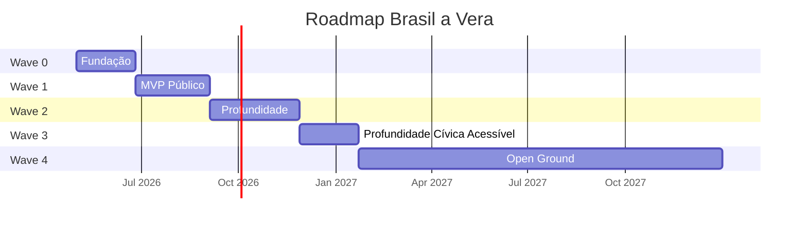
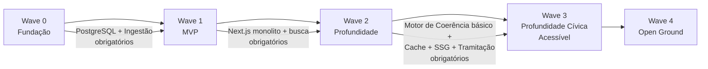

# Roadmap

> Brasil a Vera · Produto · v0.3
> Última atualização: 2026-05-13
> Status: accepted

---

## Sumário

- [Estratégia de Waves](#estratégia-de-waves)
- [Wave 0 — Fundação](#wave-0--fundação)
- [Wave 1 — MVP Público](#wave-1--mvp-público)
- [Wave 2 — Profundidade](#wave-2--profundidade)
- [Wave 3 — Profundidade Cívica Acessível](#wave-3--profundidade-cívica-acessível)
- [Wave 4 — Open Ground](#wave-4--open-ground)
- [Dependências entre Waves](#dependências-entre-waves)

---

## Estratégia de Waves

O roadmap segue **waves incrementais**, onde cada wave entrega valor autónomo e valida hipóteses antes de avançar. Nenhuma wave depende do sucesso comercial das anteriores.

| Wave | Nome | Personas Atendidas | Duração Estimada |
|------|------|--------------------|------------------|
| 0 | Fundação | Nenhuma (infraestrutura) | 6-8 semanas |
| 1 | MVP Público | Cidadão, Jornalista | 8-10 semanas |
| 2 | Profundidade | Todos | 10-12 semanas |
| 3 | Profundidade Cívica Acessível | Cidadão, Jornalista, Pesquisador, Desenvolvedor | 14-20 semanas (5 sprints + 1 micro-wave) |
| 4 | Open Ground | (definido após Wave 3) | Backlog sem plano contratual |

---

## Wave 0 — Fundação

> **Pergunta validada**: "Conseguimos ingerir, normalizar e servir dados legislativos de forma confiável?"

### Escopo

- Scripts TypeScript de ingestão: Câmara API + Senado API (executados via GitHub Actions)
- Modelo de domínio: bounded contexts core (Parlamentares, Proposições, Votações, Gastos) como módulos TypeScript
- PostgreSQL (Neon free tier) com schema por bounded context
- Migrations SQL puras em `src/shared/db/migrations/`
- Estrutura de módulos com Biome `noRestrictedImports` bloqueando imports cross-module
- API interna (Next.js Route Handlers, não pública) para validação
- CI/CD básico (Biome CI, Vitest, build Next.js) com pre-commit via Husky
- Trust Metadata como shared kernel implementado em `src/shared/trust/`

### Critérios de Done

- [ ] Pipeline da Câmara ingere 100% dos deputados da legislatura atual
- [ ] Pipeline da Câmara ingere votações nominais dos últimos 2 anos
- [ ] Pipeline da Câmara ingere gastos CEAP dos últimos 12 meses
- [ ] Pipeline do Senado ingere senadores em exercício
- [ ] Pipeline do Senado ingere votações do último ano
- [ ] Todos os registros persistidos com `trust_level: L1` e `source_url`
- [ ] Biome `noRestrictedImports` bloqueando imports cross-module no CI
- [ ] Husky pre-commit executando `biome check` nos arquivos staged
- [ ] Scripts de ingestão rodando via GitHub Actions cron
- [ ] `npm run dev` sobe o Next.js monolito conectado ao PostgreSQL
- [ ] Cobertura de testes > 70% no domínio
- [ ] Reconciliação manual confirma dados vs. fonte oficial

### Entregáveis de Arquitetura

- ADRs implementados (ver [ADRs](../architecture/ADR/))
- Monorepo estruturado conforme [ADR-001](../architecture/ADR/001-monorepo-strategy.md)
- Monolito Next.js modular conforme [ADR-007](../architecture/ADR/007-monolith-first-strategy.md)
- Clean Architecture em cada módulo conforme [ADR-002](../architecture/ADR/002-backend-language-and-framework.md)

---

## Wave 1 — MVP Público

> **Pergunta validada**: "O cidadão consegue encontrar seu parlamentar e entender o que ele faz?"
>
> **Pergunta-chave do MVP**: "O que meu deputado/senador anda fazendo?"

### Escopo

- Next.js monolito (ver [ADR-006](../architecture/ADR/006-frontend-stack.md)) — frontend SSR/SSG + API Route Handlers
- Página 360° do parlamentar (ver [Parlamentar 360°](../features/PARLAMENTAR-360.md))
- Página da proposição (tipo, ementa, tramitação, votos)
- Busca unificada (ver [Busca](../features/SEARCH.md))
- Pares contraditórios básicos (apenas verbos inequívocos)
- Top 5 parlamentares com maior afinidade de voto (SQL simples — GROUP BY + COUNT)
- Compartilhamento social com cards OG
- Export CSV básico
- Deploy em Cloudflare Workers via OpenNext (free tier)

### Critérios de Done

- [ ] Página 360° funcional para todos os deputados e senadores
- [ ] Busca por nome, proposição e tema retorna resultados em < 500ms
- [ ] Pares contraditórios exibidos com contexto temporal
- [ ] Trust level renderizado em toda a UI (badges L1/L2)
- [ ] Cards OG dinâmicos por parlamentar
- [ ] Export CSV com `trust_level` e `source_url` por linha
- [ ] WCAG 2.1 AA em todas as páginas
- [ ] Performance: LCP < 2.5s em 3G, CLS < 0.1
- [ ] 5.000 usuários ativos mensais (target)

### Personas atendidas

- **Cidadão Consciente**: página 360°, busca simples, compartilhamento
- **Jornalista Investigativo**: busca avançada, export, página de proposição

---

## Wave 2 — Profundidade

> **Status global**: ✅ **Wave 2 inteira concluída em 2026-05-13** com tag `v0.2-final`.
> As 3 sub-waves entregues: 2.0 (`v0.2.0-foundation`), 2.1 (`v0.2.1-depth`, com micro-wave 2.1.1 de fechamento de ressalvas), 2.2 mínima (`v0.2.2-distribution`).
> Próximo passo: Wave 3 — Profundidade Cívica Acessível.

> **Pergunta validada**: "Cidadãos engajados e jornalistas usam a plataforma como ferramenta de análise, não só consulta?"

A Wave 2 é dividida em três sub-waves entregáveis. Cada sub-wave tem tag de release própria e pode ser parada com algo concreto entregue.

### Wave 2.0 — Foundation Hardening

> **Tag de release**: `v0.2.0-foundation`
> **Status**: ✅ Concluída em 2026-05-12 com 2 ressalvas registradas (ver Critérios de Done abaixo)

**Por que primeiro**: a infraestrutura estabelecida na pré-Wave 2 (ADRs 016, 017, 018 + princípios 8-12 do CLAUDE.md) precisa ser implementada antes de qualquer feature nova. Sem cache, SSG e observabilidade, cada feature adicional ataca o budget direto. Esta sub-wave também consolida os safety nets que faltavam quando o incidente do Pool singleton aconteceu.

#### Escopo

**Infra de cache e SSG (princípios 8 e 9):**

- Módulo `src/lib/cache.ts` com TTLs do ADR-018 (issue #41)
- Migração de páginas de detalhe para SSG + `revalidate` periódico (issue #42)
- Webhook de revalidação pós-ingestão (issue #43)

**Tríade de observabilidade:**

- Endpoint `/api/stats` admin-only — visibilidade do banco (issue #38)
- Script GitHub Actions de poll de billing Neon — visibilidade do custo (issue #40)
- Monitoramento de jobs de ingestão GitHub Actions — visibilidade dos pipelines (issue #30)

**Safety nets:**

- Alerta quando endpoint do Senado atinge limit fixo (issue #21)
- Smoke test pós-deploy contra Workers + Neon (issue #33)

**Base de testes para a Wave 2.1:**

- Testes integrados de queries com testcontainers (issue #22)

**Débito documental:**

- ADR-010 — UUID v7 como chave primária (issue #23)
- ADR-013 — Schema por bounded context no Postgres (issue #24)
- ADR-015 — Split de driver Neon por runtime (issue #34)

**Recorrente:**

- Revisão trimestral de custo (issue #39)

#### Critérios de Done

- [ ] 30 requests concorrentes em rotas de detalhe servem em < 100ms (média, com cache quente) — **ressalva**: nunca medido formalmente. Cache de edge implementado ([ADR-018](../architecture/ADR/018-cache-edge-app.md)), arquitetura suporta. Falta benchmark empírico — fica como item de operação contínua, não bloqueia entrega.
- [ ] CU-hours mensal projetado < 50 (zona verde do [ADR-017](../architecture/ADR/017-budget-mensal-observabilidade.md)) — **parcial**: 46.98 h/mês observado (< 50 ✓), mas custo projetado entrou em zona AMARELA ($7.52, threshold $5-15) por compute em testes/dev. Acompanhamento contínuo em #39.
- [x] `/api/stats` retornando contagens, tamanho do banco, última ingestão por tipo (issue #38)
- [ ] Webhook de `revalidate` validado em produção (1 deploy de ingestão dispara `revalidatePath`) — **ressalva**: bloqueado por #58 (R2 incremental cache) que migra para Wave 3+. Issue #43 fica aberta para Wave 3. Revalidação manual via redeploy é alternativa viável até lá.
- [x] Script de poll Neon rodando diariamente com alerta em zona amarela/vermelha (issue #40, PR #55)
- [x] Monitoramento de jobs de ingestão notifica falhas em < 1h (issue #30)
- [x] Smoke test pós-deploy bloqueando rollout em caso de regressão (issue #33)
- [x] Suite de testes integrados com testcontainers cobrindo queries de domínio (issue #22, PR #63) — **parcial**: cobre módulo `parlamentares` (8 funções, 11 testes). Issues #64-#67 estendem para `proposicoes`, `votacoes`, `stats+busca`, `coerencia` em Wave 2.1.
- [x] Três ADRs de débito documental publicados (010, 013, 015) — issues #23, #24, #34 fechadas no Batch D

### Wave 2.1 — Domain Depth

> **Tag de release**: `v0.2.1-depth`
> **Status**: ✅ Concluída em 2026-05-13. Ressalvas operacionais e de domínio fechadas pela micro-wave 2.1.1 (PRs #81 / #74 → #82 / #77 → #84). Senado de alinhamento permanece bloqueado por falta de API pública — tracking em #83.
> **Duração estimada**: 4-6 semanas

**Por que segundo**: com infra hardened, cada feature de domínio herda otimização automaticamente. Aqui o produto ganha narrativa cívica — não só mostra dados isolados, mas tece a história legislativa.

#### Escopo

- **Tramitação de proposições**: ingestão e UI da história completa de cada PL/PEC/MPV. Schema com `descricao_resumida` (≤ 200 chars) + `descricao_completa` opcional. Cobertura: legislaturas 56 e 57 ([ADR-016](../architecture/ADR/016-cobertura-temporal-arquivamento.md)).
- **Alinhamento partidário**: % de fidelidade do parlamentar à bancada, visualizado em gráfico no perfil. Cálculo em batch noturno cacheado.
- **Comparativo entre parlamentares**: nova rota `/comparar?ids=X,Y[,Z]` para 2-3 parlamentares lado a lado (votos coincidentes, gastos, presenças, proposições).
- **Página de partido**: nova rota `/partidos/[sigla]` com bancada completa, fidelidade interna média, proposições por tema.

#### Critérios de Done

- [x] Visitante consegue contar uma história completa de um parlamentar em 60 segundos (perfil → tramitação de proposição → comparativo com colega de bancada) — stack completa entregue; validado por curl manual em prod pós-merge de cada ciclo
- [x] Tramitação cobre 100% das proposições das legislaturas 56 e 57 — ingestão Câmara + Senado em produção (PR #73). Filtro por casa corrigido em #74 / PR #82 para cobrir proposições compartilhadas Câmara↔Senado (antes filtro `source_url LIKE` ficava com último ingestor). Cobertura real cresce a cada run do cron semanal `ingestion-weekly.yml`.
- [x] Alinhamento partidário calculado para parlamentares com 50+ votações registradas — **parcial para Câmara**: código (PR #76) + ingestão de `orientacao_bancada` (#77 / PR #84) em produção. 56 rows × 18 votações × 8 partidos × 100% match com `parlamentar.partido_sigla`. UI renderiza percentual real (validado em 3 perfis amostrais). Cobertura cresce com cron de votações (4x/dia). **Senado bloqueado**: API não publica orientações — tracking em [#83](https://github.com/FabioCaffarello/brasil-a-vera/issues/83).
- [x] Página de comparativo funcional para qualquer combinação de 2-3 parlamentares (issue #47, PR #79) — validado em prod com 2 IDs, 3 IDs, 1 ID (erro inline), `bogus` (erro inline)
- [x] Página de partido funcional para todas as 20+ siglas ativas (issue #48, PR #78) — SSG pré-gera todas as siglas no build; validado em prod
- [x] Budget Neon segue em zona verde ou amarela controlada — **parcial**: zona AMARELA observada ($7.52, threshold $5-15 do ADR-017). Abaixo do limiar vermelho ($15) — "amarela controlada" cabe. Acompanhamento contínuo em #39.
- [x] Storage do banco < 1 GB — ~46.86 MB observado (último `/api/stats`); folga de 20x

### Wave 2.2 — Distribution & Polish

> **Tag de release**: `v0.2.2-distribution` (sub-escopo mínimo entregue em 2026-05-13)
> **Status**: ✅ **Mínima concluída** (3/5 critérios). RSS e Parquet/R2 ficam para uma Wave 2.2 completa, se valer o esforço.
> **Duração estimada original**: 2-3 semanas
> **Caráter**: opcional — entra apenas se Waves 2.0 e 2.1 fecharam sem queimar o operador e o budget estiver em zona verde. Em 2026-05-13 o budget estava em zona amarela controlada ($7.52, threshold $5-15 do ADR-017) — operador escolheu entregar o subset mínimo de distribuição (OG + /docs + PRODUCT-VISION) sem inflar escopo.

**Por que último e opcional**: distribuição e refinamento são multiplicadores de alcance, mas não desbloqueiam funcionalidade nova. Melhor parar 2.1 entregue do que iniciar 2.2 cansado.

#### Escopo

- OpenGraph dinâmico em todas as páginas (compartilhamento social com prévia rica) — **entregue**
- Newsletter/RSS de proposições e votações relevantes — adiado
- Bulk export em Parquet via R2 (formato amigo de DuckDB, Pandas) — adiado
- Página estática de documentação para desenvolvedores curiosos — **entregue**
- Atualização do PRODUCT-VISION com aprendizados das Waves 1 e 2 (issue #32) — **entregue**

#### Critérios de Done

- [x] Compartilhamento de qualquer URL em rede social gera prévia com OG dinâmico — PR #86 (fallback global + dinâmicos próprios em parlamentar / proposição / votação / partido)
- [ ] RSS feed publicado e validado em pelo menos 2 leitores — **adiado** para Wave 2.2 completa
- [ ] Bulk export em Parquet disponível no R2 — **adiado** para Wave 2.2 completa
- [x] Página `/docs` pública com guia de uso — PR #87 (SSG, sem touch DB)
- [x] PRODUCT-VISION atualizado com aprendizados de Waves 1 e 2 — PR #88 / issue #32

### Fora da Wave 2 — adiado para Wave 3 ou posterior

Por decisão consciente, o escopo abaixo não entra na Wave 2. A razão é dupla: investimento de engenharia desproporcional ao orçamento solo e ao retorno em curto prazo, e dependência de infraestrutura adicional (auth, rate limiting, gestão de contas) que abre dimensão de produto significativa.

- API pública REST com OpenAPI, rate limiting, API keys
- Webhooks para desenvolvedores terceiros
- Alertas push/email por parlamentar ou tema (exige gestão de contas de usuário, LGPD)
- Integração TSE completa (financiamento eleitoral, doações, bens) — escopo grande o suficiente para wave dedicada
- Targets de adoção (50k MAU, 10 API keys, 5 citações em mídia) — viram OKRs de Wave 3, não critérios de Done de Wave 2

---

## Wave 3 — Profundidade Cívica Acessível

> **Pergunta validada**: "Cidadão e jornalista conseguem responder perguntas cívicas concretas (coerência por tema, financiamento eleitoral) usando a plataforma sem expedição arqueológica?"

A Wave 3 transforma os dados estruturados acumulados nas Waves 1 e 2 em narrativa cívica acessível. Reescrita em 2026-05-13 (Sprint 3.0 / `v0.3.0-stable`) em 5 sprints incrementais — ordem: estabilização e honestidade → narrativa cívica → quick wins de distribuição → plataforma para devs → inteligência analítica. Cada sprint tem tag de release própria.

A Wave 3 **deliberadamente recorta escopo** — API pública REST, grafo legislativo, NLP avançado, extração de módulos Go, NATS JetStream e integração TSE completa migram para a Wave 4 (open ground). Stack permanente reafirmada em [ADR-020](../architecture/ADR/020-permanencia-monolito-typescript.md): TypeScript/Next.js/Neon/Cloudflare Workers, sem multi-runtime. Razão: nenhuma das peças propostas teve justificativa empírica, e cada uma dobraria o esforço da Wave inteira sem ganho proporcional pra cidadão. Ver [Fora da Wave 3](#fora-da-wave-3--adiado-para-wave-4) abaixo.

### Wave 3.0 — Estabilização & Honestidade

> **Tag de release**: `v0.3.0-stable`
> **Status**: ✅ Concluída em 2026-05-13
> **Duração**: 1 dia (escopo cirúrgico)

**Por que primeiro**: o produto pós-Wave 2 tinha 3 seções "honestas mas vazias" em todos os 721 perfis (pares contraditórios, top 5 afinidade, alinhamento à bancada), OG image vazando `localhost:3000` em todas as URLs sociais, e ressalvas operacionais não-fechadas. Antes de adicionar feature nova, o produto precisava estar em estado "sem vergonha de mostrar a um jornalista".

#### Escopo entregue

- **Bugs visíveis em produção** (Bloco 1): OG `localhost:3000` corrigido via `metadataBase`; auditoria do `db:migrate` automático + guarda em vitest; `/votacoes/[id]` ratificada como dynamic intencional (fechou #59); audit de triggers + concurrency dos 6 workflows + `WORKFLOWS.md` (fechou #69)
- **Auditoria de exports** (Tarefa 2): 4 endpoints CSV + `/api/stats` + busca empíricamente validados em prod; suite de regressão integration (12 + 4 testes); **truncagem honesta** via headers `X-Total-Count` / `X-Returned-Count` / `X-Truncated`
- **Diagnóstico de cobertura `orientacao_bancada`** (Tarefa 3): caminho (c) com nuance confirmado — 94.74% sobre nominais Câmara (denominador correto), não 1.21% sobre total. Senado bloqueado por #83. Script `ingestion/ops/diagnose-orientacoes.ts` permanece para revalidação periódica
- **Copy honesto em empty states** (Tarefa 4 + 3 finalização): zero ocorrências de "Pode ser que faltem dados…" em rotas públicas; copy refinado em ParesContraditorios, Top5Afinidade (disclaimer visível), AlinhamentoBancada (diferenciado por casa), FidelidadeMediaBlock, TramitacaoTimeline
- **Tooltip L1-L4** (Tarefa 5.1): acessível (hover/tap/focus, Esc, click fora), link âncora `/#piramide-confianca`
- **QA mobile** (Tarefa 5.2/5.3): Lighthouse mobile nas 6 rotas (Perf 94-99, A11y 93-100, CLS=0); tap targets ≥44px em filtros e busca

#### Critérios de Done — atendidos

- [x] Bugs OG/migrate/votacoes/workflows fechados; PRs #108-#110 mergeados
- [x] Auditoria de exports completa com tabela markdown + suite de regressão CI (PR #111)
- [x] Truncagem honesta implementada e validada em prod (X-Truncated emitido corretamente)
- [x] Diagnóstico orientação fechado com caminho técnico documentado (PR #113)
- [x] Grep `[pP]ode ser que` em src/ retorna 0 ocorrências
- [x] Lighthouse mobile rodado nas 6 rotas; sem regressão a11y
- [x] Tag `v0.3.0-stable` publicada
- [x] Budget Neon: zona AMARELA controlada (51.28 MB storage; estimativa $7.52 — abaixo do limiar vermelho $15)

#### Issues abertas pelo sprint (carregadas adiante)

- [#114](https://github.com/FabioCaffarello/brasil-a-vera/issues/114) — LCP > 2.5s em `/`, `/parlamentares`, `/partidos/[sigla]` (perf, wave-3+ → Sprint 3.1)

### Wave 3.0.5 — Refinamento NLP & Recalibragem Top 5

> **Tag de release**: `v0.3.0.5-honest`
> **Status**: planejada
> **Duração estimada**: 2-3 semanas

**Por que aqui**: dois empty states do Sprint 3.0 ficaram com copy honesto mas a feature continua "anêmica" — pares contraditórios cobre só verbos inequívocos (poucas ementas qualificam) e top 5 afinidade exibe 100% com 5 votações em comum (estatisticamente frágil). Esta micro-wave entrega o refinamento, sem ainda adicionar narrativa nova.

#### Escopo

- **NLP refinado de classificação de direção** para pares contraditórios: além de verbos inequívocos (`proíbe`, `autoriza`, `revoga`), expandir para padrões de transformação (`amplia`, `restringe`, `reduz` + objetos do verbo). Avaliar via cobertura sobre proposições classificadas hoje (`stats.votosClassificados`)
- **Recalibragem do top 5 afinidade**: quórum mínimo de votações em comum subiria de 5 → 20-30 (a definir empiricamente); janela temporal: últimos 12 meses. Disclaimer visível continua, mas raramente atinge 100%
- **Revalidação empírica** com script `diagnose-orientacoes.ts` antes e depois — registrar deltas

#### Critérios de Done

- [ ] Cobertura de pares contraditórios cresce N% (definir delta empírico no início do sprint)
- [ ] Top 5 afinidade em prod não exibe 100% para parlamentares com `totalVotosEmComum < 20` (nova regra)
- [ ] Tests integration cobrindo nova classificação + nova regra de quórum
- [ ] Diagnose script atualizado para refletir deltas pós-fix

### Wave 3.1 — Narrativa Cívica & Frontend

> **Tag de release**: `v0.3.1-narrative`
> **Status**: planejada
> **Duração estimada**: 3-4 semanas

**Por que segundo**: o cidadão que chega à plataforma sem nome em mente não sabe por onde começar. Esta sub-wave adiciona portas de entrada narrativas (não só "buscar X") e ajusta tipografia/espaçamento para destravar legibilidade.

#### Escopo

- Cards narrativos na home: "veja o que aconteceu esta semana", "deputado em maior divergência partidária", "proposição mais comentada"
- Rota `/o-meu-parlamentar` — entrada por CEP/cidade → propõe parlamentares relevantes
- Tipografia consistente entre títulos/corpo, espaçamento revisado
- Lighthouse: fechar [#114](https://github.com/FabioCaffarello/brasil-a-vera/issues/114) (LCP > 2.5s em `/`, `/parlamentares`, `/partidos/[sigla]`)
- QA mobile completo (375 / 414 / 360px) com regressões abertas como issues

#### Critérios de Done

- [ ] Home tem ≥ 3 cards de entrada narrativa, cada um linkando para fluxo cívico concreto
- [ ] `/o-meu-parlamentar` funcional para 1 método de entrada (CEP ou estado/cidade)
- [ ] LCP < 2.5s nas 3 rotas afetadas em [#114](https://github.com/FabioCaffarello/brasil-a-vera/issues/114)
- [ ] Sem regressão CLS / A11y vs baseline Sprint 3.0
- [ ] Tabela QA mobile no PR de fechamento com screenshots ou descrição textual

### Wave 3.2 — Quick wins de distribuição

> **Tag de release**: `v0.3.2-distribution`
> **Status**: planejada
> **Duração estimada**: 2-3 semanas

**Por que terceiro**: feature de produto consolidada (3.0 + 3.0.5 + 3.1), agora dá pra distribuir. Itens leves de descoberta orgânica que multiplicam alcance sem demandar infra nova.

#### Escopo

- OG dinâmico expandido (mais variantes além das atuais — perfil parlamentar com gráfico de afinidade, proposição com badge de tema)
- `/docs` pública mínima (estática, sem API ainda — explica o produto, fontes, frequência de ingestão)
- RSS de votações relevantes (rota `/feed/votacoes.xml`)
- Sem bulk Parquet por ora (espera Wave 4+)

#### Critérios de Done

- [ ] OG dinâmico cobre ≥ 5 cenários (home, parlamentar, proposição, votação, partido) — extensão da entrega da Tarefa 1.1 (Sprint 3.0)
- [ ] `/docs` pública indexável, com explicação L1/L2/L3, fontes, cadência
- [ ] RSS validado em 2 leitores (Feedly, NetNewsWire)

### Wave 3.3 — Plataforma para devs

> **Tag de release**: `v0.3.3-platform`
> **Status**: planejada
> **Duração estimada**: 3-4 semanas

**Por que quarto**: estabiliza API antes de adicionar análise pesada. Inclui TSE inicial (subset 2022) para devs/jornalistas começarem a usar a plataforma como base de pesquisa.

#### Escopo

- API pública REST documentada via OpenAPI (rotas públicas atuais formalizadas — `/parlamentares`, `/proposicoes`, `/votacoes` etc — sem auth/rate-limit ainda)
- Alertas configuráveis por parlamentar/tema (rota `/alertas` com inscrição via e-mail — exige fluxo mínimo de auth; aceitar trade-off de complexidade aqui)
- TSE inicial: schema `eleicoes` + ingestão TSE 2022 (subset doações para parlamentares em exercício)
- Rota `/parlamentares/[id]/financiamento` com agregados PF/PJ
- ADR-021 — Modelagem TSE (escopo recortado para Wave 3)

#### Critérios de Done

- [ ] OpenAPI.json publicado em `/api/openapi.json`, valida via Swagger Editor
- [ ] Alertas: usuário cria inscrição via e-mail, recebe notificação quando parlamentar X vota Y
- [ ] Schema `eleicoes` aplicado via auto-migrate sem regressão
- [ ] Matching parlamentar↔candidatura com taxa ≥ 80% (heurística nome+CPF+UF)
- [ ] `/parlamentares/[id]/financiamento` renderiza com empty state explícito para não-matched

### Wave 3.4 — Inteligência analítica

> **Tag de release**: `v0.3.4-insight`
> **Status**: planejada
> **Duração estimada**: 4-6 semanas

**Por que último**: o item mais ambicioso da Wave 3. Implementado em TypeScript ([ADR-020](../architecture/ADR/020-permanencia-monolito-typescript.md)) eventualmente com Workers AI para NLP pesado. Análises de grafo grandes rodam em batch via GitHub Actions e materializam resultado no banco.

#### Escopo

- **Índice de coerência completo** (extende Motor da Wave 1; depende do refinamento NLP do 3.0.5)
- **Página `/coerencia`** com ranking nacional + filtro por casa/partido/tema
- **Página `/sobre/metodologia`** (transparência sobre coleta, cálculo, classificação por L1/L2/L3 + princípio 13)
- **Dashboards temáticos**: schema `temas` + classificação automática de ementa, rotas `/temas` e `/temas/[slug]`, componente "Como X votou em [Tema]" nos perfis
- **Grafo legislativo**: detecção de comunidades em batch (Louvain/Leiden em JS), métricas de centralidade. Renderização frontend com `reactflow` (issue #96)
- **Workers AI** (opcional, com gargalo medido): se NLP local for insuficiente, mover classificação pesada para Workers AI

#### Critérios de Done

- [ ] Rota `/coerencia` acessível com ranking funcional para parlamentares com dados suficientes
- [ ] 6 temas cobertos, ≥ 50 proposições classificadas por tema (amostra mínima)
- [ ] Grafo legislativo renderiza em produção para top 50 parlamentares (depois expansão)
- [ ] `/sobre/metodologia` cobre L1/L2/L3, fontes oficiais, cadência, política da pirâmide
- [ ] Budget Neon mantido em zona amarela controlada (storage cresce com batches materializados)
- [ ] Princípio 13 referenciado em `/sobre/metodologia` — auditabilidade

### Fora da Wave 3 — adiado para Wave 4+

Por decisão consciente, o escopo abaixo **não entra** na Wave 3. Cada item dobraria o esforço da Wave inteira sem ganho proporcional pra cidadão; alguns foram descartados por princípio empírico (ver [ADR-019](../architecture/ADR/019-disciplina-arquitetural-sem-gargalo.md)) e por permanência do monolito ([ADR-020](../architecture/ADR/020-permanencia-monolito-typescript.md)).

- **API pública REST avançada**: rate limiting com API keys, webhooks para terceiros, push notifications (gestão de contas + LGPD ampla)
- **Migração para arquitetura distribuída**: extração de módulos Go (~~[ADR-007](../architecture/ADR/007-monolith-first-strategy.md)~~ superseded por ADR-020), NATS JetStream, Apache AGE, VPS Hostinger
- **Integração TSE completa**: bens declarados, gastos de campanha completos, anos anteriores além de 2022
- **Expansão de produto**: mobile nativa, integração Telegram/WhatsApp, i18n, assembleias legislativas estaduais
- **Brasil a Vera Labs (L4)**: análises de impacto com curadoria especializada
- **Bulk Parquet via R2**: formato amigável a DuckDB/Pandas — adiado pela Wave 2.2

Cada bloco vira issue mestre rotulada `wave-4+` no rastreamento de issues. Buscar com `gh issue list --label wave-4+`.

---

## Wave 4 — Open Ground

> **Status**: plano contratual pendente — será reavaliado após a Wave 3 fechar com base em evidência empírica de uso (cidadão, jornalista, contribuidor) e custo operacional.

A Wave 4 é deliberadamente **open ground** — sem critérios de Done atribuídos antecipadamente. As decisões adiadas das Waves 2 e 3 (e da definição "Wave 3 — Inteligência" anterior) ficam aqui como backlog explícito, rotuladas `wave-4+` no rastreamento de issues.

### Backlog (cada bullet é uma issue mestre com label `wave-4+`)

- **API pública e ecossistema externo** — REST + OpenAPI, API keys, rate limiting, webhooks, alertas push/email com gestão de contas LGPD-aware
- **Plataforma analítica avançada** — grafo legislativo interativo, NLP de classificação de direção, detecção de comunidades, métricas de centralidade
- **Migração para arquitetura distribuída** — Go Strangler Fig, NATS JetStream, Apache AGE, VPS Hostinger
- **Integração TSE completa** — bens declarados, gastos de campanha completos, anos anteriores além de 2022
- **Expansão de produto** — mobile nativa, integração com redes sociais (Telegram/WhatsApp), i18n, assembleias legislativas estaduais
- **Brasil a Vera Labs (L4)** — análises de impacto com curadoria especializada e disclaimers permanentes

Listar: `gh issue list --label wave-4+`.

### Quando reavaliar Wave 4

Reavaliação acontece **após a Wave 3 fechar** (estimativa: Q3 2026) com 3 perguntas:

1. Existe demanda concreta de cidadão, jornalista ou desenvolvedor pelo backlog acima?
2. O custo operacional manteve-se em zona amarela controlada (ADR-017) durante a Wave 3?
3. Qual o ROI estimado por item do backlog frente ao esforço solo?

Sem essas respostas calibradas em evidência empírica, a Wave 4 permanece em modo backlog. Princípio 13 do CLAUDE.md em ação: planejamento espera dados, não inferência.

---

## Dependências entre Waves

| Dependência | De | Para | Tipo |
|-------------|-----|------|------|
| PostgreSQL (Neon) + schemas | Wave 0 | Wave 1 | Obrigatória |
| Scripts de ingestão (GitHub Actions) | Wave 0 | Wave 1 | Obrigatória |
| Biome import boundaries + Husky pre-commit | Wave 0 | Wave 1 | Obrigatória |
| Next.js monolito (frontend + API) | Wave 1 | Wave 2 | Obrigatória |
| Busca unificada | Wave 1 | Wave 2 | Obrigatória |
| Motor de Coerência básico | Wave 1 | Wave 3.0 (Índice de Coerência Completo) | Obrigatória |
| Cache de edge + SSG | Wave 2.0 | Wave 3 | Obrigatória |
| Tramitação + alinhamento | Wave 2.1 | Wave 3.1 (dashboards temáticos) | Obrigatória |
| Orientação Câmara (`orientacao_bancada`) | Wave 2.1.1 | Wave 3.0 (Índice de Coerência) | Obrigatória |
| API pública REST, arquitetura distribuída (Go/NATS), TSE completo | Wave 3 anterior | Wave 4+ | Migrados — fora da Wave 3 atual |
