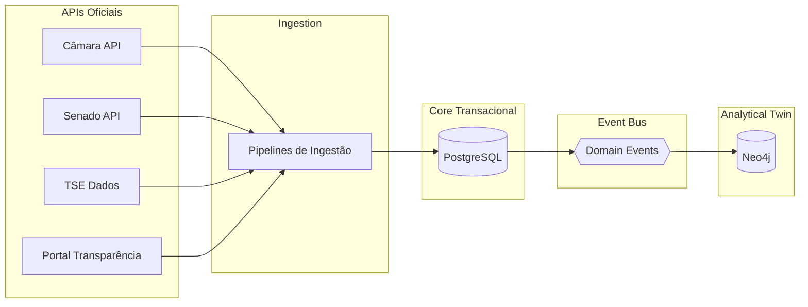

# ADR-003: Estratégia de Banco de Dados

> Brasil a Vera · Arquitetura · v0.1
> Última atualização: 2026-04-14
> Status: accepted

---

## Sumário

- [Contexto](#contexto)
- [Decisão](#decisão)
- [Alternativas Consideradas](#alternativas-consideradas)
- [Consequências](#consequências)
- [Referências](#referências)

---

## Contexto

O Brasil a Vera possui dois perfis de acesso a dados fundamentalmente diferentes:

1. **Transacional / CRUD** — armazenamento e consulta de dados estruturados: parlamentares, proposições, votações, gastos. Queries previsíveis, joins moderados, integridade referencial importante.
2. **Grafo / Analítico** — consultas de adjacência, caminho, centralidade e detecção de comunidades no Grafo Legislativo. Traversals multi-hop entre parlamentares conectados por co-votação, co-autoria e comissões.

Além disso, cada registro no sistema carrega `trust_level` (L1–L4) como metadado obrigatório (ver [Pirâmide de Confiança](../TRUST-PYRAMID.md)).

Restrições:

- Orçamento zero no início — infraestrutura deve ser executável localmente e em cloud de baixo custo
- Dados são majoritariamente ingeridos em batch (sync com APIs oficiais) e servidos como leitura
- O grafo precisa suportar ~600 nós (parlamentares) e potencialmente milhões de arestas (co-votações ao longo de legislaturas)
- Contribuidores open-source devem conseguir rodar o stack localmente com facilidade

## Decisão

**Adotamos uma estratégia de persistência poliglota com dois bancos:**

| Papel | Tecnologia | Bounded Contexts |
|-------|-----------|-----------------|
| Banco relacional (core transacional) | **PostgreSQL** | Parlamentares, Proposições, Votações, Gastos, Eleitoral, Coerência |
| Banco de grafos (analytical twin) | **Neo4j** | Grafo Legislativo |

### PostgreSQL como core

- Cada bounded context tem seu próprio schema (namespace), reforçando isolamento lógico
- Nenhum join cross-schema — bounded contexts comunicam via domain events, não via queries
- Trust Metadata é coluna (`trust_level`) em todas as tabelas core
- Migrations gerenciadas por ferramenta de migração (goose, golang-migrate ou similar)

### Neo4j como analytical twin

- Alimentado via domain events de Votações, Proposições e Parlamentares — nunca por acesso direto ao PostgreSQL
- É uma projeção de leitura otimizada para consultas de grafo, não a fonte de verdade transacional
- Se o Neo4j ficar indisponível, L1 e L2 continuam funcionando — o grafo é L2/L3
- Detalhes da escolha de Neo4j especificamente no [ADR-004](004-graph-database-choice.md)

### Diagrama de fluxo

## Alternativas Consideradas

### PostgreSQL only (sem graph database)

- **Prós**: stack simplificado, sem overhead operacional de segundo banco
- **Contras**: queries de grafo (caminho, centralidade, detecção de comunidades) são extremamente ineficientes em SQL — recursive CTEs com joins de co-votação em milhões de registros são impraticáveis. PostgreSQL com extensão Apache AGE é uma opção, mas imatura e com limitações de performance para grafos densos.
- **Veredicto**: tecnicamente possível para o MVP, mas limita severamente a Wave 3 (Grafo Legislativo interativo)

### MongoDB + Neo4j

- **Prós**: flexibilidade de schema para dados semi-estruturados de APIs externas
- **Contras**: perde integridade referencial, queries agregadas são menos eficientes que SQL, adiciona complexidade sem benefício claro dado que os dados são bem estruturados após ingestão
- **Veredicto**: dados legislativos são altamente estruturados — relacional é o fit natural

### Neo4j only (tudo no grafo)

- **Prós**: modelo unificado, sem sincronização entre bancos
- **Contras**: Neo4j não é otimizado para queries tabulares, paginação, full-text search e agregações SQL. Custo operacional maior. Contribuidores menos familiarizados.
- **Veredicto**: graph databases são excelentes para o que fazem, mas não substituem um relacional para o core transacional

## Consequências

### Positivas

- PostgreSQL é maduro, gratuito, bem documentado e familiar para a maioria dos contribuidores
- Neo4j Community Edition é gratuita e suficiente para o escopo do projeto
- A separação core/analytical twin alinha com a Pirâmide de Confiança — dados L1 vivem no PostgreSQL; projeções L2/L3 no Neo4j
- Schema-per-context no PostgreSQL reforça bounded contexts no nível de banco
- Stack inteiro roda localmente com `docker-compose`

### Negativas

- **Eventual consistency** entre PostgreSQL e Neo4j — o grafo pode estar temporariamente desatualizado em relação ao core — mitigação: acceptable para dados que são atualizados em batch (sync diário)
- **Overhead operacional** de dois bancos em produção — mitigação: Neo4j pode ser deploy separado e até desligado sem afetar L1/L2
- **Complexidade de onboarding** — contribuidores precisam entender dois bancos — mitigação: documentação clara, `docker-compose` que sobe tudo, seeds de dados

### Neutras

- Cache (Redis ou similar) pode ser adicionado no futuro para API de leitura sem alterar esta decisão

## Referências

- [PostgreSQL Documentation](https://www.postgresql.org/docs/)
- [Neo4j Documentation](https://neo4j.com/docs/)
- [Polyglot Persistence — Martin Fowler](https://martinfowler.com/bliki/PolyglotPersistence.html)
