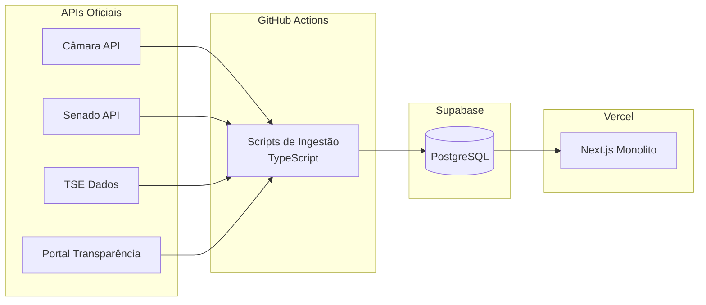

# ADR-003: Estratégia de Banco de Dados

> Brasil a Vera · Arquitetura · v0.2
> Última atualização: 2026-04-14
> Status: accepted

---

## Sumário

- [Contexto](#contexto)
- [Decisão](#decisão)
- [Estratégia Faseada para o Grafo](#estratégia-faseada-para-o-grafo)
- [Alternativas Consideradas](#alternativas-consideradas)
- [Consequências](#consequências)
- [Referências](#referências)

---

## Contexto

O Brasil a Vera possui dois perfis de acesso a dados fundamentalmente diferentes:

1. **Transacional / CRUD** — armazenamento e consulta de dados estruturados: parlamentares, proposições, votações, gastos. Queries previsíveis, joins moderados, integridade referencial importante.
2. **Grafo / Analítico** — consultas de adjacência, caminho, centralidade e detecção de comunidades no Grafo Legislativo. Traversals multi-hop entre parlamentares conectados por co-votação, co-autoria e comissões.

Além disso, cada registro no sistema carrega `trust_level` (L1–L4) como metadado obrigatório (ver [Pirâmide de Confiança](../TRUST-PYRAMID.md)).

Restrições:

- **Orçamento zero** no início — infraestrutura deve rodar no free tier (Supabase free: 500MB)
- Dados são majoritariamente ingeridos em batch (sync com APIs oficiais) e servidos como leitura
- O grafo precisa suportar ~600 nós (parlamentares) — volume trivialmente manejável com SQL
- Contribuidores open-source devem conseguir rodar o stack localmente com facilidade

## Decisão

**Adotamos PostgreSQL como único banco de dados nas Waves 0–2**, com estratégia faseada para capacidades de grafo.

| Wave | Banco | Capacidade de grafo |
|------|-------|-------------------|
| 0–2 | PostgreSQL (Supabase) | SQL agregado simples (GROUP BY + COUNT) |
| 3 | PostgreSQL + Apache AGE | Queries de vizinhança + NetworkX (Python) para análises batch |
| 4+ | Avaliar Neo4j CE ou Kuzu DB | Apenas se volume de traversals em tempo real justificar |

### PostgreSQL como core

- Cada bounded context tem seu próprio schema (namespace), reforçando isolamento lógico
- Nenhum join cross-schema — módulos comunicam via chamada de serviço (Wave 0–2) ou domain events (Wave 3+)
- Trust Metadata é coluna (`trust_level`) em todas as tabelas core
- Migrations em **SQL puro** (`.sql` versionados), nunca geradas por ORM — ver [ADR-002](002-backend-language-and-framework.md)
- Drizzle ORM usado apenas para queries (type-safe), nunca para gerar migrations

### Diagrama de fluxo (Waves 0–2)



## Estratégia Faseada para o Grafo

### Wave 0/1/2 — SQL simples

Queries de afinidade de voto ("Top 5 parlamentares com maior co-votação") implementadas como SQL agregado:

```sql
-- Top 5 parlamentares com maior co-votação com o parlamentar X
SELECT vn2.parlamentar_id, COUNT(*) AS votos_coincidentes
FROM votacoes.votos_nominais vn1
JOIN votacoes.votos_nominais vn2
  ON vn1.votacao_id = vn2.votacao_id
  AND vn1.voto = vn2.voto
  AND vn1.parlamentar_id != vn2.parlamentar_id
WHERE vn1.parlamentar_id = $1
GROUP BY vn2.parlamentar_id
ORDER BY votos_coincidentes DESC
LIMIT 5;
```

Para ~600 parlamentares e milhares de votações, esta query é performática o suficiente.

### Wave 3 — NetworkX + Apache AGE

- **NetworkX (Python)**: roda análises batch em memória (Louvain, betweenness centrality) e persiste resultados no PostgreSQL. Executado como script batch no GitHub Actions ou VPS.
- **Apache AGE (extensão PostgreSQL)**: para queries de vizinhança em tempo real (ex: "quem são os vizinhos de 2º grau do parlamentar X?"). Roda dentro do PostgreSQL existente, sem nova infraestrutura.

### Wave 4+ — Graph database dedicado (se necessário)

Neo4j CE ou Kuzu DB adicionados **apenas se** métricas reais demonstrarem que:
- Apache AGE não suporta a frequência de traversals necessária
- O volume de dados cresce significativamente (assembleias estaduais)
- Queries de grafo são gargalo de performance com dados concretos

A escolha será documentada em novo ADR nesse momento. Ver [ADR-004](004-graph-database-choice.md) para análise preliminar.

## Alternativas Consideradas

### PostgreSQL + Neo4j desde o início

- **Prós**: capacidade de grafo nativa desde o dia 1, Cypher para queries complexas
- **Contras**: Neo4j CE requer VM dedicada com mínimo 4GB RAM — custo desnecessário antes de ter usuários. Complexidade operacional de dois bancos. Contribuidores precisam entender dois bancos.
- **Veredicto**: 600 nós são trivialmente manejáveis com SQL. Adicionar Neo4j sem métricas que justifiquem é otimização prematura.

### MongoDB + Neo4j

- **Prós**: flexibilidade de schema para dados semi-estruturados de APIs externas
- **Contras**: perde integridade referencial, queries agregadas são menos eficientes que SQL, adiciona complexidade sem benefício claro dado que os dados são bem estruturados após ingestão
- **Veredicto**: dados legislativos são altamente estruturados — relacional é o fit natural

### Neo4j only (tudo no grafo)

- **Prós**: modelo unificado, sem sincronização entre bancos
- **Contras**: Neo4j não é otimizado para queries tabulares, paginação, full-text search e agregações SQL. Custo operacional maior. Contribuidores menos familiarizados.
- **Veredicto**: graph databases são excelentes para o que fazem, mas não substituem um relacional para o core transacional

## Consequências

### Positivas

- **Custo zero** — Supabase free tier (500MB) é suficiente para Waves 0/1; upgrade para Pro ($25/mês) apenas na Wave 2 se dados TSE estourarem o limite
- **Stack simplificado** — um único banco para operar, aprender e debugar
- PostgreSQL é maduro, gratuito, bem documentado e familiar para a maioria dos contribuidores
- Schema-per-context no PostgreSQL reforça bounded contexts no nível de banco
- Migrations SQL puras são compatíveis com qualquer linguagem futura (TypeScript → Go)
- Supabase oferece backups automáticos, client TypeScript nativo e dashboard de administração

### Negativas

- **Queries de grafo limitadas nas Waves 0–2** — sem traversals profundos ou detecção de comunidades em tempo real — mitigação: acceptable pois o grafo interativo é Wave 3
- **Migração futura** — se graph database dedicado for necessário na Wave 4+, haverá trabalho de migração — mitigação: dados de grafo são projeções deriváveis dos dados core (L1)

### Neutras

- Cache (Redis ou similar) pode ser adicionado no futuro para API de leitura sem alterar esta decisão
- Apache AGE é extensão PostgreSQL — pode ser adicionado sem nova infraestrutura na Wave 3

## Referências

- [PostgreSQL Documentation](https://www.postgresql.org/docs/)
- [Supabase Documentation](https://supabase.com/docs)
- [Apache AGE — Graph Extension for PostgreSQL](https://age.apache.org/)
- [NetworkX — Python Graph Library](https://networkx.org/)
