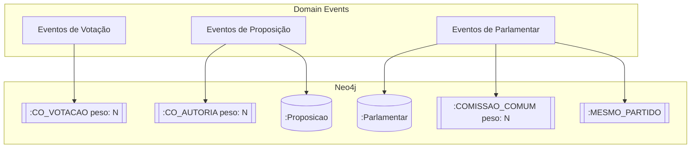

# ADR-004: Escolha do Graph Database

> Brasil a Vera · Arquitetura · v0.1
> Última atualização: 2026-04-14
> Status: accepted

---

## Sumário

- [Contexto](#contexto)
- [Decisão](#decisão)
- [Alternativas Consideradas](#alternativas-consideradas)
- [Consequências](#consequências)
- [Referências](#referências)

---

## Contexto

O [ADR-003](003-database-strategy.md) estabeleceu a estratégia de persistência poliglota com um graph database como analytical twin para o [Grafo Legislativo](../../features/LEGISLATIVE-GRAPH.md). Precisamos escolher qual graph database utilizar.

Requisitos do Grafo Legislativo:

- **~600 nós** (deputados + senadores) com propriedades ricas (partido, estado, comissões)
- **Milhões de arestas** — co-votação ao longo de múltiplas legislaturas, co-autoria, comissões em comum
- **4 tipos de aresta** com pesos: co-votação, co-autoria, comissão, partido/bloco (ver [Grafo Legislativo](../../features/LEGISLATIVE-GRAPH.md))
- **Queries de traversal** — adjacência (quem co-vota com quem), caminho (graus de separação), vizinhança
- **Métricas de centralidade** — betweenness, closeness, degree para identificar brokers e pontes
- **Detecção de comunidades** — Louvain/Leiden para identificar clusters reais vs. partidos formais
- **Evolução temporal** — snapshots do grafo por período (mês, semestre, legislatura)
- **Custo zero ou baixo** — projeto open-source sem funding inicial
- **Driver Go nativo** — integração com o backend Go ([ADR-002](002-backend-language-and-framework.md))
- **Executável localmente** — contribuidores devem rodar com `docker-compose`

## Decisão

**Adotamos Neo4j Community Edition** como graph database do Brasil a Vera.

Justificativas principais:

| Critério | Neo4j CE |
|----------|----------|
| Modelo de dados | Property graph nativo (labeled property graph) |
| Linguagem de query | Cypher — declarativa, legível, amplamente documentada |
| Algoritmos de grafo | Neo4j Graph Data Science (GDS) library — Louvain, PageRank, betweenness, etc. |
| Driver Go | Driver oficial mantido pela Neo4j (`neo4j-go-driver`) |
| Licença | GPLv3 (Community Edition) — compatível com open-source |
| Docker | Imagem oficial, configuração simples |
| Comunidade | Maior comunidade de graph database, abundância de recursos |

### Uso no projeto

### Modelo de dados no Neo4j

- **Nós**: `(:Parlamentar {id, nome, partido, uf, trust_level: "L1"})`, `(:Proposicao {id, tipo, ementa, trust_level: "L1"})`
- **Arestas**: `[:CO_VOTACAO {peso, periodo, trust_level: "L1"}]`, `[:CO_AUTORIA {peso, trust_level: "L1"}]`, `[:COMISSAO_COMUM {peso, trust_level: "L1"}]`, `[:MESMO_PARTIDO {trust_level: "L1"}]`
- **Métricas de centralidade**: calculadas como propriedades do nó (L2), recalculadas periodicamente
- **Clusters**: resultado de detecção de comunidades, armazenados como label adicional no nó (L2/L3)

## Alternativas Consideradas

### Apache AGE (extensão PostgreSQL)

- **Prós**: roda dentro do PostgreSQL existente (sem segundo banco), linguagem openCypher, sem custo adicional
- **Contras**: projeto relativamente jovem, sem library equivalente ao GDS para algoritmos de grafo, performance em traversals profundos não validada em escala, driver Go imaturo
- **Veredicto**: promissor para o futuro, mas maturidade insuficiente para depender dele agora. Pode ser reavaliado quando amadurecer.

### Amazon Neptune

- **Prós**: managed service, suporta property graph (openCypher) e RDF
- **Contras**: vendor lock-in AWS, custo significativo para projeto sem funding, não roda localmente, sem versão community
- **Veredicto**: incompatível com princípios de custo zero e independência de cloud

### ArangoDB

- **Prós**: multi-model (document + graph), sem necessidade de banco separado
- **Contras**: linguagem de query própria (AQL, não Cypher), library de algoritmos menos rica que GDS, comunidade menor, driver Go menos maduro
- **Veredicto**: viável, mas Cypher e o ecossistema Neo4j são superiores para o caso de uso de grafo puro

### JanusGraph

- **Prós**: open-source, distribuído, suporta múltiplos backends
- **Contras**: complexidade operacional alta (depende de Cassandra/HBase + Elasticsearch), overhead desproporcional para ~600 nós, sem driver Go oficial
- **Veredicto**: sobredimensionado para o volume de dados do Brasil a Vera

## Consequências

### Positivas

- Cypher é legível e acessível para contribuidores que não conhecem graph databases
- GDS library fornece algoritmos de centralidade e detecção de comunidades out-of-the-box
- Ecossistema maduro com Neo4j Browser para exploração visual (útil para desenvolvimento)
- Community Edition é suficiente — não precisamos de features enterprise (clustering, role-based access)
- `trust_level` persiste como propriedade em nós e arestas, alinhado com a Pirâmide de Confiança

### Negativas

- **Community Edition é single-instance** — sem clustering nativo para alta disponibilidade — mitigação: acceptable para o volume e criticidade (grafo é L2/L3, não L1 core)
- **GDS library tem licença separada** (NTCL) — pode ser usada para avaliação e projetos não comerciais; se o projeto escalar comercialmente, alternativas open-source de algoritmos podem ser necessárias — mitigação: algoritmos básicos podem ser implementados diretamente em Cypher ou Go
- **Segundo banco para operar** — mitigação: `docker-compose` abstrai a complexidade para desenvolvimento local

### Neutras

- Migração futura para Apache AGE seria possível se a extensão amadurecer, dado que ambos suportam Cypher/openCypher

## Referências

- [Neo4j Community Edition](https://neo4j.com/download-center/#community)
- [Neo4j Go Driver](https://github.com/neo4j/neo4j-go-driver)
- [Neo4j Graph Data Science Library](https://neo4j.com/docs/graph-data-science/current/)
- [Cypher Query Language](https://neo4j.com/docs/cypher-manual/current/)
