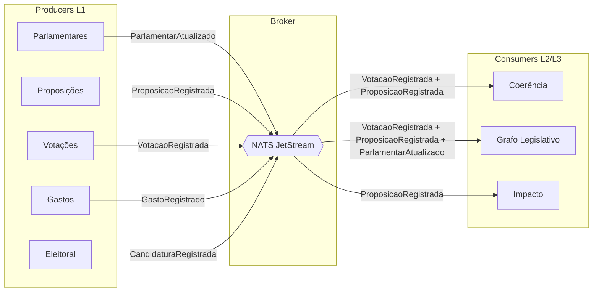

# ADR-005: Comunicação Event-Driven entre Bounded Contexts

> Brasil a Vera · Arquitetura · v0.1
> Última atualização: 2026-04-14
> Status: accepted

---

## Sumário

- [Contexto](#contexto)
- [Decisão](#decisão)
- [Alternativas Consideradas](#alternativas-consideradas)
- [Consequências](#consequências)
- [Referências](#referências)

---

## Contexto

O Brasil a Vera é composto por 9 bounded contexts (ver [Bounded Contexts](../BOUNDED-CONTEXTS.md)) que precisam trocar informações sem acoplamento direto. Especificamente:

- **Coerência** consome dados de Votações e Proposições para detectar pares contraditórios
- **Grafo Legislativo** consome dados de Votações, Proposições e Parlamentares para construir a rede de vínculos
- **Impacto** consome dados de Proposições para correlacionar com indicadores externos

O princípio arquitetural da [Pirâmide de Confiança](../TRUST-PYRAMID.md) exige que contextos de L3/L4 (Impacto) nunca contaminem contextos de L1 (Parlamentares, Votações). O isolamento deve ser estrutural, não convencional.

Restrições:

- Bounded contexts não fazem queries diretos ao banco de outro contexto
- A comunicação deve ser assíncrona para desacoplar ciclos de vida e deploy
- O mecanismo deve ser simples de operar — projeto open-source com orçamento zero
- Contribuidores devem conseguir rodar localmente com `docker-compose`
- Garantia de entrega: at-least-once é suficiente (consumers devem ser idempotentes)

## Decisão

**Adotamos comunicação via domain events assíncronos usando NATS JetStream como message broker.**

### Arquitetura de eventos



### Por que NATS JetStream

| Critério | NATS JetStream |
|----------|---------------|
| Complexidade operacional | Binário único, config mínima, sem ZooKeeper/Kraft |
| Performance | Latência sub-milissegundo, throughput alto |
| Persistência | JetStream oferece persistência com replay e consumer groups |
| Garantia de entrega | At-least-once com ack explícito |
| Docker | Imagem oficial leve (~20MB) |
| Driver Go | Client oficial de primeira classe (`nats.go`) |
| Licença | Apache 2.0 |
| Custo | Zero — open-source, single binary |

### Contratos de eventos

Eventos são definidos no shared kernel `libs/domain-events/` (ver [ADR-001](001-monorepo-strategy.md)) como structs Go com serialização JSON. Cada evento carrega:

```go
type DomainEvent struct {
    ID            string    `json:"id"`             // UUID v7
    Type          string    `json:"type"`           // ex: "votacao.registrada"
    Source        string    `json:"source"`         // bounded context de origem
    OccurredAt    time.Time `json:"occurred_at"`    // timestamp do fato
    TrustLevel    string    `json:"trust_level"`    // L1, L2, L3, L4
    CorrelationID string    `json:"correlation_id"` // rastreabilidade
    Payload       any       `json:"payload"`        // dados específicos do evento
}
```

### Tópicos (subjects)

Convenção: `bav.<context>.<aggregate>.<action>`

| Subject | Producer | Consumers |
|---------|----------|-----------|
| `bav.votacoes.votacao.registrada` | Votações | Coerência, Grafo |
| `bav.proposicoes.proposicao.registrada` | Proposições | Coerência, Grafo, Impacto |
| `bav.parlamentares.parlamentar.atualizado` | Parlamentares | Grafo |
| `bav.gastos.gasto.registrado` | Gastos | (futuro) |
| `bav.eleitoral.candidatura.registrada` | Eleitoral | (futuro) |

### Streams e consumers

- Um **stream** por bounded context produtor (ex: `VOTACOES`, `PROPOSICOES`)
- **Durable consumers** por bounded context consumidor (ex: `coerencia-votacoes`, `grafo-votacoes`)
- Retention policy: `WorkQueue` para consumers exclusivos, `Interest` para fan-out
- Replay: consumers podem ser reiniciados do início do stream para reprocessamento

## Alternativas Consideradas

### RabbitMQ

- **Prós**: maduro, bem documentado, suporte a múltiplos protocolos (AMQP, MQTT, STOMP), UI de management
- **Contras**: mais complexo de operar que NATS, Erlang runtime, consumo de memória maior, driver Go funcional mas menos idiomático
- **Veredicto**: viável, mas NATS é mais simples e leve para o caso de uso

### Apache Kafka

- **Prós**: padrão da indústria para event streaming, log imutável, replay nativo, ecossistema rico
- **Contras**: complexidade operacional muito alta (ZooKeeper/KRaft, partições, rebalancing), consumo de recursos desproporcional para o volume do Brasil a Vera (~600 parlamentares, sync diário), curva de aprendizado íngreme para contribuidores
- **Veredicto**: sobredimensionado — Kafka resolve problemas que o Brasil a Vera não tem

### PostgreSQL LISTEN/NOTIFY + Outbox Pattern

- **Prós**: sem infraestrutura adicional (reutiliza PostgreSQL existente), transactional outbox garante consistência
- **Contras**: LISTEN/NOTIFY não persiste mensagens (se o consumer estiver offline, perde), outbox requer polling ou CDC, sem consumer groups nativos, não escala para múltiplos consumers independentes
- **Veredicto**: aceitável como stepping stone no Wave 0 se NATS for prematuramente complexo, mas não como solução definitiva. Pode ser usado como fallback.

### Comunicação síncrona (HTTP/gRPC entre serviços)

- **Prós**: simples de implementar, sem broker adicional
- **Contras**: acoplamento temporal (se Coerência está fora, Votações falha?), cascading failures, viola o princípio de isolamento da Pirâmide de Confiança
- **Veredicto**: incompatível com os princípios arquiteturais do projeto

## Consequências

### Positivas

- **Desacoplamento real** — bounded contexts não conhecem seus consumers; publicam eventos e pronto
- **Isolamento da Pirâmide** — L3/L4 consomem via eventos, nunca acessam L1 diretamente; remover Impacto não afeta Votações
- **Replay** — se Coerência tiver bug, pode reprocessar todos os eventos desde o início
- **Simplicidade operacional** — NATS é um binário de ~20MB, configuração mínima
- **Idempotência forçada** — at-least-once obriga consumers a serem idempotentes, o que é bom para resiliência

### Negativas

- **Eventual consistency** — consumers processam eventos com delay (milissegundos a segundos) — mitigação: acceptable dado que dados são ingeridos em batch diário
- **Infraestrutura adicional** — NATS é mais um componente para operar — mitigação: binário único, `docker-compose` inclui
- **Debug mais difícil** — rastrear fluxo de eventos é menos intuitivo que request/response — mitigação: `correlation_id` em todos os eventos, logging estruturado

### Neutras

- Se o volume crescer dramaticamente (assembleias estaduais, Wave 4), NATS JetStream escala horizontalmente com clustering

## Referências

- [NATS JetStream Documentation](https://docs.nats.io/nats-concepts/jetstream)
- [NATS Go Client](https://github.com/nats-io/nats.go)
- [Domain Events — Martin Fowler](https://martinfowler.com/eaaDev/DomainEvent.html)
