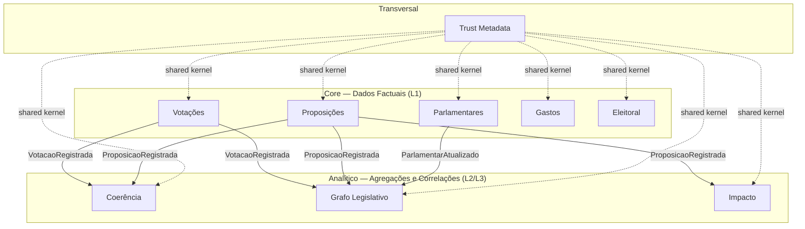
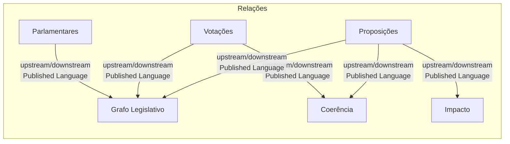

# Bounded Contexts

> Brasil a Vera · Arquitetura · v0.3
> Última atualização: 2026-07-01
> Status: accepted

---

## Sumário

- [Visão Geral](#visão-geral)
- [Mapa de Contextos](#mapa-de-contextos)
- [Contextos Core (L1)](#contextos-core-l1)
- [Contextos Analíticos (L2/L3)](#contextos-analíticos-l2l3)
- [Shared Kernel](#shared-kernel)
- [Relações entre Contextos](#relações-entre-contextos)
- [Regras de Comunicação](#regras-de-comunicação)

---

## Visão Geral

O Brasil a Vera é modelado segundo Domain-Driven Design (DDD) com bounded contexts que refletem o domínio legislativo brasileiro e os níveis da [Pirâmide de Confiança](TRUST-PYRAMID.md). Cada contexto é autónomo: tem seu próprio modelo de domínio, repositório, use cases e routes.

Cada contexto vive como módulo TypeScript em `src/modules/<contexto>/` dentro do monolito Next.js (ver [ADR-007](ADR/007-monolith-first-strategy.md)). O projeto permanece monolito TypeScript per [ADR-020](ADR/020-permanencia-monolito-typescript.md) — extração para microserviços Go foi descartada definitivamente.

A separação em contextos não é apenas organizacional — é a garantia estrutural de que dados factuais (L1) nunca são contaminados por análises derivadas (L3/L4).

## Mapa de Contextos

**Legenda**: setas sólidas = comunicação entre contextos (chamada de função no monolito, sem plano de migração para NATS (ver [ADR-020](ADR/020-permanencia-monolito-typescript.md))); setas tracejadas = dependência de shared kernel.

## Contextos Core (L1)

Estes contextos armazenam dados factuais verificáveis, provenientes diretamente de fontes oficiais. Cada registro carrega URL da fonte primária.

### Parlamentares

| Atributo | Valor |
|----------|-------|
| **Responsabilidade** | Perfil do parlamentar: dados pessoais, mandato atual, histórico de partidos, comissões titulares/suplentes, frentes parlamentares |
| **Aggregate root** | `Parlamentar` |
| **Trust level** | L1 |
| **Fontes** | Câmara API (`/deputados`), Senado API (`/senadores`) |
| **Eventos publicados** | `ParlamentarAtualizado`, `MandatoIniciado`, `ComissaoAlterada` |
| **Consumers** | Grafo Legislativo |

É o aggregate root central do sistema — quase todas as consultas do usuário partem de um parlamentar.

### Proposições

| Atributo | Valor |
|----------|-------|
| **Responsabilidade** | Proposições legislativas: PL, PEC, MP, PDL, PRC. Autoria, tramitação, relator, temas, ementa, estado atual |
| **Aggregate root** | `Proposicao` |
| **Trust level** | L1 |
| **Fontes** | Câmara API (`/proposicoes`), Senado API (`/materias`), LexML |
| **Eventos publicados** | `ProposicaoRegistrada`, `TramitacaoAtualizada`, `RelatorDesignado` |
| **Consumers** | Coerência, Grafo Legislativo, Impacto |

Atenção ao domínio: uma proposição pode ter substitutivos que alteram completamente o texto original. O modelo deve capturar versões para que o [Motor de Coerência](../future/COHERENCE-ENGINE.md) tenha contexto (ver [Processo Legislativo](../domain/LEGISLATIVE-PROCESS.md)).

### Votações

| Atributo | Valor |
|----------|-------|
| **Responsabilidade** | Votações nominais: votos individuais (SIM/NÃO/abstenção/ausência/obstrução), orientação de bancada, quórum, resultado |
| **Aggregate root** | `Votacao` |
| **Trust level** | L1 |
| **Fontes** | Câmara API (`/votacoes`), Senado API (`/votacoes`) |
| **Eventos publicados** | `VotacaoRegistrada`, `VotoNominalRegistrado` |
| **Consumers** | Coerência, Grafo Legislativo |

Distinção importante: votação nominal (voto individual registrado) vs. votação simbólica (sem registro individual). O Brasil a Vera só opera sobre votações nominais para dados L1.

### Gastos

| Atributo | Valor |
|----------|-------|
| **Responsabilidade** | Cota para Exercício da Atividade Parlamentar (CEAP), verba de gabinete, auxílio-moradia. Por categoria, fornecedor e período |
| **Aggregate root** | `Gasto` |
| **Trust level** | L1 |
| **Fontes** | Câmara API (`/deputados/{id}/despesas`), Senado API, Portal da Transparência |
| **Eventos publicados** | `GastoRegistrado` |
| **Consumers** | (futuro: correlação gastos × votações) |

### Eleitoral

| Atributo | Valor |
|----------|-------|
| **Responsabilidade** | Histórico de candidaturas, doações de campanha (doadores, valores, CNPJs), bens declarados, resultados eleitorais |
| **Aggregate root** | `Candidatura` |
| **Trust level** | L1 |
| **Fontes** | TSE Dados Abertos (CSV/bulk) |
| **Eventos publicados** | `CandidaturaRegistrada`, `DoacaoRegistrada` |
| **Consumers** | (futuro: correlação doações × votos em L3) |

Integração completa: bens 2014/2018/2022 ingeridos (Camadas A/B/C/D); doações de campanha não existem (issue #98). Dados do TSE são em CSV bulk — pipeline de ingestão diferente das APIs REST.

## Contextos Analíticos (L2/L3)

Estes contextos consomem dados dos contextos core sem acesso direto ao banco dos contextos L1. A comunicação é via chamada de serviço TypeScript dentro do monolito. Domain events são contratos TypeScript em `src/shared/domain-events/` — sem transporte assíncrono planejado (ADR-020).

### Coerência

| Atributo | Valor |
|----------|-------|
| **Responsabilidade** | Detecção de pares de votos contraditórios, índice de coerência temática |
| **Trust level** | L2 (agregações determinísticas com fórmula pública) |
| **Consome eventos de** | Votações (`VotacaoRegistrada`), Proposições (`ProposicaoRegistrada`) |
| **Eventos publicados** | `ParContraditórioDetectado`, `IndiceCoerenciaCalculado` |
| **Spec detalhada** | [Motor de Coerência](../future/COHERENCE-ENGINE.md) |

Princípio: falso negativo > falso positivo. Apenas classificações inequívocas de direção (restritiva/permissiva) geram pares.

### Grafo Legislativo

| Atributo | Valor |
|----------|-------|
| **Responsabilidade** | Rede de vínculos entre parlamentares, métricas de centralidade, detecção de comunidades, evolução temporal |
| **Trust level** | L2 (arestas e métricas) / L3 (detecção de comunidades e interpretação de clusters) |
| **Consome eventos de** | Votações, Proposições, Parlamentares |
| **Persistência** | PostgreSQL + ReactFlow para visualização (issue #96). Graph database dedicado não planejado (ADR-019). |
| **Spec detalhada** | [Grafo Legislativo](../future/LEGISLATIVE-GRAPH.md) |

### Impacto

| Atributo | Valor |
|----------|-------|
| **Responsabilidade** | Correlação temporal entre proposições aprovadas e indicadores socioeconómicos (IBGE, IPEA) |
| **Trust level** | L3/L4 |
| **Consome eventos de** | Proposições (`ProposicaoRegistrada`) |
| **Fontes externas** | IBGE, IPEA Data |
| **Spec detalhada** | (Wave 3+, a definir) |

Contexto L4 opera sob sub-brand "Brasil a Vera Labs" com identidade visual distinta. Isolamento máximo — se todo o código de Impacto for removido, o restante do sistema funciona sem alteração.

## Shared Kernel

### Trust Metadata

| Atributo | Valor |
|----------|-------|
| **Responsabilidade** | Vocabulário de `trust_level` (L1–L4), regras de classificação, textos de disclaimer, validação |
| **Tipo** | Shared kernel — importado por todos os bounded contexts |
| **Localização** | `src/shared/trust/` (ver [ADR-001](ADR/001-monorepo-strategy.md)) |

O Trust Metadata define:

- Enum de níveis: `L1`, `L2`, `L3`, `L4`
- Regras de classificação: critérios para cada nível
- Disclaimers: textos obrigatórios para L3 e L4
- Validação: garantia de que todo registro tem `trust_level` atribuído

Detalhes completos na [Pirâmide de Confiança](TRUST-PYRAMID.md).

## Relações entre Contextos

| Relação | Tipo DDD | Descrição |
|---------|----------|-----------|
| Core → Analítico | Published Language (domain events) | Contextos core publicam eventos com contratos estáveis; analíticos consomem |
| Trust Metadata → Todos | Shared Kernel | Vocabulário comum importado, não duplicado |
| Entre contextos Core | Nenhuma dependência direta | Parlamentares, Votações e Proposições não se consultam; a relação entre um parlamentar e seus votos é resolvida na camada de aplicação/API via IDs |

## Regras de Comunicação

### Monolito Next.js (permanente — ADR-020)

1. **Chamada de serviço, nunca queries diretas ao banco** — um módulo nunca faz query ao schema de outro. Comunicação é via interface de serviço TypeScript (chamada de função síncrona)
2. **Biome `noRestrictedImports`** — bloqueia imports cruzados entre módulos no CI (ver [ADR-006](ADR/006-frontend-stack.md#import-boundaries-biome))
3. **Contratos em shared kernel** — domain events são interfaces TypeScript definidas em `src/shared/domain-events/`, documentando os contratos entre contextos
4. **Direção única: Core → Analítico** — contextos L1 fornecem dados; contextos L2/L3 consomem. Nunca o inverso.
5. **Falha isolada** — se o módulo Coerência falhar, Votações e Proposições continuam funcionando normalmente
