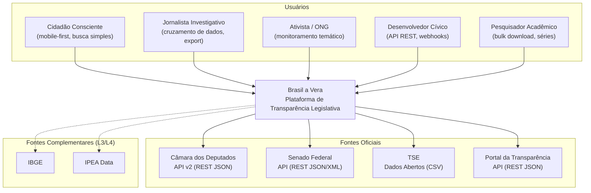
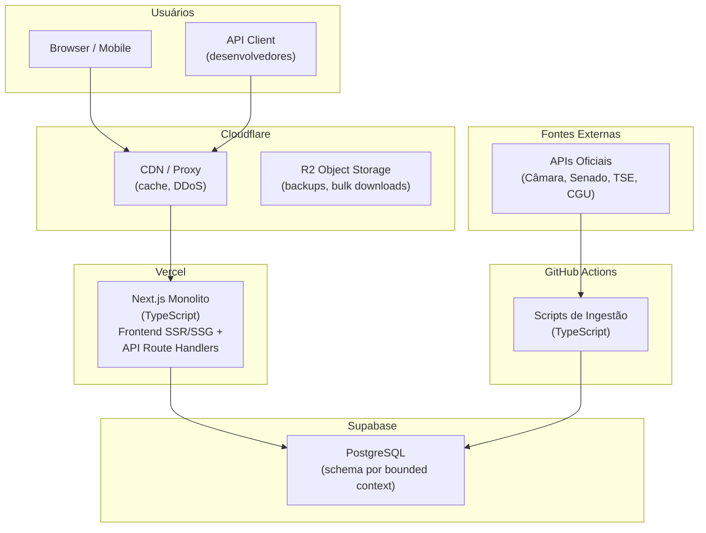
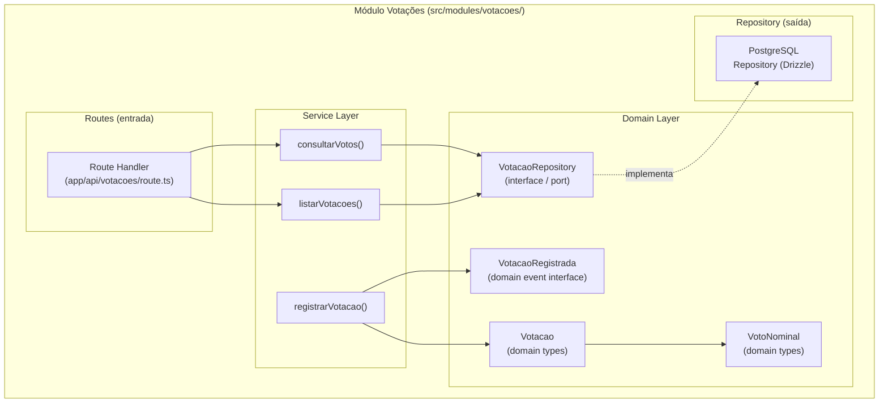
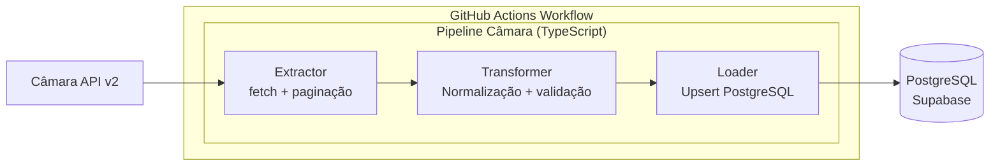
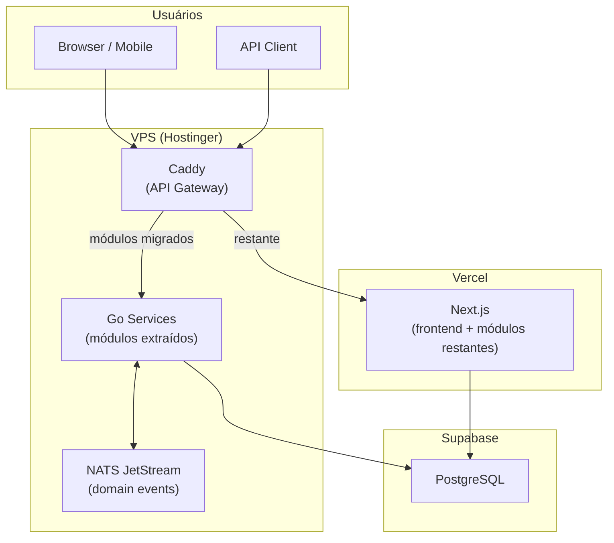

# Diagramas C4

> Brasil a Vera · Arquitetura · v0.2
> Última atualização: 2026-04-14
> Status: draft

---

## Sumário

- [Nível 1 — Contexto do Sistema](#nível-1--contexto-do-sistema)
- [Nível 2 — Containers (Waves 0–2)](#nível-2--containers-waves-02)
- [Nível 3 — Componentes (Módulo Backend)](#nível-3--componentes-módulo-backend)
- [Nível 3 — Componentes (Ingestão)](#nível-3--componentes-ingestão)
- [Nível 2 — Containers (Wave 3+)](#nível-2--containers-wave-3)

---

## Nível 1 — Contexto do Sistema

Visão de alto nível: quem usa o Brasil a Vera e com que sistemas externos ele se integra.

## Nível 2 — Containers (Waves 0–2)

Componentes de deploy do sistema durante as Waves 0–2 (monolito Next.js).

### Descrição dos containers (Waves 0–2)

| Container | Tecnologia | Responsabilidade |
|-----------|-----------|-----------------|
| Next.js Monolito | TypeScript, Vercel | Frontend SSR/SSG + API Route Handlers. Módulos internos por bounded context em `src/modules/` |
| PostgreSQL | Supabase (free tier) | Core transacional — schema por bounded context. Trust level em todas as tabelas |
| Scripts de Ingestão | TypeScript (`tsx`), GitHub Actions | Sync periódico com APIs oficiais. Executados via cron workflows, nunca na Vercel |
| CDN / Proxy | Cloudflare (free) | Cache, DDoS protection, SSL |
| Object Storage | Cloudflare R2 (free) | Backups, bulk downloads (Wave 2) |

> **Wave 3+**: módulos Go são extraídos do monolito via Strangler Fig. Um API Gateway (Caddy) na frente roteia requests entre Next.js e os microserviços Go. NATS JetStream é introduzido para domain events. Ver diagrama abaixo.

## Nível 3 — Componentes (Módulo Backend)

Detalhamento interno de um bounded context representativo (Votações) no monolito Next.js. Todos os bounded contexts seguem a mesma estrutura (ver [ADR-002](ADR/002-backend-language-and-framework.md)).

### Fluxo de dados

1. **Ingestão** → Script TypeScript no GitHub Actions extrai votações da API da Câmara/Senado e persiste no PostgreSQL
2. **Service** → Módulo Coerência chama `VotacaoService.consultarVotos()` via interface de serviço (chamada de função síncrona no monolito)
3. **API Query** → Route Handler recebe request, aciona service `consultarVotos()`, retorna com `trust_level: L1`
4. **Wave 3+** → O service publica `VotacaoRegistrada` no NATS em vez de ser chamado diretamente

## Nível 3 — Componentes (Ingestão)

Cada pipeline segue o padrão ETL:

| Fase | Responsabilidade |
|------|-----------------|
| **Extract** | Chamada HTTP à API externa com retry, paginação, rate limiting |
| **Transform** | Normalização de encoding (UTF-8), datas (ISO 8601), IDs; validação com Zod; enriquecimento com `trust_level: L1` e `source_url` |
| **Load** | Upsert idempotente no PostgreSQL via ID da fonte |

Scripts executados via `tsx` (TypeScript runner). Schedules configurados no GitHub Actions workflow (ver [Fontes de Dados](DATA-SOURCES.md)).

## Nível 2 — Containers (Wave 3+)

Visão futura quando os primeiros módulos Go são extraídos via Strangler Fig.

Detalhes da estratégia de migração no [ADR-007](ADR/007-monolith-first-strategy.md).
