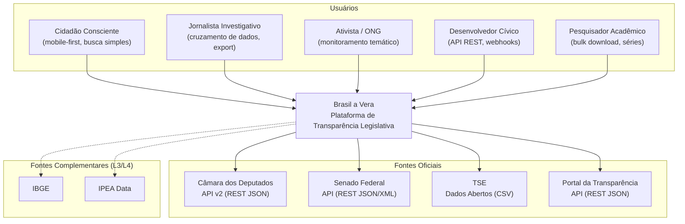
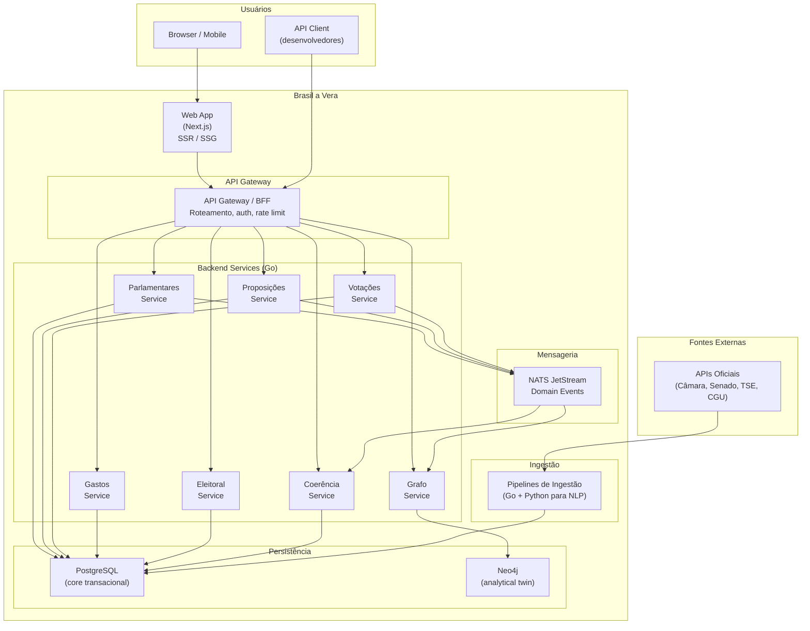
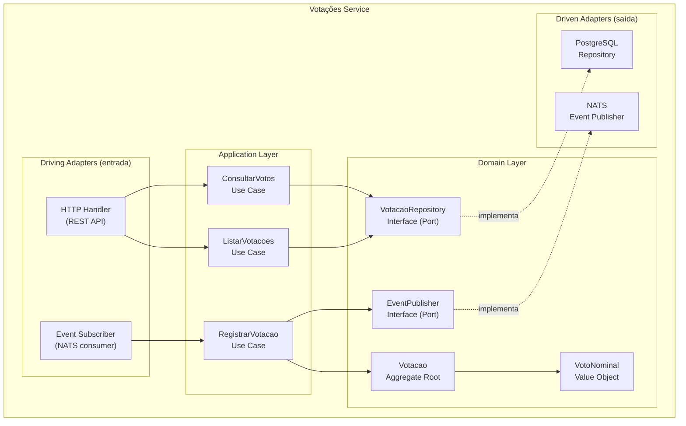
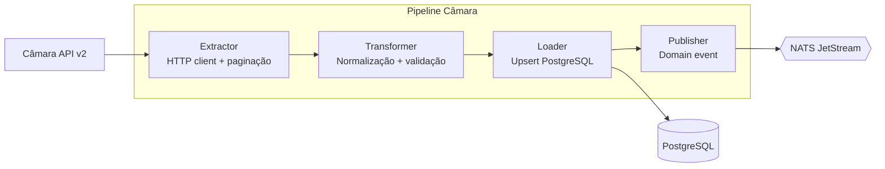

# Diagramas C4

> Brasil a Vera · Arquitetura · v0.1
> Última atualização: 2026-04-14
> Status: draft

---

## Sumário

- [Nível 1 — Contexto do Sistema](#nível-1--contexto-do-sistema)
- [Nível 2 — Containers](#nível-2--containers)
- [Nível 3 — Componentes (Backend)](#nível-3--componentes-backend)
- [Nível 3 — Componentes (Ingestão)](#nível-3--componentes-ingestão)

---

## Nível 1 — Contexto do Sistema

Visão de alto nível: quem usa o Brasil a Vera e com que sistemas externos ele se integra.

## Nível 2 — Containers

Componentes de deploy do sistema e como se comunicam.

### Descrição dos containers

| Container | Tecnologia | Responsabilidade |
|-----------|-----------|-----------------|
| Web App | Next.js (TypeScript) | Interface web com SSR/SSG, SEO, compartilhamento social |
| API Gateway / BFF | Go (ou NGINX + config) | Roteamento, autenticação de API keys, rate limiting, CORS |
| Backend Services | Go | Um serviço por bounded context, Clean Architecture |
| NATS JetStream | NATS | Message broker para domain events entre bounded contexts |
| PostgreSQL | PostgreSQL 16+ | Core transacional — schema por bounded context |
| Neo4j | Neo4j CE | Grafo legislativo — analytical twin alimentado por eventos |
| Pipelines de Ingestão | Go + Python | Sync com APIs oficiais, normalização, persistência |

## Nível 3 — Componentes (Backend)

Detalhamento interno de um bounded context representativo (Votações). Todos os bounded contexts seguem a mesma estrutura hexagonal (ver [ADR-002](ADR/002-backend-language-and-framework.md)).

### Fluxo de dados

1. **Ingestão** → Pipeline extrai votações da API da Câmara/Senado e publica evento `VotacaoBrutaExtraida` no NATS
2. **Event Subscriber** → Consome o evento e aciona o use case `RegistrarVotacao`
3. **Use Case** → Valida, cria aggregate `Votacao` com votos nominais, persiste via `VotacaoRepository`
4. **Domain Event** → Após persistir, publica `VotacaoRegistrada` via `EventPublisher`
5. **Consumers externos** → Coerência e Grafo Legislativo consomem `VotacaoRegistrada`
6. **API Query** → HTTP Handler recebe request, aciona use case `ConsultarVotos`, retorna com `trust_level: L1`

## Nível 3 — Componentes (Ingestão)

Cada pipeline segue o padrão ETL:

| Fase | Responsabilidade |
|------|-----------------|
| **Extract** | Chamada HTTP à API externa com retry, paginação, rate limiting |
| **Transform** | Normalização de encoding (UTF-8), datas (ISO 8601), IDs; validação de schema; enriquecimento com `trust_level: L1` e `source_url` |
| **Load** | Upsert idempotente no PostgreSQL via ID da fonte |
| **Publish** | Publicação de domain event no NATS para consumers downstream |

Detalhes das fontes e estratégia de ingestão em [Fontes de Dados](DATA-SOURCES.md).
