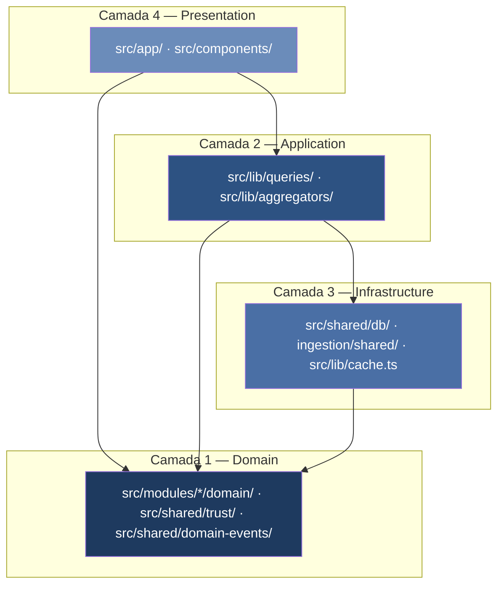

# Clean Architecture — Brasil a Vera

> Brasil a Vera · Arquitetura · v1.0
> Última atualização: 2026-07-01
> Status: accepted

---

O projeto organiza o código em camadas concêntricas seguindo os princípios de Clean
Architecture de Robert C. Martin. A regra de dependência é unidirecional: camadas
externas dependem de internas, nunca o inverso.

## Diagrama de Camadas

A seta indica direção de dependência (quem importa quem). O núcleo (Domain) não
importa nada das camadas externas.

---

## Camada 1 — Domain (núcleo)

**Localização**: `src/modules/*/domain/`, `src/shared/trust/`, `src/shared/domain-events/`

Esta é a camada de mais alto nível. Contém as regras de negócio puras do domínio
legislativo brasileiro, independentes de qualquer framework, banco ou protocolo HTTP.

**Regras**:
- Funções puras — zero IO, zero imports de `next/`, `drizzle-orm`, `pg`, `fetch`
- Testável em isolamento com Vitest, sem banco ou servidor
- Tipos e validações Zod para dados de domínio
- Sem estado global mutable

**Exemplos reais no código**:

| Arquivo | Responsabilidade |
|---------|-----------------|
| `src/modules/parlamentar/domain/alinhamento.ts` | Cálculo de índice de alinhamento (Sim/Não/Abstenção vs. orientação) |
| `src/modules/eleitoral/domain/patrimonio.ts` | Correção IPCA, variação patrimonial real (`buildEvolucao`) |
| `src/shared/trust/types.ts` | Enum `TrustLevel` (L1–L4) e classificadores |
| `src/shared/domain-events/types.ts` | Interfaces de domain events entre bounded contexts |

**O que não entra aqui**: queries SQL, chamadas HTTP, `process.env`, imports do Next.js.

---

## Camada 2 — Application (use cases)

**Localização**: `src/lib/queries/`, `src/lib/aggregators/`, `src/modules/*/`

Orquestra o domínio para atender casos de uso concretos da aplicação. Sabe quais
dados buscar e como combinar resultados de múltiplas queries, mas não sabe como
renderizar nem como executar SQL diretamente.

**Regras**:
- Toda query nova em `src/lib/queries/` deve usar `cached()` de `src/lib/cache.ts` (ADR-018)
- Sem imports diretos de `@neondatabase/serverless` ou `pg` nesta camada
- Aggregators (`src/lib/aggregators/`) compõem múltiplas queries para server components

**Exemplos reais**:

| Arquivo | Responsabilidade |
|---------|-----------------|
| `src/lib/queries/parlamentares.ts` | Listar/buscar parlamentares com filtros e paginação cursor |
| `src/lib/queries/votacoes.ts` | Buscar votações nominais com votos individuais |
| `src/lib/aggregators/parlamentar.ts` | Compor perfil completo (mandato + comissões + KPIs) |

**Invariante**: nenhuma server component chama `db` diretamente — sempre via uma função
exportada de `src/lib/queries/`.

---

## Camada 3 — Infrastructure (adapters)

**Localização**: `src/shared/db/`, `ingestion/shared/`, `src/lib/cache.ts`, `src/lib/resend-client.ts`

Implementa os detalhes de IO: banco de dados, HTTP externo, cache, email. Esta camada
conhece os frameworks e drivers concretos; o domínio não precisa saber que o banco é
PostgreSQL ou que o cache é Cloudflare KV.

**Split de driver — a decisão mais crítica desta camada** (ADR-015/011):

| Driver | Arquivo | Contexto | Capacidade |
|--------|---------|----------|-----------|
| `@neondatabase/serverless` (HTTP) | `src/shared/db/index.ts` | Cloudflare Workers / edge | Sem transações multi-statement |
| `node-postgres` (TCP) | `ingestion/shared/db.ts` | GitHub Actions / Node.js | Transações completas |

O guard `DB_DRIVER=node-postgres` em dev local ativa o driver TCP via branch de código
com `as unknown as` (costura de tipos — os dois drivers não têm supertipo comum).

**Exemplos reais**:

| Arquivo | Responsabilidade |
|---------|-----------------|
| `src/shared/db/index.ts` | Driver neon-http, schema Drizzle re-exportado |
| `src/shared/db/schema.ts` | Re-exporta todos os schemas de módulos para o Drizzle Kit |
| `ingestion/shared/db.ts` | Pool node-postgres para scripts ETL |
| `ingestion/shared/http.ts` | `fetchWithRetry` (3 tentativas: 1s/5s/30s, timeout 30s) |
| `src/lib/cache.ts` | `cached()` wrapper — edge cache + app cache via Next.js |

**Regra de ouro**: `ingestion/` nunca é importado pelo bundle do app. Build time é
o canário — salto de ~975ms para 5s+ indica vazamento (CLAUDE.md §feedback).

---

## Camada 4 — Presentation (UI + API)

**Localização**: `src/app/`, `src/components/`

React Server Components e Client Components. Consome a camada Application, nunca
acessa banco diretamente. Componentes de domínio são construídos sobre
`@fabio.caffarello/react-design-system` (ADR-053).

**Regras**:
- Server Components chamam funções de `src/lib/queries/` (nunca `db` diretamente)
- Páginas de detalhe usam SSG + `revalidate` (não dynamic rendering — CLAUDE.md §9)
- Dynamic rendering somente em buscas e filtros customizados
- Componentes de domínio em `src/components/` são construídos *sobre* composições do RDS, não reinventam layout

**Exemplos reais**:

| Arquivo | Padrão |
|---------|--------|
| `src/app/parlamentares/[id]/page.tsx` | SSG + `revalidate`, consome `getParlamentarPerfil()` |
| `src/app/parlamentares/page.tsx` | Dynamic (filtros), consome `getParlamentares()` |
| `src/components/parlamentar/KpiStrip.tsx` | Componente de domínio sobre RDS `StatsGrid` |
| `src/app/api/health/route.ts` | Dinâmico por design — não toca banco |

---

## Regras de Dependência

| Camada | Pode importar de | NÃO pode importar de |
|--------|-----------------|---------------------|
| Domain (1) | Nada além de stdlib/Zod/tipos puros | Application, Infrastructure, Presentation |
| Application (2) | Domain | Infrastructure diretamente, Presentation |
| Infrastructure (3) | Domain | Application, Presentation |
| Presentation (4) | Application, Domain, Infrastructure (via cache) | `ingestion/` |

**Nota sobre Infrastructure**: `src/lib/cache.ts` é Infrastructure que a Presentation
importa diretamente — isso é intencional (é o adapter de cache do Next.js, não lógica
de domínio).

---

## Pontos de Violação Sancionados

Estas são violações conhecidas da regra de dependência estrita, aceitas com justificativa
explícita:

| Violação | Justificativa |
|----------|---------------|
| `ingestion/` acessa `db` (node-postgres) diretamente | `ingestion/` é Infrastructure — o acesso direto ao banco é sua responsabilidade |
| Server Components em `src/app/` às vezes importam `cached()` (Infrastructure) | `cached()` é um adapter de cache transparente sem lógica de domínio |
| Wrappers de bundle RDS (`rds-accordion`, `rds-dialog`, etc.) em `src/design-system/` | Sancionados em ADR-038: importar `/granular` do RDS vaza +294KB; wrappers são a solução de bundle |
| `src/shared/db/schema.ts` é importado tanto por Application quanto por Infrastructure | É o único ponto de verdade do schema Drizzle; duplicar seria pior |

---

## Invariantes Verificáveis

1. **Bundle isolation**: `ingestion/` nunca aparece no output de `npm run build`. Build time > 2s é alerta.
2. **Domain purity**: nenhum arquivo em `src/modules/*/domain/` importa `drizzle-orm`, `pg`, `next/`, `react`.
3. **Query cache**: toda função em `src/lib/queries/` é envelopada por `cached()`. Exceção explícita documentada no PR.
4. **Zod boundary**: todo dado vindo de API externa passa por `.parse()` ou `.safeParse()` antes de tocar o domínio.
5. **DB driver split**: `@neondatabase/serverless` nunca aparece em `ingestion/`; `pg` nunca aparece em `src/` (exceto `src/shared/db/index.ts` no branch dev).

---

## Relação com Outros Documentos

- [BOUNDED-CONTEXTS.md](BOUNDED-CONTEXTS.md) — mapa de bounded contexts (DDD)
- [DESIGN-PATTERNS.md](DESIGN-PATTERNS.md) — padrões de design em uso
- [TRUST-PYRAMID.md](TRUST-PYRAMID.md) — níveis L1–L4
- [ADR-020](ADR/020-permanencia-monolito-typescript.md) — decisão de permanecer no monolito
- [ADR-018](ADR/018-cache-edge-app.md) — política de cache obrigatório em queries
- [ADR-011](ADR/011-database-driver.md) / [ADR-015](ADR/015-split-driver-neon-runtime.md) — split de driver
