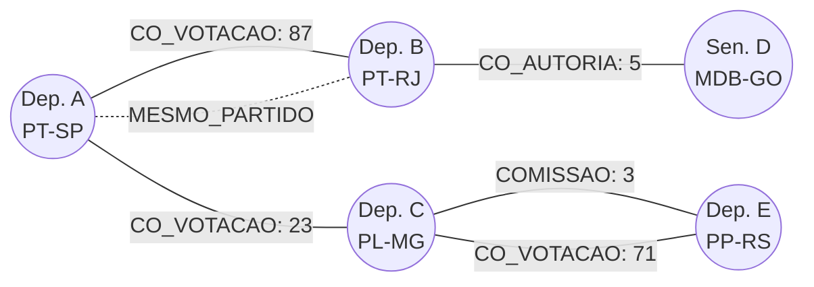
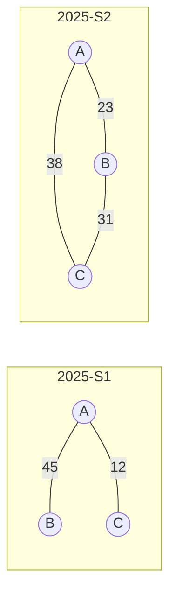

# Grafo Legislativo

> Brasil a Vera · Feature · v0.1
> Última atualização: 2026-04-14
> Status: draft

---

## Sumário

- [Visão Geral](#visão-geral)
- [Modelo de Grafo](#modelo-de-grafo)
- [Tipos de Aresta](#tipos-de-aresta)
- [Métricas de Centralidade](#métricas-de-centralidade)
- [Detecção de Comunidades](#detecção-de-comunidades)
- [Evolução Temporal](#evolução-temporal)
- [Enquadramento na Pirâmide de Confiança](#enquadramento-na-pirâmide-de-confiança)
- [Visualização Interativa](#visualização-interativa)

---

## Visão Geral

O Grafo Legislativo escala o Brasil a Vera da análise individual para a **análise sistêmica do poder legislativo**. Relações entre políticos são naturalmente um grafo, e a literatura em ciência política já validou extensamente essa abordagem.

O grafo opera dentro do bounded context Grafo Legislativo (ver [Bounded Contexts](../architecture/BOUNDED-CONTEXTS.md)), persistido no Neo4j (ver [ADR-004](../architecture/ADR/004-graph-database-choice.md)) e alimentado por domain events de Votações, Proposições e Parlamentares.

### Insights que o Grafo Revela

1. **Clusters reais vs. partidos formais** — agrupamentos reais do Congresso que frequentemente não correspondem aos partidos
2. **Nós entre mundos** — parlamentares do Partido A que co-votam mais com o cluster do Partido B
3. **Pontes e brokers** — parlamentares com alta betweenness centrality que articulam coalizões
4. **Evolução temporal** — como coalizões se formam e se desfazem ao longo do tempo
5. **Votação em bloco** — cliques que votam identicamente em 100% das votações num período

## Modelo de Grafo



### Nós

Cada nó representa um parlamentar:

```cypher
(:Parlamentar {
  id: "178957",
  nome: "Dep. Exemplo",
  partido: "PT",
  uf: "SP",
  casa: "CAMARA",
  trust_level: "L1",
  // Métricas calculadas (L2)
  degree_centrality: 0.42,
  betweenness_centrality: 0.15,
  closeness_centrality: 0.38,
  community_id: 3
})
```

## Tipos de Aresta

| Tipo | Definição | Peso | Trust Level | Wave |
|------|-----------|------|-------------|------|
| `CO_VOTACAO` | Parlamentares que votaram igual em N proposições | Frequência de voto coincidente | L1 | 1 |
| `CO_AUTORIA` | Parlamentares que co-assinaram a mesma proposição | Número de proposições co-assinadas | L1 | 1 |
| `COMISSAO_COMUM` | Parlamentares em comissões em comum | Número de comissões compartilhadas | L1 | 1 |
| `MESMO_PARTIDO` | Relação formal declarada | Binário (1 ou 0) | L1 | 1 |

### Cálculo do peso de co-votação

```
peso_co_votacao(A, B) = |{v : voto(A, v) == voto(B, v)}|
```

Onde `v` é uma votação nominal e `voto(X, v)` é o voto do parlamentar X na votação v. Apenas votos SIM e NÃO contam (abstenção, ausência e obstrução são excluídos).

**Normalização opcional** (para comparabilidade):

```
co_votacao_normalizada(A, B) = peso_co_votacao(A, B) / |{v : A votou AND B votou}|
```

O peso normalizado varia de 0 a 1: 1 = votaram igual em 100% das votações em que ambos participaram.

### Cálculo do peso de co-autoria

```
peso_co_autoria(A, B) = |{p : A é autor/coautor de p AND B é autor/coautor de p}|
```

### Filtros temporais

Todas as arestas podem ser filtradas por período:
- Legislatura (ex: 57ª legislatura, 2023-2027)
- Ano
- Semestre
- Período customizado

## Métricas de Centralidade

Calculadas via Neo4j Graph Data Science (GDS) library. Armazenadas como propriedades do nó (L2).

### Degree Centrality

**O que revela**: parlamentares com mais conexões — os mais "conectados" do Congresso.

```
degree(v) = grau(v) / (N - 1)
```

### Betweenness Centrality

**O que revela**: parlamentares que são **pontes** entre grupos — os articuladores reais de coalizão. Alto betweenness = frequentemente no caminho mais curto entre outros parlamentares.

Algoritmo: Brandes (O(V·E))

```cypher
CALL gds.betweenness.stream('legislativo')
YIELD nodeId, score
RETURN gds.util.asNode(nodeId).nome AS parlamentar, score
ORDER BY score DESC
LIMIT 10
```

### Closeness Centrality

**O que revela**: parlamentares com menor distância média a todos os outros — os mais "centrais" na rede.

```
closeness(v) = (N - 1) / Σ d(v, u)
```

### PageRank

**O que revela**: parlamentares "influentes" considerando a influência de quem se conecta a eles (não apenas quantidade de conexões).

## Detecção de Comunidades

### Algoritmo: Louvain

Detecta comunidades (clusters) maximizando a modularidade do grafo. Revela agrupamentos reais que podem cruzar fronteiras partidárias.

```cypher
CALL gds.louvain.stream('legislativo', {
  relationshipWeightProperty: 'peso'
})
YIELD nodeId, communityId
RETURN gds.util.asNode(nodeId).nome AS parlamentar,
       gds.util.asNode(nodeId).partido AS partido,
       communityId
ORDER BY communityId, parlamentar
```

### Parâmetros documentados

| Parâmetro | Valor default | Descrição |
|-----------|---------------|-----------|
| `relationshipWeightProperty` | `peso` | Propriedade usada como peso das arestas |
| `maxLevels` | 10 | Número máximo de níveis de Louvain |
| `maxIterations` | 10 | Iterações por nível |
| `tolerance` | 0.0001 | Critério de convergência |
| `includeIntermediateCommunities` | false | Retorna hierarquia de comunidades |

**Importante**: a resolução do algoritmo afeta o número e tamanho dos clusters. O Brasil a Vera:
- Documenta os parâmetros usados
- Permite que usuários avançados ajustem parâmetros via API (Wave 3)
- Classifica resultados de detecção de comunidades como **L2/L3** (ver seção Trust Level)

### Interpretação de clusters

O grafo **mostra** os clusters; os **rótulos** são responsabilidade do observador. O Brasil a Vera pode indicar composição partidária do cluster ("70% partido A, 20% partido B, 10% partido C") mas **não nomeia clusters** como "Centrão", "Oposição", etc.

## Evolução Temporal

O grafo suporta snapshots temporais para revelar como coalizões se formam e se desfazem.

### Implementação

- Arestas têm propriedade `periodo` (ex: "2025-S1")
- O grafo pode ser construído para qualquer janela temporal
- A UI permite slider temporal (mês a mês ou semestre a semestre)



### Detecção de mudanças

| Insight | Descrição | Trust Level |
|---------|-----------|-------------|
| Fortalecimento de vínculo | Peso de co-votação aumentou significativamente entre períodos | L2 |
| Enfraquecimento de vínculo | Peso diminuiu significativamente | L2 |
| Migração de cluster | Parlamentar mudou de comunidade entre períodos | L2/L3 |
| Formação de bloco | Novo clique com alta coesão aparece | L2 |

## Enquadramento na Pirâmide de Confiança

| Elemento | Trust Level | Justificativa |
|----------|-------------|---------------|
| Arestas (co-votação, co-autoria, comissão, partido) | **L1** | Derivadas diretamente de votos nominais, autorias e composição de comissões |
| Pesos das arestas | **L2** | Contagens determinísticas com fórmula publicada |
| Métricas de centralidade (degree, betweenness, closeness) | **L2** | Algoritmos determinísticos com parâmetros documentados |
| Detecção de comunidades (Louvain/Leiden) | **L2/L3** | Envolve parâmetros de algoritmo; resultado pode variar com a resolução |
| Interpretação de clusters ("grupo X vota junto") | **L3** | Observação de padrão; disclaimer obrigatório |
| Comparação com partidos formais | **L3** | Correlação entre clusters detectados e estrutura partidária formal |

### Disclaimer obrigatório para L3

> "Comunidades detectadas por algoritmo com base em padrões de votação. Parâmetros: [link]. A composição dos grupos pode variar conforme o período e os parâmetros de análise. Detecção de comunidades indica proximidade de voto, não necessariamente coordenação intencional."

## Visualização Interativa

### Wave 3 — Requisitos

- Grafo força-dirigida com React Flow — zoom, pan e seleção nativos
- Cores por partido ou por comunidade detectada (toggle)
- Tamanho do nó proporcional a uma métrica selecionável (degree, betweenness, etc.)
- Espessura da aresta proporcional ao peso
- Filtros: tipo de aresta, período, partido, UF, tema
- Hover: card com informações do parlamentar
- Click: navega para página 360° do parlamentar (ver [Parlamentar 360°](PARLAMENTAR-360.md))
- Slider temporal: animar evolução do grafo ao longo do tempo

### Performance

- ~600 nós + milhares de arestas → React Flow é adequado para este volume no desktop
- Se expandir para assembleias estaduais (Wave 4+): reavaliar Sigma.js (WebGL) com dados reais de performance — não antecipar esta necessidade
- Target: > 30fps no desktop, > 15fps no mobile
- Lazy loading: carregar arestas sob demanda por tipo e período
