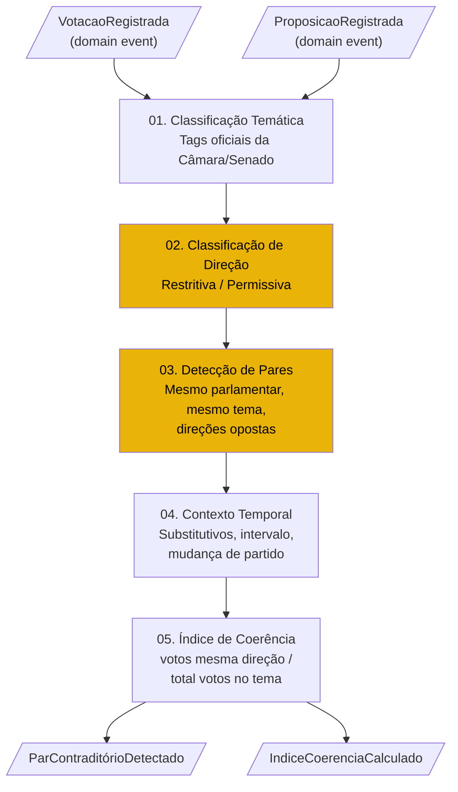
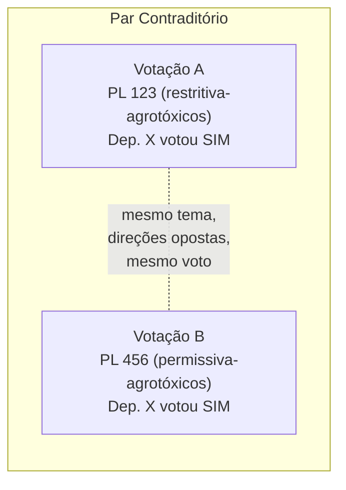
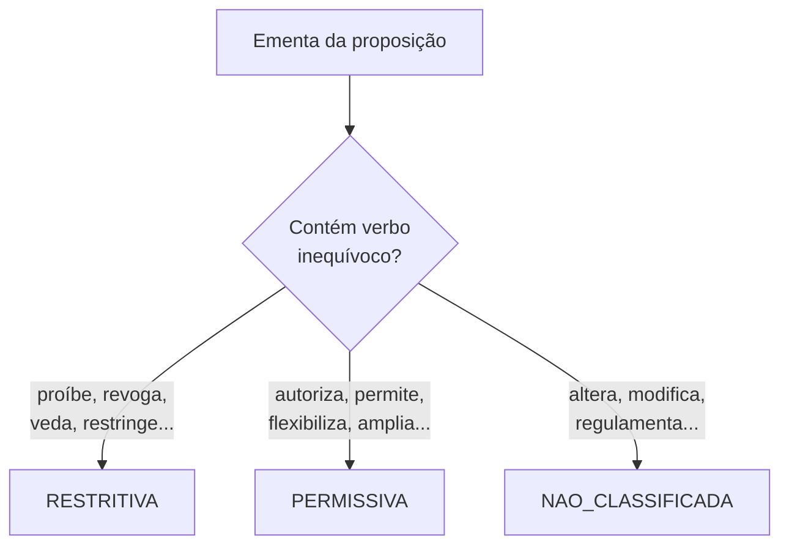

# Motor de Coerência

> Brasil a Vera · Feature · v0.1
> Última atualização: 2026-04-14
> Status: draft

---

## Sumário

- [Visão Geral](#visão-geral)
- [Pipeline de Detecção](#pipeline-de-detecção)
- [Princípios de Design](#princípios-de-design)
- [Classificação de Direção](#classificação-de-direção)
- [Índice de Coerência](#índice-de-coerência)
- [Edge Cases](#edge-cases)
- [Exibição na UI](#exibição-na-ui)
- [Trust Level](#trust-level)

---

## Visão Geral

O Motor de Coerência é a capacidade mais diferenciadora do Brasil a Vera. Ele detecta **pares de votos potencialmente contraditórios** do mesmo parlamentar de forma puramente factual, sem emitir juízo de valor.

> A plataforma é o espelho — não o juiz.

O motor opera dentro do bounded context Coerência (ver [Bounded Contexts](../architecture/BOUNDED-CONTEXTS.md)), consumindo domain events de Votações e Proposições via NATS JetStream (ver [ADR-005](adr/005-event-driven-communication.md)).

## Pipeline de Detecção



### Etapa 01 — Classificação Temática (L1)

Cada proposição recebe tags temáticas com base nos **códigos oficiais da API da Câmara** (`/referencias/proposicoes/codTema`). Estes são dados L1 — vêm diretamente da fonte oficial.

- **MVP**: utilizar exclusivamente os temas oficiais atribuídos pela Câmara/Senado
- **Futuro**: enriquecimento com NLP restrito a ementas (ainda L2, pois é determinístico sobre texto oficial)

Temas sem código oficial não participam do motor de coerência.

### Etapa 02 — Classificação de Direção (L2)

Dentro de cada tema, a proposição é classificada como **restritiva** ou **permissiva**. Esta é a etapa mais sensível do pipeline.

**Critério MVP — apenas verbos inequívocos:**

| Direção | Verbos aceitos | Exemplo |
|---------|---------------|---------|
| Restritiva | revoga, proíbe, veda, criminaliza, restringe, limita, suspende, extingue | "Proíbe o uso de agrotóxicos X" |
| Permissiva | autoriza, permite, flexibiliza, amplia, libera, cria, institui, concede, isenta | "Flexibiliza regras para agrotóxicos" |
| Não classificada | (todos os outros casos) | "Altera dispositivos da Lei X" |

**Regra de ouro**: na dúvida, `NAO_CLASSIFICADA`. Um verbo como "altera", "modifica" ou "regulamenta" é ambíguo — pode restringir ou ampliar. Estes casos **não geram pares contraditórios**.

Detalhes da implementação no [Modelo de Domínio](../architecture/DOMAIN-MODEL.md#coerência).

### Etapa 03 — Detecção de Pares (L2)

Um par contraditório é detectado quando:

1. **Mesmo parlamentar** votou em duas proposições
2. **Mesmo tema** (pelo menos um tema oficial em comum)
3. **Direções opostas** (uma restritiva, outra permissiva)
4. **Votos em direções opostas**: votou SIM na restritiva e SIM na permissiva, ou votou NÃO na restritiva e NÃO na permissiva



**Atenção**: votar SIM em proposição restritiva E SIM em proposição permissiva no mesmo tema é potencialmente contraditório. Votar SIM em restritiva e NÃO em permissiva é **coerente** (posição consistente pró-restrição).

### Etapa 04 — Contexto Temporal (L1)

Nenhum par contraditório é exibido sem contexto. O motor enriquece cada par com:

| Contexto | Descrição | Trust Level |
|----------|-----------|-------------|
| Intervalo entre votos | Dias entre as duas votações | L1 |
| Mudança de partido | Parlamentar mudou de partido entre os votos? | L1 |
| Substitutivos | Alguma das proposições tinha substitutivo que alterou o texto? | L1 |
| Relator | O parlamentar era relator de alguma das proposições? | L1 |

Contexto é apresentado **junto ao par**, nunca omitido.

### Etapa 05 — Índice de Coerência (L2)

Para cada parlamentar e tema:

```
índice_coerência = votos_mesma_direção / total_votos_no_tema
```

Onde:
- `votos_mesma_direção` = votos que são consistentes entre si (todos restritivos OU todos permissivos)
- `total_votos_no_tema` = total de votos em proposições classificadas (restritiva + permissiva) no tema

**Fórmula publicada no repositório** — qualquer pessoa pode reproduzir o cálculo.

## Princípios de Design

### 1. Falso negativo > falso positivo

Preferível **deixar de detectar** uma contradição real a **apontar uma contradição onde não existe**. Consequência prática: a taxa de "não classificado" será alta, especialmente no MVP. Isto é intencional.

### 2. O dado fala por si

A plataforma **nunca usa termos como**:
- "controverso"
- "vendido"
- "incoerente"
- "hipócrita"
- "traidor"

A plataforma **mostra**:
- "Votou SIM na PL 123 (proíbe agrotóxicos X) em 12/03/2025"
- "Votou SIM na PL 456 (flexibiliza regras para agrotóxicos) em 18/06/2025"

O cidadão tira a conclusão.

### 3. Contexto obrigatório

Nenhum par contraditório é exibido sem:
- Intervalo temporal entre os votos
- Indicação de substitutivos (se houver)
- Indicação de mudança de partido (se houver)
- Link direto para cada votação na fonte oficial

### 4. Metodologia aberta

A fórmula de coerência, os critérios de classificação de direção e os parâmetros de detecção são publicados neste documento e no repositório open-source. Qualquer cidadão, jornalista ou pesquisador pode auditar.

## Classificação de Direção

### Abordagem MVP — Verbos na Ementa

A classificação analisa a **ementa oficial** da proposição (campo da API da Câmara/Senado).



### Regras de desempate

1. Se a ementa contém verbos de ambas as direções → `NAO_CLASSIFICADA`
2. Se a ementa é genérica ("Altera a Lei X") → `NAO_CLASSIFICADA`
3. Se a proposição é um substitutivo que muda a direção do original → classificar pela direção do substitutivo (texto vigente na votação)

### Evolução futura (Wave 3)

NLP sobre o texto completo da ementa e do inteiro teor da proposição. Ainda assim, o princípio permanece: na dúvida, `NAO_CLASSIFICADA`.

## Índice de Coerência

### Fórmula

```
IC(parlamentar, tema) = votos_consistentes / total_votos_classificados
```

- **votos_consistentes**: número de votos na direção majoritária do parlamentar naquele tema
- **total_votos_classificados**: total de votos em proposições com direção classificada (restritiva ou permissiva)

### Exemplo

Dep. X no tema "Meio Ambiente":
- 8 votos em proposições restritivas (6 SIM, 2 NÃO)
- 4 votos em proposições permissivas (1 SIM, 3 NÃO)

Posição inferida: pró-restrição (6 SIM restritiva + 3 NÃO permissiva = 9 votos nessa direção)
Votos contrários à posição: 2 NÃO restritiva + 1 SIM permissiva = 3

```
IC = 9 / 12 = 0.75 (75%)
```

### Limitações documentadas

- Temas com menos de 3 votos classificados não geram índice (amostra insuficiente)
- O índice não captura nuances dentro do mesmo tema (ex: agrotóxicos ≠ desmatamento, ambos "Meio Ambiente")
- Proposições com substitutivo podem ter direção diferente do texto original

## Edge Cases

| Caso | Tratamento |
|------|-----------|
| Parlamentar votou como relator | Indicar na UI ("era relator desta proposição") |
| Proposição com substitutivo que muda direção | Classificar pela direção do texto votado (substitutivo), não do original |
| Parlamentar mudou de partido entre votos | Indicar na UI ("mudou do Partido A para Partido B entre os votos") |
| Votação por acordo de líderes | Indicar; votos por acordo podem não refletir posição pessoal |
| Ementa com múltiplos temas | Considerar cada tema separadamente; par só é detectado se compartilham ao menos um tema |
| Proposição sem tema oficial | Não participa do motor de coerência |
| Abstenção / ausência / obstrução | Não geram par contraditório (apenas SIM e NÃO) |

## Exibição na UI

### Card de par contraditório

```
┌──────────────────────────────────────────────────┐
│  VOTOS EM DIREÇÕES OPOSTAS · Meio Ambiente  [L2] │
├──────────────────────────────────────────────────┤
│                                                    │
│  12/03/2025 — PL 123/2025                         │
│  "Proíbe o uso de agrotóxicos X em áreas Y"       │
│  Dep. Exemplo votou: SIM ✓                        │
│  [Ver votação na Câmara ↗]                        │
│                                                    │
│  ────────── 98 dias depois ──────────              │
│                                                    │
│  18/06/2025 — PL 456/2025                         │
│  "Flexibiliza regras para uso de agrotóxicos"     │
│  Dep. Exemplo votou: SIM ✓                        │
│  [Ver votação na Câmara ↗]                        │
│                                                    │
│  ℹ Sem substitutivos · Mesmo partido              │
│                                                    │
│  Metodologia: docs/future/COHERENCE-ENGINE.md     │
└──────────────────────────────────────────────────┘
```

### Princípios de exibição

1. **Sem adjetivação** — o card mostra votos lado a lado, sem palavras valorativas
2. **Contexto visível** — intervalo temporal, substitutivos e partido sempre presentes
3. **Link para fonte** — cada votação linka para a fonte oficial (L1)
4. **Link para metodologia** — link para este documento no repositório
5. **Badge L2** — indica que é uma agregação determinística

## Trust Level

| Elemento | Trust Level | Justificativa |
|----------|-------------|---------------|
| Temas oficiais da proposição | L1 | Dados da API da Câmara/Senado |
| Classificação de direção | L2 | Determinística sobre verbos na ementa (fórmula pública) |
| Pares contraditórios | L2 | Derivados de classificação L2 |
| Índice de coerência | L2 | Cálculo determinístico com fórmula publicada |
| Contexto temporal | L1 | Dados brutos (datas, partido, substitutivos) |
| Interpretação de contradição | Responsabilidade do cidadão | A plataforma não interpreta |
