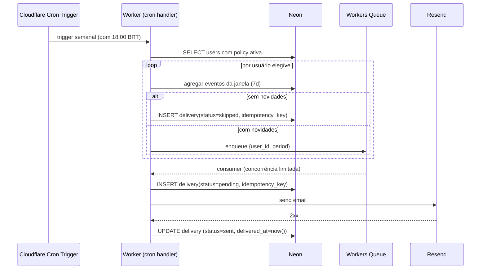

# Brasil à Vera — Visão da Área Logada (Wave 10)

> Documento de visão. Não é spec de implementação nem cronograma.
> Ground truth de escopo da Wave 10. ADRs derivados (-029 modelo de
> dados + topologia de auth, -030 alertas + Resend, -031 framework
> LGPD) e addendum ao [ADR-022](../architecture/ADR/022-clerk-para-autenticacao.md)
> são gerados em sessão separada após aprovação deste documento.

---

## 1. Tese e princípios

A área logada existe para responder a uma pergunta diferente da pública. A
pública responde *"o que aconteceu?"*. A logada responde *"o que aconteceu
com quem me importa, e o que eu faço sobre isso?"*. Quatro princípios
norteiam toda decisão de produto e de implementação.

| # | Princípio | Aplicação operacional |
|---|---|---|
| 1 | **Job diferente, não versão melhor.** | Feature que só pagina dado público por usuário é cortada. |
| 2 | **Privacidade é feature.** | Compliance LGPD entra na proposta de valor; cada toggle pro-privacidade é diferenciação. |
| 3 | **Empty state é oportunidade.** | Toda tela vazia ensina ação concreta e contextual; "nada aqui" é bug de design. |
| 4 | **Documentação serve o código.** | VISION é denso e acionável; ADRs nascem só quando decisão precisa de respaldo formal. |

Histórico: duas tentativas anteriores do projeto morreram por
over-engineering e overdose de documentação (ratio 23× doc:code na última).
Este documento opera dentro da disciplina do [ADR-019](../architecture/ADR/019-disciplina-arquitetural-sem-gargalo.md).

---

## 2. Job to be done

| | Área pública | Área logada |
|---|---|---|
| Pergunta | "O que aconteceu?" | "O que aconteceu com quem me importa, e o que eu faço sobre isso?" |
| Sujeito | Cidadão anônimo curioso | Cidadão identificado interessado em vínculo durado |
| Tempo | Visita pontual | Relação contínua, semanal ou eventual |
| Métrica de valor | Página visitada | Report consumido + ação (acompanhar, desacompanhar, mudar política) |

**Três jobs primários do usuário logado**, em ordem de frequência esperada:

1. **Atualização semanal sem garimpo**. Saber o que os parlamentares
   acompanhados fizeram desde o último ciclo, sem precisar abrir 10 perfis.
2. **Reler a relação concreta entre meu voto e a atuação do eleito.**
   Pontualmente — antes de compartilhar opinião, ou após manchete.
3. **Calibrar o nível de atenção.** Acompanhar mais, desacompanhar, mudar
   tema, pausar alertas em período de mudança de vida.

Tudo o que não atende um desses três jobs é candidato a corte ou a backlog
futuro. Listas custom, score pessoal, grafos e similares cairam por esse
filtro (ver §11).

---

## 3. Modelo de domínio

Bounded context novo: `usuario`. Schema Drizzle `pgSchema('usuario')`.
Convenções herdadas: UUIDv7 como PK, `created_at`/`updated_at` em todas as
tabelas com mutações, `deleted_at` para soft delete onde a LGPD pede 30
dias de carência. Não há `trust_level`/`source_url`/`ingested_at` — esses
são para dados ingeridos de fontes externas e não se aplicam a dados de
usuário.

```mermaid
erDiagram
    user_profile ||--o{ follows : "acompanha"
    user_profile ||--|| alert_policy : "tem 1"
    user_profile ||--o{ alert_delivery : "recebe"
    user_profile ||--o{ consent_log : "consente"
    user_profile ||--o{ data_request : "exerce direito"
    parlamentar ||--o{ follows : "acompanhado por"

    user_profile {
        uuid id PK
        text clerk_user_id UK
        char(2) uf
        text email
        text display_name
        timestamptz created_at
        timestamptz updated_at
        timestamptz deleted_at
        timestamptz onboarded_at
    }
    follows {
        uuid user_id PK_FK
        uuid parlamentar_id PK_FK
        timestamptz followed_at
    }
    alert_policy {
        uuid user_id PK_FK
        text cadence
        boolean channel_email
        boolean channel_inapp
        boolean topic_votacoes
        boolean topic_gastos
        boolean topic_proposicoes
        boolean topic_discursos
        boolean topic_divergencias
        boolean boost_eleicoes
        boolean boost_cpis
        boolean boost_proposicoes_marcadas
        timestamptz updated_at
    }
    alert_delivery {
        uuid id PK
        uuid user_id FK
        text idempotency_key UK
        text channel
        text subject
        text body_md
        timestamptz scheduled_for
        timestamptz delivered_at
        timestamptz read_at
        text status
    }
    consent_log {
        uuid id PK
        uuid user_id FK
        text scope
        boolean granted
        text legal_basis
        text policy_version
        text source
        text ip_hash
        timestamptz consented_at
    }
    data_request {
        uuid id PK
        uuid user_id FK
        text kind
        text status
        text result_url
        timestamptz requested_at
        timestamptz completed_at
    }
    alert_period {
        uuid id PK
        text name
        text kind
        timestamptz started_at
        timestamptz ends_at
        jsonb scope
    }
```

### Schema canônico (referência — SQL final na migration)

| Tabela | Coluna | Tipo | Constraint | Índice |
|---|---|---|---|---|
| `user_profile` | `id` | `uuid` | PK, default uuidv7 | — |
| | `clerk_user_id` | `text` | unique, not null | `user_profile_clerk_id_idx` |
| | `email` | `text` | not null | — |
| | `display_name` | `text` | — | — |
| | `uf` | `char(2)` | — | btree (recomendação) |
| | `created_at` | `timestamptz` | not null, default now() | — |
| | `updated_at` | `timestamptz` | not null, default now() | — |
| | `deleted_at` | `timestamptz` | nullable | partial btree (`WHERE deleted_at IS NULL`) |
| | `onboarded_at` | `timestamptz` | nullable | — — `NULL` = ainda não completou wizard de onboarding |
| `follows` | `user_id` | `uuid` | not null, FK→`user_profile.id` ON DELETE CASCADE | — |
| | `parlamentar_id` | `uuid` | not null, FK→`parlamentares.parlamentar.id` ON DELETE CASCADE | btree (`parlamentar_id`) — agregação reversa |
| | `followed_at` | `timestamptz` | not null, default now() | — |
| | PK composta | (`user_id`, `parlamentar_id`) | — | — |
| `alert_policy` | `user_id` | `uuid` | PK, FK→`user_profile.id` ON DELETE CASCADE | — |
| | `cadence` | `text` | not null, default `'weekly'`, CHECK in `('weekly','biweekly','monthly')` | — |
| | `channel_email` | `boolean` | not null, default `true` | — |
| | `channel_inapp` | `boolean` | not null, default `true` | — |
| | 5× `topic_*` | `boolean` | not null, default `true` | — |
| | 3× `boost_*` | `boolean` | not null, default `true` | — |
| | `updated_at` | `timestamptz` | not null, default now() | — |
| `alert_delivery` | `id` | `uuid` | PK uuidv7 | — |
| | `user_id` | `uuid` | not null, FK→`user_profile.id` ON DELETE CASCADE | — |
| | `idempotency_key` | `text` | unique, not null | `delivery_idempotency_idx` |
| | `channel` | `text` | not null, CHECK in `('email','inapp')` | — |
| | `subject` | `text` | not null | — |
| | `body_md` | `text` | not null | — |
| | `scheduled_for` | `timestamptz` | not null | btree |
| | `delivered_at` | `timestamptz` | nullable | — |
| | `read_at` | `timestamptz` | nullable | — |
| | `status` | `text` | not null, CHECK in `('pending','sent','failed','skipped')` | — |
| | composto | — | — | btree (`user_id`, `scheduled_for DESC`) — inbox |
| `consent_log` | `id` | `uuid` | PK uuidv7 | — |
| | `user_id` | `uuid` | nullable (preserva log após anonimização) | btree |
| | `scope` | `text` | not null | — |
| | `granted` | `boolean` | not null | — |
| | `legal_basis` | `text` | not null | — |
| | `policy_version` | `text` | not null | — |
| | `source` | `text` | not null | — |
| | `ip_hash` | `text` | not null (SHA-256 do IP + salt diário) | — |
| | `consented_at` | `timestamptz` | not null, default now() | — |
| `data_request` | `id` | `uuid` | PK uuidv7 | — |
| | `user_id` | `uuid` | not null, FK | btree (`user_id`, `requested_at DESC`) |
| | `kind` | `text` | not null, CHECK in `('export','erase','rectify','anonymize')` | — |
| | `status` | `text` | not null, CHECK in `('queued','running','done','failed')` | — |
| | `result_url` | `text` | nullable (R2 signed URL para export) | — |
| `alert_period` | `id` | `uuid` | PK uuidv7 | — |
| | `name` | `text` | not null | — |
| | `kind` | `text` | not null, CHECK in `('eleicoes','cpi','proposicao_marcada','outro')` | — |
| | `started_at`, `ends_at` | `timestamptz` | not null | btree (`ends_at`) |
| | `scope` | `jsonb` | not null | — |

### Decisões de schema fundamentadas

| Decisão | Alternativa rejeitada | Justificativa (2-4 frases) |
|---|---|---|
| UUIDv7 PK em `user_profile`, `clerk_user_id` como coluna unique | `clerk_user_id` como PK | Soberania de dados: trocar Clerk não força re-mapeamento de PKs no banco inteiro (ADR-022 §Plano de migração). FK opaca interna é nossa. |
| PK composta em `follows` | id sintético + unique (`user_id`,`parlamentar_id`) | A combinação é a chave natural; índice adicional é desperdício; agregação reversa precisa só do índice em `parlamentar_id`. |
| `alert_policy` 1:1, não 1:N de toggles | `alert_topic_preference (user_id, topic)` | Toggles são fixos e poucos; uma linha por usuário é simples, queriable, introspectável no Studio. Não é dataset que cresce. |
| Tudo em colunas booleanas, não `jsonb` | `topics jsonb`, `boosts jsonb` | Boolean é tipado, queriable em SQL puro, lido pelo Drizzle sem coerção. jsonb seria reabertura preventiva para hipótese futura. |
| `consent_log.user_id` nullable | `cascade delete` total | Após anonimização (LGPD art. 16), preserva-se o log da tomada de consentimento sem identificar o titular — exigência de comprovação. |
| `ip_hash` em vez de IP cru | armazenar IP | LGPD exige minimização; hash com salt diário comprova "veio do mesmo IP no mesmo dia" sem permitir reidentificação retroativa. |
| `alert_period.scope` em jsonb | tabelas relacionais (UF list, parlamentar_id list, theme list) | Periodos são raros (5-10/ano), admin-managed, sem UI; flexibilidade aqui é barata. |

**Cap operacional:** `count(follows) ≤ 200` por usuário, enforçado a nível de API (não constraint SQL — fica leve no banco). Valor calibrado para Câmara dos Deputados (513 deputados) com folga para "bancada inteira de uma UF grande" ou "bancada de um partido grande" ou "todos os membros de uma CPI relevante". Revisar quando Senado (81), Assembleias Estaduais ou Câmaras Municipais entrarem em escopo em waves futuras.

---

## 4. Arquitetura de rotas

```
/sign-in/[[...sign-in]]              → Custom Clerk SignIn (client)
/sign-up/[[...sign-up]]              → Custom Clerk SignUp (client)
/painel                              → Resumo (RSC, dynamic, auth-gated)
/painel/parlamentares                → Lista (sub-tabs: Acompanhando | Da minha UF)
/painel/alertas                      → Sub-tabs: Recebidos (inbox) | Políticas (config)
/painel/configuracoes                → Perfil + Temas + Comunicação
/painel/configuracoes/meus-dados     → Dashboard LGPD
/privacidade                         → Política de privacidade (público, SSG)
```

| Rota | Rendering | Auth | Cache estratégia | Observação |
|---|---|---|---|---|
| `/sign-in/[[...]]` | Client component | público | — | `<SignIn />` Clerk com prop `appearance` no tema dark; respeita paleta Brasil à Vera; sem CSS invasivo. |
| `/sign-up/[[...]]` | Client component | público | — | Idem. |
| `/painel` | RSC `dynamic` (auth) | obrigatório (`auth.protect()` middleware) | `cached()` ADR-018 para list of follows do usuário, TTL 60s, key inclui `clerk_user_id` | — |
| `/painel/parlamentares` | RSC `dynamic` | obrigatório | `cached()` para sub-tab "Da minha UF" (TTL 1h, key inclui UF) | — |
| `/painel/alertas` | RSC `dynamic` | obrigatório | Recebidos sem cache (dado pessoal mutável); Políticas sem cache (form) | — |
| `/painel/configuracoes` | RSC `dynamic` | obrigatório | — | — |
| `/painel/configuracoes/meus-dados` | RSC `dynamic` | obrigatório | — | Dados em tempo real exigidos pela LGPD. |
| `/privacidade` | SSG `revalidate: 86400` | público | edge | Texto institucional + versão da política. Toda mudança bump `policy_version` força revalidate. |

**Notas técnicas:**

- `auth.protect()` aplicado ao matcher do middleware para todo `/painel/*` e `/api/painel/*` na Etapa 1 (hoje o middleware está em modo dormente).
- Topologia do `<ClerkProvider>` para rotas autenticadas é decidida e fundamentada no ADR-029 (alternativas em jogo: subir ao `<html>` raiz, manter na `auth-island.tsx` atual, ou criar route group `(authenticated)/layout.tsx`).
- Account Portal hosted Clerk (`accounts.brasilavera.clerk.accounts.dev`) continua existindo como fallback — design do Clerk. Não é vetor de fricção no fluxo principal; usuário avançado que descobrir pode usar. Registrado aqui por transparência.
- Allowed origins e Redirect URLs no Clerk Dashboard: adicionar `https://brasilavera.org/sign-in`, `/sign-up`, `/painel` na Etapa 1 (tarefa de configuração externa, não código).

---

## 5. Detalhamento por tela

### 5.1 `/painel` (Resumo) — quatro estados dinâmicos

| Estado | Threshold | Layout |
|---|---|---|
| **onboarding-wizard** | `onboarded_at IS NULL` | Modal full-screen do wizard (3 passos: UF, Temas, Tipos de movimentação). Não bloqueia navegação para outras rotas, mas re-aparece no próximo `/painel` até completar ou skipar explicitamente. Ver §5.6. |
| **novo** | `onboarded_at IS NOT NULL` E `count(follows) = 0` | Hero "Comece acompanhando alguém". CTA único: "Explorar parlamentares". Cards de sugestão por UF se UF preenchida; senão pede UF inline antes. |
| **onboarding** | `onboarded_at IS NOT NULL` E `1 ≤ count(follows) ≤ 4` E nenhum `alert_delivery` recebida | KPIs já com números reais. Bloco "Quase lá — recomendamos 5+ parlamentares para um primeiro report útil". Cards sugestão por UF. Sem bloco Report. |
| **maduro** | `count(follows) ≥ 5` OU `count(alert_delivery WHERE delivered_at IS NOT NULL) ≥ 1` | KPIs + último report card + bloco "Da sua UF — sugestões" (cap 4). Aviso de período especial se ativo. |

Thresholds fundamentados:
- 5 follows é o piso experimental para um report semanal ter conteúdo médio. Abaixo disso o cron pode pular várias semanas vazias.
- Receber 1 report basta para "maduro" mesmo com poucos follows — é prova de ativação.
- `onboarded_at IS NULL` colocado **antes** dos demais para garantir que o wizard apareça no primeiro acesso mesmo que o usuário já tenha `follows` (caso teórico: migração futura, restauração de backup).

```
+----------------------------------------------------------------------+
|  [Avatar]  Fabio Caffarello                                  [Sair]  |
|            fabio@example.com   ·   UF: SP                            |
+----------------------------------------------------------------------+
| [Resumo]  Parlamentares  Alertas  Configurações                      |
+----------------------------------------------------------------------+
|                                                                      |
|  Acomp.    Movimentações   Reports recebidos                         |
|  ╭─────╮   ╭─────────────╮  ╭───────────────╮                        |
|  │ 12  │   │     4       │  │       7       │                        |
|  ╰─────╯   ╰─────────────╯  ╰───────────────╯                        |
|  (KPI "Período especial" removida em 2026-05-18; Etapa 8 deferida)   |
|                                                                      |
|  Último report  ·  03/05–09/05                                       |
|  ╭───────────────────────────────────────────────────────────────╮   |
|  │ 3 votações nominais  ·  R$ 23.450 em gastos  ·  2 proposições │   |
|  │ Abrir report →                                                │   |
|  ╰───────────────────────────────────────────────────────────────╯   |
|                                                                      |
|  Da sua UF (SP) — sugestões                                          |
|  ╭───╮ ╭───╮ ╭───╮ ╭───╮                                             |
|  │ A │ │ B │ │ C │ │ D │  (ParlamentarCard com botão Acompanhar)     |
|  ╰───╯ ╰───╯ ╰───╯ ╰───╯                                             |
+----------------------------------------------------------------------+
```

### 5.2 `/painel/parlamentares` (sub-tabs)

| Sub-tab | Conteúdo | Empty state |
|---|---|---|
| Acompanhando (N) | Grid de ParlamentarCard com botão "Acompanhando ✓" (toggle) | "Você ainda não acompanha. Veja sugestões da sua UF." + cards |
| Da minha UF (M) | Grid de ParlamentarCard da UF do perfil, ordem por proximidade (município se houver, senão UF inteira) | Se UF não preenchida: form inline "Selecione sua UF" |

Mudança de UF (questão 9): `follows` é preservada por completo, sem prompt. Banner não-bloqueante na sub-tab "Da minha UF" no primeiro acesso pós-mudança: *"Você mudou para `<UF>`. Seus N acompanhados anteriores continuam — revisar?"* Link abre o modal `<RevisarAcompanhadosUFAntiga />`.

**Modal `<RevisarAcompanhadosUFAntiga />`:**

- Lista os parlamentares atualmente acompanhados que **não são da nova UF** — query: `follows JOIN parlamentar WHERE parlamentar.uf != user_profile.uf`.
- Cada linha: foto, nome, partido, UF antiga, checkbox **"desacompanhar"** (default *unchecked* — preserva intenção do usuário).
- Botão "Desacompanhar selecionados (N)" + botão "Manter todos".
- Após confirmação: batch `DELETE` em `follows` + invalidação do cache de follows do usuário.
- Banner some após primeira interação. Persistência: campo `user_profile.uf_change_acked_at` ou inferência por ausência de divergência entre `parlamentar.uf` e `user_profile.uf` no conjunto de follows.

Razão: o `follows` reflete intenção do usuário, não tem dependência rígida de UF. Mudança de UF é evento administrativo (mudei de estado), não de invalidação política. O modal oferece ação direta para o caso onde o usuário de fato quer enxugar para a nova UF — sem forçar.

### 5.3 `/painel/alertas` (sub-tabs)

| Sub-tab | Conteúdo |
|---|---|
| Recebidos (N) | Lista cronológica de `alert_delivery` (channel=inapp OU email com cópia inapp). Cada item: assunto, data, badge "lido/novo", link "abrir". Markdown body renderizado inline. |
| Políticas | Form com cadence (radio), canais (toggles), topics (5 checkboxes), boosts (3 checkboxes). Save dispara update + invalida cache de policy. |

### 5.4 `/painel/configuracoes`

```
Perfil
  · Nome (editável)
  · E-mail (read-only — gerenciado em /sign-in da Clerk)
  · UF (select, vazio permitido)
  [Salvar]

Temas de interesse                  (chips toggle, 8 opções fixas)
  · Educação · Saúde · Segurança · Economia
  · Meio ambiente · Direitos humanos · Transporte · Trabalho

Comunicação                         (separado de alertas de serviço)
  □ Receber comunicações esporádicas do projeto (releases, etc)
  □ Receber convite para survey ocasional

Privacidade
  → Ver, exportar ou apagar meus dados (link /painel/configuracoes/meus-dados)
  → Política de privacidade (link /privacidade)
```

A antiga seção "Preferências de acompanhamento" (4 toggles) é consolidada na sub-tab "Políticas" de `/painel/alertas`. Estes toggles eram a mesma config sob outro nome — Wave 10 elimina a duplicação.

### 5.5 `/painel/configuracoes/meus-dados` (Dashboard LGPD)

Layout em 3 blocos verticais:

1. **O que sabemos sobre você** — tabela com 5-6 linhas: identidade (email, nome, UF), acompanhamentos (N parlamentares), políticas (resumo), reports recebidos (N nas últimas 12 semanas), consentimentos ativos.
2. **Exercer direitos** — 4 botões: "Exportar tudo (JSON)", "Pedir correção", "Anonimizar minha conta", "Apagar minha conta". Cada um abre modal explicando consequência + cria registro em `data_request`.
3. **Histórico de pedidos** — tabela `data_request` do usuário, mais recente primeiro, com status.

### 5.6 Wizard de onboarding

Modal full-screen disparado no primeiro acesso a `/painel` quando `onboarded_at IS NULL`. Três passos sequenciais, todos com botão "Pular".

| # | Pergunta | Input | Skip aceitável | Persistência |
|---|---|---|---|---|
| 1 | "De onde você acompanha a política?" | Select de 27 UFs | sim (UF vazia continua permitida) | `user_profile.uf` |
| 2 | "Quais temas mais te importam?" | 8 chips multi-select (Educação, Saúde, Segurança, Economia, Meio ambiente, Direitos humanos, Transporte, Trabalho), mínimo 0, máximo 8 | sim | tabela de chips de tema (sem schema novo nesta wave — usa coluna `themes jsonb` no `user_profile` ou tabela auxiliar; decisão deferida ao ADR-029) |
| 3 | "O que você quer receber no seu report semanal?" | 5 chips multi-select correspondendo aos `topic_*`. Mínimo 1 se não pular | sim | colunas `topic_*` em `alert_policy` |

**CTA final:** "Comece a acompanhar parlamentares" → redirect para `/painel/parlamentares?tab=da-minha-uf` (ou `?tab=acompanhando` se UF não preenchida).

**Defaults aplicados em pulo total (skip em todos os passos):**

- `topic_votacoes = true`, `topic_proposicoes = true`, `topic_divergencias = true`
- `topic_gastos = false`, `topic_discursos = false`
- `boost_* = true` (todos os 3)

Justificativa dos defaults conservadores: entregam valor sem inundar o usuário; quem pulou tudo provavelmente quer experimentar antes de afinar. Ajuste posterior em `/painel/alertas → Políticas`.

**Defaults aplicados em pulo parcial:** o que foi marcado vai como `true`; o que não foi marcado e não foi explicitamente desmarcado segue os defaults acima.

**Após qualquer término (completo ou skip):** `UPDATE user_profile SET onboarded_at = now()`. Wizard não reaparece.

---

## 6. Sistema de alertas

### Arquitetura



### Decisões

| Tópico | Decisão | Por quê |
|---|---|---|
| Trigger | **Cloudflare Cron Trigger** semanal (dom 21:00 UTC = 18:00 BRT) | Nativo, sem peer dep; agendamento previsível; cabe no Workers Paid sem custo adicional. |
| Backpressure / retry | **Workers Queues** entre trigger e envio | Retry transparente para falha de Resend; concorrência limitada evita rajada; queue tem dead-letter para diagnose. |
| Idempotência | `idempotency_key = sha256(user_id + period_start + cadence)` | Cron rodando duas vezes não duplica; chave unique no banco bloqueia conflito. |
| ~~Modulação~~ | ~~Tabela `alert_period` admin-managed (sem UI Wave 10)~~ — **deferida em 2026-05-18 para Wave 11+** (Etapa 8 fora do escopo). |
| Sem novidades | **Não envia email**; registra `delivery(status=skipped)` para auditoria; agrega no próximo ciclo | LGPD do usuário (não receber comunicação inútil); auditoria preserva intenção. |
| ~~Modulação aplicada~~ | ~~Cron extra dispara fora da cadência se `alert_period.scope` matchar o usuário (UF, follows, temas)~~ — **deferida em 2026-05-18 para Wave 11+** (Etapa 8 fora do escopo). |

### Estrutura editorial do email semanal

| Bloco | Conteúdo | Inclusão | Pulo |
|---|---|---|---|
| Assunto | `Brasil à Vera · Resumo {de}–{a}` | sempre | — |
| Cabeçalho | Logo + período + "N parlamentares acompanhados" + link "ver no painel" | sempre | — |
| KPI strip | N votações nominais · N proposições · R$ gastos · N divergências de bancada | sempre | — |
| Bloco Votações | Top 5 por relevância (nominais > anônimas; temas marcados > outras; divergências da bancada) | se `topic_votacoes` | omite |
| Bloco Gastos | Top 3 maiores OU 1+ anomalia (gasto > média do parlamentar + 2σ no semestre) | se `topic_gastos` | omite |
| Bloco Proposições | Apresentadas na semana + movimentações de proposições já marcadas pelos temas | se `topic_proposicoes` | omite |
| Bloco Discursos | Plenário com palavras-chave dos temas (Câmara API) | se `topic_discursos` | omite |
| Bloco Divergências | Lista de votações onde acompanhado divergiu da bancada | se `topic_divergencias` | omite |
| ~~Aviso de período especial~~ | ~~Banner topo "Eleições 2026 — frequência aumentada"~~ — **bloco removido em 2026-05-18** (Etapa 8 deferida; sem `alert_period` em Wave 10). | — | sempre omite na Wave 10 |
| Footer | DPO contato · endereço · política · link gerenciar alertas · `delivery_id` | sempre | — |

**Hierarquia de importância:** Votações nominais com divergência > Votações nominais > Gastos com anomalia > Proposições marcadas avançando > Apresentações novas > Discursos > Gastos rotineiros. Renderização do email mostra os primeiros N caracteres dos blocos prioritários acima da dobra.

**Sem cap rígido de itens por bloco.** Hierarquia decide ordem; tamanho de email é gerenciado pelo template (cliente de email faz scroll). Cidadão engajado em política consome reports densos. Métrica de leitura pós-lançamento dirá se precisa cap.

**Semanas vazias:** sem envio. Próximo ciclo agrega o período pulado declarando no cabeçalho "Período: 22/04–09/05 (15 dias)". Limite: nunca passa de 4 semanas acumuladas sem envio — força um report-resumo mesmo com baixa atividade.

---

## 7. LGPD e compliance

### Tabela de tratamentos

| Dado | Finalidade | Base legal (LGPD art. 7º) | Retenção | Justificativa de prazo |
|---|---|---|---|---|
| `email`, `display_name` (Clerk + `user_profile`) | autenticação, comunicação de serviço | V — execução de contrato | até deleção + 30d soft | janela de reversão do "apaguei sem querer" |
| `uf` | personalização de recomendações | V — execução de contrato | até deleção | requisitada explicitamente pelo titular |
| `follows` (acompanhamentos) | núcleo do serviço | V — execução de contrato | até deleção | sem follows o serviço não opera |
| `alert_policy` | configuração de comunicação | V — execução de contrato | até deleção | idem |
| `alert_delivery` | inbox + auditoria de entrega | IX — legítimo interesse | **12 meses** | suficiente para SLA e disputa de "não recebi"; minimização exige expirar |
| `consent_log` | comprovação de consentimento | II — obrigação legal LGPD | **5 anos** após término do tratamento | prazo prescricional de ações cíveis típicas |
| `consent_log.ip_hash` | confirmar identidade do consentimento sem reidentificação | II — obrigação legal | 5 anos (junto) | hash com salt diário; reidentificação retroativa inviável |
| Marketing opt-in | comunicação fora do serviço | I — consentimento | até revogação | revogação revoga imediatamente e dispara erase do flag |
| `data_request` | trilha de exercício de direitos | II — obrigação legal | 5 anos | mesma prescrição |

### Hard delete vs anonimização vs soft delete

- **Soft delete** (`deleted_at` setado): usuário some das telas; auth bloqueado pelo middleware via lookup; mantido 30 dias para reversão manual ou auditoria.
- **Lembrete pré-hard-delete** (25 dias após soft delete): email automático ao endereço cadastrado — *"Sua conta no Brasil à Vera será apagada permanentemente em 5 dias. Caso tenha mudado de ideia, reative em [link]."* Link leva a fluxo de re-autenticação Clerk que zera `deleted_at`. Implementado como cron diário separado da varredura de hard delete. Idempotente via `data_request.id` (não envia duas vezes para o mesmo pedido de eliminação).
- **Hard delete** (30 dias após soft delete): `user_profile` removido; cascade limpa `follows`, `alert_policy`, `alert_delivery`, `data_request`.
- **Anonimização** (opcional, alternativa ao hard delete): substitui `email`, `display_name`, `clerk_user_id` por hash; preserva agregados estatísticos. `consent_log.user_id` é setado para NULL (preserva log sem identificar). Usuário escolhe entre hard delete e anonimização no `/meus-dados`.

### Fluxos do titular (LGPD art. 18)

| Direito | Endpoint / fluxo | Implementação |
|---|---|---|
| Confirmação + acesso | `/painel/configuracoes/meus-dados` | RSC lê do banco e mostra resumo + botão "exportar tudo" |
| Correção | `/painel/configuracoes` (form de Perfil) | Update direto; para campos não editáveis (`created_at`, etc.) abre `data_request kind=rectify` para tratamento manual |
| Anonimização | Botão em `/meus-dados` | Cria `data_request kind=anonymize` → job processa em até 15 dias |
| Eliminação | Botão em `/meus-dados` | Cria `data_request kind=erase` → soft delete imediato; hard delete cron diário após 30d |
| Portabilidade | Botão "exportar" | Cria `data_request kind=export` → job gera JSON em R2, signed URL 7 dias, registra `result_url` |
| Revogação consent | Toggle em Configurações → Comunicação | Update + insert `consent_log(granted=false)` |
| Oposição | Mesmo que eliminação ou anonimização (LGPD não exige caminho separado) | — |

### Dashboard `/meus-dados`

Conteúdo descrito em §5.5. Mostra ao titular **tudo** que o sistema registra: identidade, follows, política, reports recebidos (últimos 12), consentimentos ativos, histórico de pedidos. Botão único de acesso à exportação JSON contendo as mesmas tabelas + valores reais.

### Política de privacidade e DPO

- Página `/privacidade` (SSG, `policy_version` no metadata).
- DPO: **Fabio Caffarello**. Contato: `lgpd@brasilavera.org` (placeholder; MX no Cloudflare Email Routing tarefa explícita na Etapa 9).
- Toda mudança de versão da política força modal de re-aceite no próximo login + insert em `consent_log`.

### Idade mínima e tratamento de menores

- **Termos de uso declaram:** serviço destinado a maiores de 16 anos (idade do voto facultativo, art. 14 §1º II CF). Cadastro de menor de 16 é violação dos termos.
- **Sem age gate ativo no signup.** Clerk não suporta nativamente; gates baseados em data de nascimento são facilmente burláveis. Política operacional: se identificado cadastro de menor (denúncia, auto-declaração, sinal nos dados), executar erase administrativo e notificar o email cadastrado.
- **Dados de menor de 16 detectado** são tratados pela LGPD art. 14 (dado sensível, exige consentimento parental). Brasil à Vera não tem mecanismo para coletar consentimento parental — portanto **não opera com menores**, e erase é o caminho único.
- **Política de privacidade reflete:** seção "Idade mínima" com texto claro e canal de contato do DPO para responsáveis legais reportarem.

---

## 8. Plano de implementação em 10 etapas (+ Etapa 0)

| # | Entrega | Dependências | Sprints | Critério de Done |
|---|---|---|---|---|
| **0** | **Higiene de repo** — addendum ADR-022 (rebrand `/minha-area`→`/painel`), atualização de `middleware.ts`, `sign-in/page.tsx`, `CLERK-SETUP.md`, ROADMAP (Waves 7–10), comentário em issue #174 | — | 0.5 | Diff aprovado; nenhuma referência ativa a `/minha-area` no `main` |
| 1 | Custom sign-in/sign-up + `usuario.user_profile` (incl. `onboarded_at`) + Clerk webhook + middleware `auth.protect()` + topologia de auth conforme ADR-029 + layout vazio `/painel` "em construção" | Etapa 0 | 1 | Login pelo site sem ir a `accounts.*.clerk.accounts.dev`; webhook cria `user_profile`; `/painel/*` redireciona anônimo para `/sign-in` |
| 2 | `usuario.follows` + API `/api/painel/follows` (POST/DELETE) + botão "Acompanhar/Acompanhando ✓" no `ParlamentarCard` + `cached()` para list-by-user TTL 60s | 1 | 1 | Toggle persiste; cache invalidado em mutação; clique anônimo redireciona para sign-in |
| 3 | `/painel` Resumo com 4 estados (onboarding-wizard / novo / onboarding / maduro) + wizard de 3 passos + KPIs reais + recomendações por UF (sem alertas ainda) | 2 | 1 | Estados refletem dados reais; transição entre estados sem reload manual; wizard de onboarding renderiza no primeiro acesso de usuário sem `onboarded_at` e respeita pular/completar |
| 4 | `/painel/parlamentares` com 2 sub-tabs (Acompanhando / Da minha UF) | 2 | 0.5 | Sub-tabs preservam URL state (`?tab=`); empty states pedagógicos |
| 5 | `/painel/configuracoes` com Perfil (UF), Temas, Comunicação opt-ins + link `/meus-dados` | 1 | 0.5 | Update UF reflete em recomendações; consent_log inserido em toggle de marketing |
| 6 | `usuario.alert_policy` + sub-tab Políticas em `/painel/alertas` + migração da config antiga "Preferências de acompanhamento" | 5 | 0.5 | Mudança de policy persiste; defaults preenchidos no primeiro acesso |
| 7 | Resend setup (DNS, API key, suppression list) + cron handler + Workers Queue + sub-tab Recebidos + envio do primeiro report semanal | 6 | 1.5 | Primeiro email entregue (DKIM/SPF/DMARC ok); inbox renderiza; idempotency_key blocando duplicatas |
| ~~8~~ | ~~`usuario.alert_period` (admin-managed) + modulação por scope match + banner em `/painel` quando ativo~~ — **deferida em 2026-05-18 para Wave 11+** (decisão owner: sem evidência empírica de "ciclo semanal insuficiente"; cadência semanal cobre Wave 10 com folga). Tabela `alert_period`, modulação extra-cadência e banner ficam fora do escopo. Reentrada documentada em §11. | — | — | — |
| 9 | LGPD completo — `/privacidade` (SSG) + `consent_log` + `data_request` + `/meus-dados` (3 blocos) + endpoints export/erase/anonymize + Cloudflare Email Routing `lgpd@` + modal de re-aceite por versão + modal de migração `localStorage` (defensivo) + cron diário de lembrete pré-hard-delete aos 25d + template de email de reativação + cláusula de idade mínima nos termos de uso + procedimento de erase administrativo de menores documentado | 5, 7 | 2 | Política publicada com versão; export gera JSON; erase produz soft delete + lembrete aos 25d + cron diário de hard delete aos 30d |
| 10 | Anti-abuse + closure — rate limit follows (Workers KV), cap 200 follows/user, métricas em `/api/stats`, smoke test signup→follow→resume→alerta, tag `v0.10.0`, release notes, ADRs -029/-030/-031 publicados, README/ROADMAP update | 9 | 1 | Smoke verde em produção; PR de release notes mergeado |

**Total estimado:** 8.5 sprints (Etapa 8 deferida em 2026-05-18). Sequencial até Etapa 5; Etapas 6–7 dependem de 5; Etapa 9 corre paralela após 5. Etapas 0–3 são bloqueantes do resto.

---

## 9. Riscos e questões abertas

| Risco | Mitigação | Aceito? |
|---|---|---|
| Resend free tier (3k/mês) é apertado se houver pico de signup | Cron pula semanas sem novidade (reduz envios); cap 200 follows; report consolidado em vez de N por evento | sim |
| Cron Worker CPU limit (50ms/request padrão) pode estourar agregando muitos usuários | Trigger só faz "SELECT users elegíveis" e enfileira; agregação por usuário acontece no consumer da Queue (jobs curtos) | sim |
| Clerk webhook delay (~segundos) pode atrasar `user_profile.created` no primeiro hit do `/painel` | RSC do `/painel` faz lazy upsert se `clerk_user_id` não estiver no banco | sim |
| Email cair em spam (SPF/DKIM/DMARC mal configurados) | Tarefa explícita na Etapa 7: setup DNS via Resend + warm-up de 100 emails antes de abrir geral | sim |
| ~~`alert_period` admin-managed via SQL frágil operacionalmente~~ | ~~OK para Wave 10 (poucos eventos por ano); UI vai para Wave 11+ se houver evidência~~ — **risco neutralizado em 2026-05-18:** Etapa 8 deferida, `alert_period` sai do escopo Wave 10. | n/a |
| Conceito de "anonimização" vs "eliminação" precisa de parecer legal | Etapa 9 documenta posição interna; revisar com advogado antes de v0.10.0 | **questão aberta** |
| ~~Custo Resend escalar não-linear se report semanal virar diário em período eleitoral~~ | ~~Cap por usuário: máximo 1 email por dia mesmo em período especial~~ — **mitigação não necessária na Wave 10:** Etapa 8 (extra-cadência) deferida em 2026-05-18; cadência semanal fixa. | n/a |
| Migração localStorage defensiva pode parecer "código que nunca roda" | Aceitar; hedge barato; remover na Wave 11 se confirmado zero hits em telemetria | sim |
| UX do custom sign-in via `<SignIn />` Clerk pode parecer estranho dependendo do tema | Tarefa de polimento na Etapa 1; QA visual com `appearance` prop; NÃO inventar CSS custom invasivo | sim |
| Account Portal hosted Clerk continua acessível como fallback | Aceitar; design da Clerk; documentado em §4 | sim |

**Questão aberta única:** o produto trata "anonimização" como caminho separado de "eliminação"? O brief diz sim. Parecer legal definirá se o texto da política precisa diferenciar explicitamente. Tarefa para a Etapa 9.

**Tratamento de parlamentares "ex" (questão 10):** follow continua existindo, vira read-only com badge "Mandato encerrado em `<data>`" no card. Próximo report após encerramento inclui linha "Parlamentar X encerrou mandato em `<data>`; você ainda receberá movimentações pendentes nas próximas 4 semanas, depois ele sai do report". Quatro semanas depois do encerramento, o cron deixa de incluir o ex-parlamentar nas agregações. `follows` permanece no banco até o usuário desacompanhar — é histórico cívico legítimo.

---

## 10. Custo operacional estimado

| Serviço | Free tier | Volume Wave 10 | Custo após exceder | MAU onde excede |
|---|---|---|---|---|
| Cloudflare Workers Paid | n/a — **$5/mo fixo** desde 2026-05-15 ([ADR-017](../architecture/ADR/017-budget-mensal-observabilidade.md)) | 100% do tráfego | escala generosa | — |
| Domínio `brasilavera.org` | n/a | — | **~R$50–100/ano** (placeholder; valor real confirmado com owner) | — |
| Neon Postgres | Free (3 GB storage, 100 horas compute/mês) | Acompanhamentos cabem em MB; scale-to-zero protege compute | $19/mo (Launch tier) | ~10k MAU ativos diários |
| Resend | Free (3.000 emails/mês) | ~750 MAU com report semanal | $20/mo (50k emails) → ~12.500 MAU | 750 MAU |
| Clerk | Hobby (10k MAU, dados próprios) | Wave 10 com folga | Pro $20/mo (50k incluídos) | 10k MAU |
| R2 (export JSON) | 10 GB grátis | Negligível | $0.015/GB | — |
| Cloudflare Email Routing (`lgpd@`) | grátis | — | — | — |

**Custo total hoje (zero usuários novos):** **$5/mo + domínio**. Em 750 MAU: **$5 + $20 = $25/mo + domínio**. Em 10k MAU: **$25 + $19 + $20 = $64/mo + domínio**.

**Alavancas de redução:**

1. Pular semanas sem novidades (já adotado) — corta 20-40% dos envios em meses de baixa atividade legislativa.
2. Consolidar reports quinzenal/mensal se MAU passar de 12k (Resend desconto por volume contratado).
3. Cache agressivo `cached()` ADR-018 protege Neon do `100 horas/mês` em picos.
4. Cap 200 follows + skip de período sem evento contém compute do cron handler.

---

## 11. Fora de escopo da Wave 10

Os itens abaixo **não entram nesta wave**. Cada um pode reabrir como Wave 11+ se houver evidência empírica (ADR-019).

| Item | Por quê fora | Reentrada |
|---|---|---|
| Listas customizadas / compartilháveis | Sem evidência de demanda; complica modelo (`list`, `list_item`, `list_share`) preventivamente | Wave 11+ se ≥3 usuários pedirem |
| Score de alinhamento pessoal / quiz | Subjetividade alta; risco de viés que contraria "espelho, não juiz" | Reabrir só com metodologia auditável |
| Promessa vs Realidade tracker | Demanda escopo de NLP + curadoria editorial fora do orçamento | Wave 12+ |
| Grafos (ReactFlow) | Issue #96 deferida na auditoria pré-Wave 3; sem evidência de uso analítico | Reabrir só com evidência |
| Integração OpenAI / OAuth Codex | Custo externo recorrente; conflita com "custo zero por design" | — |
| Deep search unificado dentro da área logada | Busca pública já cobre 80% dos casos | Reabrir com telemetria de "buscas dentro do painel" |
| API pessoal para power users | Issue #95 fechada (ADR-019) | Reabrir só com forks/issues externas |
| Calendário cívico sincronizável (ICS) | Resend + inbox já endereçam canal de notificação | Wave 12+ |
| Termômetro cidadão (sentimento) | Subjetividade + risco de manipulação | — |
| Petições vinculadas | Fora do escopo "espelho, não juiz" | — |
| Telegram / Webhook / Push como canais | Cada canal é peça de infra adicional; ADR-019 bloqueia preventivo | Reabrir só com pedido evidenciado |
| Modulação de cadência por período especial (`alert_period`, scope match, extra-cadência, banner em `/painel`) | **Deferida em 2026-05-18 da Etapa 8 original.** Sem evidência empírica de que cadência semanal é insuficiente; ADR-019 (gargalo concreto antes da peça nova). Volume Wave 10 (≤750 MAU) com folga no free tier Resend. | Wave 11+ se houver pedido evidenciado durante período eleitoral 2026 ou volume de feedback sinalizar gap |

---

## 12. Anti-patterns evitados

| # | Anti-pattern evitado | Justificativa |
|---|---|---|
| 1 | **Não criei `AlertEngine` abstrato nem `NotificationDispatcher` interface.** | Há uma função `runWeeklyAlerts()` direta no cron handler que chama Drizzle e Resend. Strategy pattern preventivo é o que matou as duas tentativas anteriores. |
| 2 | **Não separei `alert_policy` em (`policy`, `topics`, `boosts`, `channels`).** | Uma linha 1:1 com o usuário em colunas booleanas é o esquema certo enquanto **canais e topics forem flags planas independentes**. Refator vem quando entrarem ≥4 canais (Telegram, Webhook, RSS, Push) E os toggles deixarem de ser independentes — ex: "Telegram só para divergências de votação", que pede matriz canal × topic. Métrica qualitativa, não contagem absoluta. |
| 3 | **Não usei `jsonb` para topics/boosts/channels.** | Tipagem boolean explícita é queriable, lida pelo Drizzle sem coerção, e introspectável em Drizzle Studio. `jsonb` é hipótese futura sem gargalo presente. |
| 4 | **Não inventei wrapper de Drizzle ("repository pattern", "data access layer").** | O brief proíbe. Drizzle direto nas queries de RSC ou em `src/lib/queries/usuario.ts` se reuso surgir. |
| 5 | **Não criei Worker dedicado para email.** | O mesmo Worker do app responde ao cron trigger; consumer da Queue mora ali também. Um Worker, um runtime, um bundle. |
| 6 | **Não inventei microservice para LGPD.** | `/painel/configuracoes/meus-dados` é RSC com 3 SELECTs. `data_request` é tabela com 4 colunas funcionais. Jobs de export/erase rodam no mesmo cron Worker. |
| 7 | **Não modelei "ex-parlamentar" como tabela separada.** | `parlamentar.situacao_mandato` já existe (ENUM). Cron consulta esse campo e modula o report. Sem `historico_parlamentar` paralelo. |
