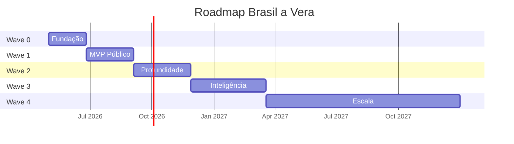
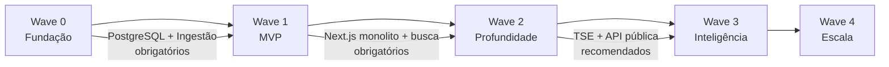

# Roadmap

> Brasil a Vera · Produto · v0.2
> Última atualização: 2026-04-14
> Status: accepted

---

## Sumário

- [Estratégia de Waves](#estratégia-de-waves)
- [Wave 0 — Fundação](#wave-0--fundação)
- [Wave 1 — MVP Público](#wave-1--mvp-público)
- [Wave 2 — Profundidade](#wave-2--profundidade)
- [Wave 3 — Inteligência](#wave-3--inteligência)
- [Wave 4 — Escala](#wave-4--escala)
- [Dependências entre Waves](#dependências-entre-waves)

---

## Estratégia de Waves

O roadmap segue **waves incrementais**, onde cada wave entrega valor autónomo e valida hipóteses antes de avançar. Nenhuma wave depende do sucesso comercial das anteriores.

| Wave | Nome | Personas Atendidas | Duração Estimada |
|------|------|--------------------|------------------|
| 0 | Fundação | Nenhuma (infraestrutura) | 6-8 semanas |
| 1 | MVP Público | Cidadão, Jornalista | 8-10 semanas |
| 2 | Profundidade | Todos | 10-12 semanas |
| 3 | Inteligência | Jornalista, Ativista, Pesquisador | 12-16 semanas |
| 4 | Escala | Cidadão (mobile), Todos | Contínuo |

---

## Wave 0 — Fundação

> **Pergunta validada**: "Conseguimos ingerir, normalizar e servir dados legislativos de forma confiável?"

### Escopo

- Scripts TypeScript de ingestão: Câmara API + Senado API (executados via GitHub Actions)
- Modelo de domínio: bounded contexts core (Parlamentares, Proposições, Votações, Gastos) como módulos TypeScript
- PostgreSQL (Neon free tier) com schema por bounded context
- Migrations SQL puras em `src/shared/db/migrations/`
- Estrutura de módulos com Biome `noRestrictedImports` bloqueando imports cross-module
- API interna (Next.js Route Handlers, não pública) para validação
- CI/CD básico (Biome CI, Vitest, build Next.js) com pre-commit via Husky
- Trust Metadata como shared kernel implementado em `src/shared/trust/`

### Critérios de Done

- [ ] Pipeline da Câmara ingere 100% dos deputados da legislatura atual
- [ ] Pipeline da Câmara ingere votações nominais dos últimos 2 anos
- [ ] Pipeline da Câmara ingere gastos CEAP dos últimos 12 meses
- [ ] Pipeline do Senado ingere senadores em exercício
- [ ] Pipeline do Senado ingere votações do último ano
- [ ] Todos os registros persistidos com `trust_level: L1` e `source_url`
- [ ] Biome `noRestrictedImports` bloqueando imports cross-module no CI
- [ ] Husky pre-commit executando `biome check` nos arquivos staged
- [ ] Scripts de ingestão rodando via GitHub Actions cron
- [ ] `npm run dev` sobe o Next.js monolito conectado ao PostgreSQL
- [ ] Cobertura de testes > 70% no domínio
- [ ] Reconciliação manual confirma dados vs. fonte oficial

### Entregáveis de Arquitetura

- ADRs implementados (ver [ADRs](../architecture/ADR/))
- Monorepo estruturado conforme [ADR-001](../architecture/ADR/001-monorepo-strategy.md)
- Monolito Next.js modular conforme [ADR-007](../architecture/ADR/007-monolith-first-strategy.md)
- Clean Architecture em cada módulo conforme [ADR-002](../architecture/ADR/002-backend-language-and-framework.md)

---

## Wave 1 — MVP Público

> **Pergunta validada**: "O cidadão consegue encontrar seu parlamentar e entender o que ele faz?"
>
> **Pergunta-chave do MVP**: "O que meu deputado/senador anda fazendo?"

### Escopo

- Next.js monolito (ver [ADR-006](../architecture/ADR/006-frontend-stack.md)) — frontend SSR/SSG + API Route Handlers
- Página 360° do parlamentar (ver [Parlamentar 360°](../features/PARLAMENTAR-360.md))
- Página da proposição (tipo, ementa, tramitação, votos)
- Busca unificada (ver [Busca](../features/SEARCH.md))
- Pares contraditórios básicos (apenas verbos inequívocos)
- Top 5 parlamentares com maior afinidade de voto (SQL simples — GROUP BY + COUNT)
- Compartilhamento social com cards OG
- Export CSV básico
- Deploy em Cloudflare Workers via OpenNext (free tier)

### Critérios de Done

- [ ] Página 360° funcional para todos os deputados e senadores
- [ ] Busca por nome, proposição e tema retorna resultados em < 500ms
- [ ] Pares contraditórios exibidos com contexto temporal
- [ ] Trust level renderizado em toda a UI (badges L1/L2)
- [ ] Cards OG dinâmicos por parlamentar
- [ ] Export CSV com `trust_level` e `source_url` por linha
- [ ] WCAG 2.1 AA em todas as páginas
- [ ] Performance: LCP < 2.5s em 3G, CLS < 0.1
- [ ] 5.000 usuários ativos mensais (target)

### Personas atendidas

- **Cidadão Consciente**: página 360°, busca simples, compartilhamento
- **Jornalista Investigativo**: busca avançada, export, página de proposição

---

## Wave 2 — Profundidade

> **Pergunta validada**: "Cidadãos engajados e jornalistas usam a plataforma como ferramenta de análise, não só consulta?"

A Wave 2 é dividida em três sub-waves entregáveis. Cada sub-wave tem tag de release própria e pode ser parada com algo concreto entregue.

### Wave 2.0 — Foundation Hardening

> **Tag de release**: `v0.2.0-foundation`
> **Status**: ✅ Concluída em 2026-05-12 com 2 ressalvas registradas (ver Critérios de Done abaixo)

**Por que primeiro**: a infraestrutura estabelecida na pré-Wave 2 (ADRs 016, 017, 018 + princípios 8-12 do CLAUDE.md) precisa ser implementada antes de qualquer feature nova. Sem cache, SSG e observabilidade, cada feature adicional ataca o budget direto. Esta sub-wave também consolida os safety nets que faltavam quando o incidente do Pool singleton aconteceu.

#### Escopo

**Infra de cache e SSG (princípios 8 e 9):**

- Módulo `src/lib/cache.ts` com TTLs do ADR-018 (issue #41)
- Migração de páginas de detalhe para SSG + `revalidate` periódico (issue #42)
- Webhook de revalidação pós-ingestão (issue #43)

**Tríade de observabilidade:**

- Endpoint `/api/stats` admin-only — visibilidade do banco (issue #38)
- Script GitHub Actions de poll de billing Neon — visibilidade do custo (issue #40)
- Monitoramento de jobs de ingestão GitHub Actions — visibilidade dos pipelines (issue #30)

**Safety nets:**

- Alerta quando endpoint do Senado atinge limit fixo (issue #21)
- Smoke test pós-deploy contra Workers + Neon (issue #33)

**Base de testes para a Wave 2.1:**

- Testes integrados de queries com testcontainers (issue #22)

**Débito documental:**

- ADR-010 — UUID v7 como chave primária (issue #23)
- ADR-013 — Schema por bounded context no Postgres (issue #24)
- ADR-015 — Split de driver Neon por runtime (issue #34)

**Recorrente:**

- Revisão trimestral de custo (issue #39)

#### Critérios de Done

- [ ] 30 requests concorrentes em rotas de detalhe servem em < 100ms (média, com cache quente) — **ressalva**: nunca medido formalmente. Cache de edge implementado ([ADR-018](../architecture/ADR/018-cache-edge-app.md)), arquitetura suporta. Falta benchmark empírico — fica como item de operação contínua, não bloqueia entrega.
- [ ] CU-hours mensal projetado < 50 (zona verde do [ADR-017](../architecture/ADR/017-budget-mensal-observabilidade.md)) — **parcial**: 46.98 h/mês observado (< 50 ✓), mas custo projetado entrou em zona AMARELA ($7.52, threshold $5-15) por compute em testes/dev. Acompanhamento contínuo em #39.
- [x] `/api/stats` retornando contagens, tamanho do banco, última ingestão por tipo (issue #38)
- [ ] Webhook de `revalidate` validado em produção (1 deploy de ingestão dispara `revalidatePath`) — **ressalva**: bloqueado por #58 (R2 incremental cache) que migra para Wave 3+. Issue #43 fica aberta para Wave 3. Revalidação manual via redeploy é alternativa viável até lá.
- [x] Script de poll Neon rodando diariamente com alerta em zona amarela/vermelha (issue #40, PR #55)
- [x] Monitoramento de jobs de ingestão notifica falhas em < 1h (issue #30)
- [x] Smoke test pós-deploy bloqueando rollout em caso de regressão (issue #33)
- [x] Suite de testes integrados com testcontainers cobrindo queries de domínio (issue #22, PR #63) — **parcial**: cobre módulo `parlamentares` (8 funções, 11 testes). Issues #64-#67 estendem para `proposicoes`, `votacoes`, `stats+busca`, `coerencia` em Wave 2.1.
- [x] Três ADRs de débito documental publicados (010, 013, 015) — issues #23, #24, #34 fechadas no Batch D

### Wave 2.1 — Domain Depth

> **Tag de release**: `v0.2.1-depth`
> **Status**: ✅ Concluída em 2026-05-13 com 3 ressalvas registradas (ver Critérios de Done abaixo)
> **Duração estimada**: 4-6 semanas

**Por que segundo**: com infra hardened, cada feature de domínio herda otimização automaticamente. Aqui o produto ganha narrativa cívica — não só mostra dados isolados, mas tece a história legislativa.

#### Escopo

- **Tramitação de proposições**: ingestão e UI da história completa de cada PL/PEC/MPV. Schema com `descricao_resumida` (≤ 200 chars) + `descricao_completa` opcional. Cobertura: legislaturas 56 e 57 ([ADR-016](../architecture/ADR/016-cobertura-temporal-arquivamento.md)).
- **Alinhamento partidário**: % de fidelidade do parlamentar à bancada, visualizado em gráfico no perfil. Cálculo em batch noturno cacheado.
- **Comparativo entre parlamentares**: nova rota `/comparar?ids=X,Y[,Z]` para 2-3 parlamentares lado a lado (votos coincidentes, gastos, presenças, proposições).
- **Página de partido**: nova rota `/partidos/[sigla]` com bancada completa, fidelidade interna média, proposições por tema.

#### Critérios de Done

- [x] Visitante consegue contar uma história completa de um parlamentar em 60 segundos (perfil → tramitação de proposição → comparativo com colega de bancada) — stack completa entregue; validado por curl manual em prod pós-merge de cada ciclo
- [x] Tramitação cobre 100% das proposições das legislaturas 56 e 57 — **parcial**: ingestão Câmara + Senado deploy ✓ (PR #73); primeiro batch do cron semanal roda domingo após o merge. Cobertura real é verificada após o primeiro run em `ingestion-weekly.yml`.
- [ ] Alinhamento partidário calculado para todos os parlamentares com 50+ votações registradas — **ressalva**: código deploy ✓ (PR #76) mas tabela `orientacao_bancada` está vazia em produção. UI mostra empty state em todos os perfis até que [#77](https://github.com/FabioCaffarello/brasil-a-vera/issues/77) (ingestão de orientação_bancada) seja implementado.
- [x] Página de comparativo funcional para qualquer combinação de 2-3 parlamentares (issue #47, PR #79) — validado em prod com 2 IDs, 3 IDs, 1 ID (erro inline), `bogus` (erro inline)
- [x] Página de partido funcional para todas as 20+ siglas ativas (issue #48, PR #78) — SSG pré-gera todas as siglas no build; validado em prod
- [x] Budget Neon segue em zona verde ou amarela controlada — **parcial**: zona AMARELA observada ($7.52, threshold $5-15 do ADR-017). Abaixo do limiar vermelho ($15) — "amarela controlada" cabe. Acompanhamento contínuo em #39.
- [x] Storage do banco < 1 GB — ~46.86 MB observado (último `/api/stats`); folga de 20x

### Wave 2.2 — Distribution & Polish

> **Tag de release**: `v0.2.2-distribution`
> **Duração estimada**: 2-3 semanas
> **Caráter**: opcional — entra apenas se Waves 2.0 e 2.1 fecharam sem queimar o operador e o budget estiver em zona verde.

**Por que último e opcional**: distribuição e refinamento são multiplicadores de alcance, mas não desbloqueiam funcionalidade nova. Melhor parar 2.1 entregue do que iniciar 2.2 cansado.

#### Escopo

- OpenGraph dinâmico em todas as páginas (compartilhamento social com prévia rica)
- Newsletter/RSS de proposições e votações relevantes
- Bulk export em Parquet via R2 (formato amigo de DuckDB, Pandas)
- Página estática de documentação para desenvolvedores curiosos
- Atualização do PRODUCT-VISION com aprendizados das Waves 1 e 2 (issue #32)

#### Critérios de Done

- [ ] Compartilhamento de qualquer URL em rede social gera prévia com OG dinâmico
- [ ] RSS feed publicado e validado em pelo menos 2 leitores
- [ ] Bulk export em Parquet disponível no R2
- [ ] Página `/docs` pública com guia de uso
- [ ] PRODUCT-VISION atualizado com aprendizados de Waves 1 e 2

### Fora da Wave 2 — adiado para Wave 3 ou posterior

Por decisão consciente, o escopo abaixo não entra na Wave 2. A razão é dupla: investimento de engenharia desproporcional ao orçamento solo e ao retorno em curto prazo, e dependência de infraestrutura adicional (auth, rate limiting, gestão de contas) que abre dimensão de produto significativa.

- API pública REST com OpenAPI, rate limiting, API keys
- Webhooks para desenvolvedores terceiros
- Alertas push/email por parlamentar ou tema (exige gestão de contas de usuário, LGPD)
- Integração TSE completa (financiamento eleitoral, doações, bens) — escopo grande o suficiente para wave dedicada
- Targets de adoção (50k MAU, 10 API keys, 5 citações em mídia) — viram OKRs de Wave 3, não critérios de Done de Wave 2

---

## Wave 3 — Inteligência

> **Pergunta validada**: "O grafo legislativo revela padrões não visíveis a olho nu?"

A Wave 3 acumula dois eixos: o que migrou da Wave 2 original (plataforma para desenvolvedores e integrações externas) e o salto analítico (grafo legislativo, NLP, correlações de impacto).

### Escopo

**Plataforma para desenvolvedores** (migrado da Wave 2 original):

- API pública REST com documentação OpenAPI (via Next.js Route Handlers)
- API keys e rate limiting (gestão de contas, LGPD-aware)
- Webhooks para desenvolvedores terceiros
- Alertas configuráveis por parlamentar e por tema (push/email)
- Integração TSE inicial — candidaturas e doações vinculadas a parlamentares (TSE completo, incluindo bens, permanece em Wave 4)

**Inteligência analítica**:

- **Início da extração de módulos Go (Strangler Fig)** — ver [ADR-007](../architecture/ADR/007-monolith-first-strategy.md)
- **Introdução do NATS JetStream** para domain events entre serviços — ver [ADR-005](../future/adr/005-event-driven-communication.md)
- Grafo legislativo interativo (ver [Grafo Legislativo](../future/LEGISLATIVE-GRAPH.md))
- **NetworkX + Apache AGE** para análise de grafo (sem Neo4j) — ver [ADR-003](../architecture/ADR/003-database-neon.md)
- Detecção de comunidades (Louvain/Leiden) via NetworkX (Python, batch)
- Métricas de centralidade (betweenness, closeness, degree)
- Correlação doações × votos (L3, seção isolada com disclaimer)
- Timeline de impacto (L3/L4)
- NLP avançado para classificação de direção de proposições
- Evolução temporal do grafo
- VPS Hostinger KVM 2 (R$59/mês) para serviços Go + Caddy como API Gateway

### Critérios de Done

- [ ] API pública com documentação OpenAPI publicada
- [ ] 10 desenvolvedores com API keys ativas
- [ ] Alertas configuráveis por parlamentar e por tema funcionando em produção
- [ ] Dados TSE iniciais (candidaturas e doações) vinculados a parlamentares (CPF ou heurística nome+partido+UF)
- [ ] Grafo interativo renderiza todos os parlamentares com filtros por tipo de aresta
- [ ] Detecção de comunidades com parâmetros documentados e ajustáveis
- [ ] Correlações L3 exibidas com disclaimer permanente
- [ ] Performance: grafo interativo > 30fps no desktop
- [ ] 50.000 usuários ativos mensais (target migrado de Wave 2)
- [ ] 5 citações em mídia (target migrado de Wave 2)
- [ ] 50 matérias jornalísticas citando o Brasil a Vera (target original Wave 3)
- [ ] 100 API keys ativas (target original Wave 3)

---

## Wave 4 — Escala

> **Pergunta validada**: "A plataforma escala para além do Congresso Nacional?"

### Escopo

- Mobile app nativa (React Native ou similar)
- Integração com redes sociais (notificações via Telegram/WhatsApp)
- Expansão para assembleias legislativas estaduais
- Brasil a Vera Labs (L4) — correlações de impacto com especialistas
- Internacionalização da plataforma (interface multilíngue para pesquisadores internacionais)

### Critérios de Done

- Definidos conforme Waves 0-3 validem hipóteses

---

## Dependências entre Waves

| Dependência | De | Para | Tipo |
|-------------|-----|------|------|
| PostgreSQL (Neon) + schemas | Wave 0 | Wave 1 | Obrigatória |
| Scripts de ingestão (GitHub Actions) | Wave 0 | Wave 1 | Obrigatória |
| Biome import boundaries + Husky pre-commit | Wave 0 | Wave 1 | Obrigatória |
| Next.js monolito (frontend + API) | Wave 1 | Wave 2 | Obrigatória |
| Busca unificada | Wave 1 | Wave 2 | Obrigatória |
| API pública | Wave 2 | Wave 3 | Recomendada |
| TSE integration | Wave 2 | Wave 3 | Recomendada (para correlação doações × votos) |
| Extração de módulos Go (Strangler Fig) | Wave 2 | Wave 3 | Obrigatória para microserviços |
| NATS JetStream | Wave 2 | Wave 3 | Obrigatória para event-driven |
