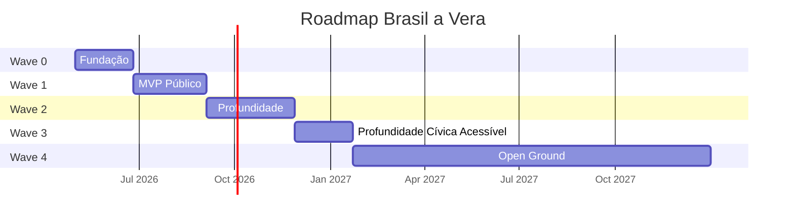
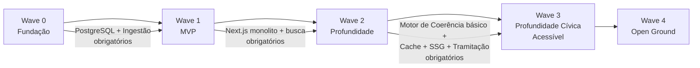

# Roadmap

> Brasil a Vera · Produto · v0.2
> Última atualização: 2026-04-14
> Status: accepted

---

## Sumário

- [Estratégia de Waves](#estratégia-de-waves)
- [Wave 0 — Fundação](#wave-0--fundação)
- [Wave 1 — MVP Público](#wave-1--mvp-público)
- [Wave 2 — Profundidade](#wave-2--profundidade)
- [Wave 3 — Profundidade Cívica Acessível](#wave-3--profundidade-cívica-acessível)
- [Wave 4 — Open Ground](#wave-4--open-ground)
- [Dependências entre Waves](#dependências-entre-waves)

---

## Estratégia de Waves

O roadmap segue **waves incrementais**, onde cada wave entrega valor autónomo e valida hipóteses antes de avançar. Nenhuma wave depende do sucesso comercial das anteriores.

| Wave | Nome | Personas Atendidas | Duração Estimada |
|------|------|--------------------|------------------|
| 0 | Fundação | Nenhuma (infraestrutura) | 6-8 semanas |
| 1 | MVP Público | Cidadão, Jornalista | 8-10 semanas |
| 2 | Profundidade | Todos | 10-12 semanas |
| 3 | Profundidade Cívica Acessível | Cidadão, Jornalista, Pesquisador | 7-10 semanas (3 sub-waves) |
| 4 | Open Ground | (definido após Wave 3) | Backlog sem plano contratual |

---

## Wave 0 — Fundação

> **Pergunta validada**: "Conseguimos ingerir, normalizar e servir dados legislativos de forma confiável?"

### Escopo

- Scripts TypeScript de ingestão: Câmara API + Senado API (executados via GitHub Actions)
- Modelo de domínio: bounded contexts core (Parlamentares, Proposições, Votações, Gastos) como módulos TypeScript
- PostgreSQL (Neon free tier) com schema por bounded context
- Migrations SQL puras em `src/shared/db/migrations/`
- Estrutura de módulos com Biome `noRestrictedImports` bloqueando imports cross-module
- API interna (Next.js Route Handlers, não pública) para validação
- CI/CD básico (Biome CI, Vitest, build Next.js) com pre-commit via Husky
- Trust Metadata como shared kernel implementado em `src/shared/trust/`

### Critérios de Done

- [ ] Pipeline da Câmara ingere 100% dos deputados da legislatura atual
- [ ] Pipeline da Câmara ingere votações nominais dos últimos 2 anos
- [ ] Pipeline da Câmara ingere gastos CEAP dos últimos 12 meses
- [ ] Pipeline do Senado ingere senadores em exercício
- [ ] Pipeline do Senado ingere votações do último ano
- [ ] Todos os registros persistidos com `trust_level: L1` e `source_url`
- [ ] Biome `noRestrictedImports` bloqueando imports cross-module no CI
- [ ] Husky pre-commit executando `biome check` nos arquivos staged
- [ ] Scripts de ingestão rodando via GitHub Actions cron
- [ ] `npm run dev` sobe o Next.js monolito conectado ao PostgreSQL
- [ ] Cobertura de testes > 70% no domínio
- [ ] Reconciliação manual confirma dados vs. fonte oficial

### Entregáveis de Arquitetura

- ADRs implementados (ver [ADRs](../architecture/ADR/))
- Monorepo estruturado conforme [ADR-001](../architecture/ADR/001-monorepo-strategy.md)
- Monolito Next.js modular conforme [ADR-007](../architecture/ADR/007-monolith-first-strategy.md)
- Clean Architecture em cada módulo conforme [ADR-002](../architecture/ADR/002-backend-language-and-framework.md)

---

## Wave 1 — MVP Público

> **Pergunta validada**: "O cidadão consegue encontrar seu parlamentar e entender o que ele faz?"
>
> **Pergunta-chave do MVP**: "O que meu deputado/senador anda fazendo?"

### Escopo

- Next.js monolito (ver [ADR-006](../architecture/ADR/006-frontend-stack.md)) — frontend SSR/SSG + API Route Handlers
- Página 360° do parlamentar (ver [Parlamentar 360°](../features/PARLAMENTAR-360.md))
- Página da proposição (tipo, ementa, tramitação, votos)
- Busca unificada (ver [Busca](../features/SEARCH.md))
- Pares contraditórios básicos (apenas verbos inequívocos)
- Top 5 parlamentares com maior afinidade de voto (SQL simples — GROUP BY + COUNT)
- Compartilhamento social com cards OG
- Export CSV básico
- Deploy em Cloudflare Workers via OpenNext (free tier)

### Critérios de Done

- [ ] Página 360° funcional para todos os deputados e senadores
- [ ] Busca por nome, proposição e tema retorna resultados em < 500ms
- [ ] Pares contraditórios exibidos com contexto temporal
- [ ] Trust level renderizado em toda a UI (badges L1/L2)
- [ ] Cards OG dinâmicos por parlamentar
- [ ] Export CSV com `trust_level` e `source_url` por linha
- [ ] WCAG 2.1 AA em todas as páginas
- [ ] Performance: LCP < 2.5s em 3G, CLS < 0.1
- [ ] 5.000 usuários ativos mensais (target)

### Personas atendidas

- **Cidadão Consciente**: página 360°, busca simples, compartilhamento
- **Jornalista Investigativo**: busca avançada, export, página de proposição

---

## Wave 2 — Profundidade

> **Status global**: ✅ **Wave 2 inteira concluída em 2026-05-13** com tag `v0.2-final`.
> As 3 sub-waves entregues: 2.0 (`v0.2.0-foundation`), 2.1 (`v0.2.1-depth`, com micro-wave 2.1.1 de fechamento de ressalvas), 2.2 mínima (`v0.2.2-distribution`).
> Próximo passo: Wave 3 — Profundidade Cívica Acessível.

> **Pergunta validada**: "Cidadãos engajados e jornalistas usam a plataforma como ferramenta de análise, não só consulta?"

A Wave 2 é dividida em três sub-waves entregáveis. Cada sub-wave tem tag de release própria e pode ser parada com algo concreto entregue.

### Wave 2.0 — Foundation Hardening

> **Tag de release**: `v0.2.0-foundation`
> **Status**: ✅ Concluída em 2026-05-12 com 2 ressalvas registradas (ver Critérios de Done abaixo)

**Por que primeiro**: a infraestrutura estabelecida na pré-Wave 2 (ADRs 016, 017, 018 + princípios 8-12 do CLAUDE.md) precisa ser implementada antes de qualquer feature nova. Sem cache, SSG e observabilidade, cada feature adicional ataca o budget direto. Esta sub-wave também consolida os safety nets que faltavam quando o incidente do Pool singleton aconteceu.

#### Escopo

**Infra de cache e SSG (princípios 8 e 9):**

- Módulo `src/lib/cache.ts` com TTLs do ADR-018 (issue #41)
- Migração de páginas de detalhe para SSG + `revalidate` periódico (issue #42)
- Webhook de revalidação pós-ingestão (issue #43)

**Tríade de observabilidade:**

- Endpoint `/api/stats` admin-only — visibilidade do banco (issue #38)
- Script GitHub Actions de poll de billing Neon — visibilidade do custo (issue #40)
- Monitoramento de jobs de ingestão GitHub Actions — visibilidade dos pipelines (issue #30)

**Safety nets:**

- Alerta quando endpoint do Senado atinge limit fixo (issue #21)
- Smoke test pós-deploy contra Workers + Neon (issue #33)

**Base de testes para a Wave 2.1:**

- Testes integrados de queries com testcontainers (issue #22)

**Débito documental:**

- ADR-010 — UUID v7 como chave primária (issue #23)
- ADR-013 — Schema por bounded context no Postgres (issue #24)
- ADR-015 — Split de driver Neon por runtime (issue #34)

**Recorrente:**

- Revisão trimestral de custo (issue #39)

#### Critérios de Done

- [ ] 30 requests concorrentes em rotas de detalhe servem em < 100ms (média, com cache quente) — **ressalva**: nunca medido formalmente. Cache de edge implementado ([ADR-018](../architecture/ADR/018-cache-edge-app.md)), arquitetura suporta. Falta benchmark empírico — fica como item de operação contínua, não bloqueia entrega.
- [ ] CU-hours mensal projetado < 50 (zona verde do [ADR-017](../architecture/ADR/017-budget-mensal-observabilidade.md)) — **parcial**: 46.98 h/mês observado (< 50 ✓), mas custo projetado entrou em zona AMARELA ($7.52, threshold $5-15) por compute em testes/dev. Acompanhamento contínuo em #39.
- [x] `/api/stats` retornando contagens, tamanho do banco, última ingestão por tipo (issue #38)
- [ ] Webhook de `revalidate` validado em produção (1 deploy de ingestão dispara `revalidatePath`) — **ressalva**: bloqueado por #58 (R2 incremental cache) que migra para Wave 3+. Issue #43 fica aberta para Wave 3. Revalidação manual via redeploy é alternativa viável até lá.
- [x] Script de poll Neon rodando diariamente com alerta em zona amarela/vermelha (issue #40, PR #55)
- [x] Monitoramento de jobs de ingestão notifica falhas em < 1h (issue #30)
- [x] Smoke test pós-deploy bloqueando rollout em caso de regressão (issue #33)
- [x] Suite de testes integrados com testcontainers cobrindo queries de domínio (issue #22, PR #63) — **parcial**: cobre módulo `parlamentares` (8 funções, 11 testes). Issues #64-#67 estendem para `proposicoes`, `votacoes`, `stats+busca`, `coerencia` em Wave 2.1.
- [x] Três ADRs de débito documental publicados (010, 013, 015) — issues #23, #24, #34 fechadas no Batch D

### Wave 2.1 — Domain Depth

> **Tag de release**: `v0.2.1-depth`
> **Status**: ✅ Concluída em 2026-05-13. Ressalvas operacionais e de domínio fechadas pela micro-wave 2.1.1 (PRs #81 / #74 → #82 / #77 → #84). Senado de alinhamento permanece bloqueado por falta de API pública — tracking em #83.
> **Duração estimada**: 4-6 semanas

**Por que segundo**: com infra hardened, cada feature de domínio herda otimização automaticamente. Aqui o produto ganha narrativa cívica — não só mostra dados isolados, mas tece a história legislativa.

#### Escopo

- **Tramitação de proposições**: ingestão e UI da história completa de cada PL/PEC/MPV. Schema com `descricao_resumida` (≤ 200 chars) + `descricao_completa` opcional. Cobertura: legislaturas 56 e 57 ([ADR-016](../architecture/ADR/016-cobertura-temporal-arquivamento.md)).
- **Alinhamento partidário**: % de fidelidade do parlamentar à bancada, visualizado em gráfico no perfil. Cálculo em batch noturno cacheado.
- **Comparativo entre parlamentares**: nova rota `/comparar?ids=X,Y[,Z]` para 2-3 parlamentares lado a lado (votos coincidentes, gastos, presenças, proposições).
- **Página de partido**: nova rota `/partidos/[sigla]` com bancada completa, fidelidade interna média, proposições por tema.

#### Critérios de Done

- [x] Visitante consegue contar uma história completa de um parlamentar em 60 segundos (perfil → tramitação de proposição → comparativo com colega de bancada) — stack completa entregue; validado por curl manual em prod pós-merge de cada ciclo
- [x] Tramitação cobre 100% das proposições das legislaturas 56 e 57 — ingestão Câmara + Senado em produção (PR #73). Filtro por casa corrigido em #74 / PR #82 para cobrir proposições compartilhadas Câmara↔Senado (antes filtro `source_url LIKE` ficava com último ingestor). Cobertura real cresce a cada run do cron semanal `ingestion-weekly.yml`.
- [x] Alinhamento partidário calculado para parlamentares com 50+ votações registradas — **parcial para Câmara**: código (PR #76) + ingestão de `orientacao_bancada` (#77 / PR #84) em produção. 56 rows × 18 votações × 8 partidos × 100% match com `parlamentar.partido_sigla`. UI renderiza percentual real (validado em 3 perfis amostrais). Cobertura cresce com cron de votações (4x/dia). **Senado bloqueado**: API não publica orientações — tracking em [#83](https://github.com/FabioCaffarello/brasil-a-vera/issues/83).
- [x] Página de comparativo funcional para qualquer combinação de 2-3 parlamentares (issue #47, PR #79) — validado em prod com 2 IDs, 3 IDs, 1 ID (erro inline), `bogus` (erro inline)
- [x] Página de partido funcional para todas as 20+ siglas ativas (issue #48, PR #78) — SSG pré-gera todas as siglas no build; validado em prod
- [x] Budget Neon segue em zona verde ou amarela controlada — **parcial**: zona AMARELA observada ($7.52, threshold $5-15 do ADR-017). Abaixo do limiar vermelho ($15) — "amarela controlada" cabe. Acompanhamento contínuo em #39.
- [x] Storage do banco < 1 GB — ~46.86 MB observado (último `/api/stats`); folga de 20x

### Wave 2.2 — Distribution & Polish

> **Tag de release**: `v0.2.2-distribution` (sub-escopo mínimo entregue em 2026-05-13)
> **Status**: ✅ **Mínima concluída** (3/5 critérios). RSS e Parquet/R2 ficam para uma Wave 2.2 completa, se valer o esforço.
> **Duração estimada original**: 2-3 semanas
> **Caráter**: opcional — entra apenas se Waves 2.0 e 2.1 fecharam sem queimar o operador e o budget estiver em zona verde. Em 2026-05-13 o budget estava em zona amarela controlada ($7.52, threshold $5-15 do ADR-017) — operador escolheu entregar o subset mínimo de distribuição (OG + /docs + PRODUCT-VISION) sem inflar escopo.

**Por que último e opcional**: distribuição e refinamento são multiplicadores de alcance, mas não desbloqueiam funcionalidade nova. Melhor parar 2.1 entregue do que iniciar 2.2 cansado.

#### Escopo

- OpenGraph dinâmico em todas as páginas (compartilhamento social com prévia rica) — **entregue**
- Newsletter/RSS de proposições e votações relevantes — adiado
- Bulk export em Parquet via R2 (formato amigo de DuckDB, Pandas) — adiado
- Página estática de documentação para desenvolvedores curiosos — **entregue**
- Atualização do PRODUCT-VISION com aprendizados das Waves 1 e 2 (issue #32) — **entregue**

#### Critérios de Done

- [x] Compartilhamento de qualquer URL em rede social gera prévia com OG dinâmico — PR #86 (fallback global + dinâmicos próprios em parlamentar / proposição / votação / partido)
- [ ] RSS feed publicado e validado em pelo menos 2 leitores — **adiado** para Wave 2.2 completa
- [ ] Bulk export em Parquet disponível no R2 — **adiado** para Wave 2.2 completa
- [x] Página `/docs` pública com guia de uso — PR #87 (SSG, sem touch DB)
- [x] PRODUCT-VISION atualizado com aprendizados de Waves 1 e 2 — PR #88 / issue #32

### Fora da Wave 2 — adiado para Wave 3 ou posterior

Por decisão consciente, o escopo abaixo não entra na Wave 2. A razão é dupla: investimento de engenharia desproporcional ao orçamento solo e ao retorno em curto prazo, e dependência de infraestrutura adicional (auth, rate limiting, gestão de contas) que abre dimensão de produto significativa.

- API pública REST com OpenAPI, rate limiting, API keys
- Webhooks para desenvolvedores terceiros
- Alertas push/email por parlamentar ou tema (exige gestão de contas de usuário, LGPD)
- Integração TSE completa (financiamento eleitoral, doações, bens) — escopo grande o suficiente para wave dedicada
- Targets de adoção (50k MAU, 10 API keys, 5 citações em mídia) — viram OKRs de Wave 3, não critérios de Done de Wave 2

---

## Wave 3 — Profundidade Cívica Acessível

> **Pergunta validada**: "Cidadão e jornalista conseguem responder perguntas cívicas concretas (coerência por tema, financiamento eleitoral) usando a plataforma sem expedição arqueológica?"

A Wave 3 transforma os dados estruturados acumulados nas Waves 1 e 2 em narrativa cívica acessível. Três eixos: índice de coerência tornando o padrão de voto legível por padrão, dashboards temáticos agrupando proposições por área (saúde, educação, etc.), e doações do TSE 2022 vinculando financiamento eleitoral ao mandato em exercício. Segue o padrão validado de sub-waves curtas com tag de release própria.

A Wave 3 **deliberadamente recorta escopo** — API pública REST, grafo legislativo, NLP avançado, extração de módulos Go, NATS JetStream e integração TSE completa migram para a Wave 4 (open ground). Razão: nenhum deles atende a pergunta validada acima, e cada um dobraria o esforço da Wave inteira sem ganho proporcional pra cidadão. Ver [Fora da Wave 3](#fora-da-wave-3--adiado-para-wave-4) abaixo.

### Wave 3.0 — Realignment

> **Tag de release**: `v0.3.0-realignment`
> **Status**: planejada
> **Duração estimada**: 1-2 semanas

**Por que primeiro**: estabelece base conceitual e arquitetural antes de qualquer feature de domínio nova. Os ADRs cristalizam disciplina arquitetural (princípio 13 aplicado a um ano de operação) e o escopo Profundidade Cívica fica registrado antes da implementação começar.

#### Escopo

- ADR-019 — Disciplina arquitetural: não introduzir infra sem gargalo empírico (Go, NATS, Apache AGE etc só entram com evidência real, não inferência teórica)
- ADR-020 — Wave 3: escopo Profundidade Cívica Acessível (registro formal do recorte e do que migrou para Wave 4+)
- Índice de Coerência Completo (extende Motor de Coerência básico da Wave 1; depende de Wave 2.1.1 + #77 — orientação Câmara em produção)
- Página `/coerencia` com ranking nacional
- Página `/sobre/metodologia` (transparência sobre como cada dado é coletado, calculado e classificado)

#### Critérios de Done

- [ ] ADR-019 e ADR-020 publicados em `docs/architecture/ADR/` com status `accepted`
- [ ] Rota `/coerencia` acessível e indexável, ranking funcional para parlamentares com dados suficientes (threshold de votações documentado)
- [ ] Rota `/sobre/metodologia` cobre L1/L2/L3, fontes oficiais, cadência de ingestão, e política da pirâmide de confiança
- [ ] Princípio 13 (validação empírica) referenciado em `/sobre/metodologia` — auditabilidade da plataforma
- [ ] Sem regressão em rotas existentes (curl pós-deploy, smoke test verde)
- [ ] Budget Neon mantido em zona amarela controlada ou abaixo

### Wave 3.1 — Dashboards Temáticos

> **Tag de release**: `v0.3.1-themes`
> **Status**: planejada
> **Duração estimada**: 3-4 semanas

**Por que segundo**: com índice de coerência publicado, o dashboard temático ganha utilidade — agrupar proposições por área permite ver coerência por tema, não só global. Cidadão consegue perguntar "como meu deputado votou em saúde?" e ver resposta factual.

#### Escopo

- Schema `temas` com categorias predefinidas (Saúde, Educação, Segurança, Meio Ambiente, Economia, Direitos Humanos — 6 inicialmente)
- Pipeline de classificação por palavras-chave em ementas (L2, fórmula aberta, sem ML)
- Rotas `/temas` e `/temas/[slug]`
- Componente "Como [Parlamentar] votou em [Tema]" integrado em `/parlamentares/[id]`
- Trust badge L2 em todas as métricas temáticas (cálculo derivado de classificação de ementa)
- Export CSV temático (filtro por tema nas rotas de export existentes)

#### Critérios de Done

- [ ] 6 temas cobertos, com pelo menos 50 proposições classificadas por tema (amostra mínima)
- [ ] `/temas/[slug]` funcional com listagem de proposições + parlamentares atuantes naquele tema
- [ ] Componente "Como votou em X" integrado em todos os perfis de parlamentar
- [ ] Export CSV com filtro de tema testado por curl
- [ ] Trust level L2 documentado em `/sobre/metodologia` para o cálculo de classificação

### Wave 3.2 — TSE Doações Eleitorais

> **Tag de release**: `v0.3.2-tse-financing`
> **Status**: planejada
> **Duração estimada**: 3-4 semanas

**Por que último**: TSE é integração externa nova com schema novo — maior risco de delay. Coloca ao final pra não bloquear sub-waves anteriores. Escopo deliberadamente recortado (só 2022, só doações vinculáveis a parlamentares em exercício) reduz ambição de produto e evita "TSE completo" virar Wave inteira.

#### Escopo

- Schema novo `eleicoes` com tabelas `candidatura` e `doacao`
- Ingestão TSE 2022 — subset de doações vinculáveis a parlamentares atuais em exercício (não TSE completo; bens, gastos de campanha completos e anos anteriores permanecem em Wave 4+)
- Página `/parlamentares/[id]/financiamento` com listagem de doações + agregados (total, top doadores, distribuição por origem PF/PJ)
- ADR-021 — Modelagem TSE: escopo recortado para Wave 3 (documenta o que entra e o que fica fora)
- Auditoria L2 de matching parlamentar↔candidatura (heurística nome+CPF+UF, review manual de ambiguidades)
- 3 posts técnicos de showcase ativo da plataforma após entrega (canais: blog próprio, mídia parceira ou fórum)

#### Critérios de Done

- [ ] Schema `eleicoes` aplicado em produção sem regressão em outras tabelas (migration verde via auto-migrate do deploy)
- [ ] ADR-021 publicado e referenciado pelo código de ingestão TSE
- [ ] `/parlamentares/[id]/financiamento` renderiza para parlamentares com matching confirmado, com empty state explícito para não-matched
- [ ] Auditoria de matching exposta em `/api/stats` ou similar (taxa de matching agregada + lista de parlamentares não-matched)
- [ ] 3 posts técnicos publicados em canais distintos

### Fora da Wave 3 — adiado para Wave 4+

Por decisão consciente, o escopo abaixo **não entra** na Wave 3. Foi originalmente migrado da Wave 2 (decisão de 2026-05-12) e da definição "Wave 3 — Inteligência" anterior. Cada item dobraria o esforço da Wave inteira sem ganho proporcional pra cidadão.

- **API pública REST** com OpenAPI, API keys, rate limiting, webhooks, alertas push/email (gestão de contas + LGPD ampla)
- **Plataforma analítica avançada**: grafo legislativo interativo, NLP avançado de classificação de direção, detecção de comunidades (Louvain/Leiden), métricas de centralidade
- **Migração para arquitetura distribuída**: extração de módulos Go (Strangler Fig, [ADR-007](../architecture/ADR/007-monolith-first-strategy.md)), NATS JetStream, Apache AGE, VPS Hostinger
- **Integração TSE completa**: bens declarados, gastos de campanha completos, anos anteriores além de 2022
- **Expansão de produto**: mobile nativa, integração Telegram/WhatsApp, i18n, assembleias legislativas estaduais
- **Brasil a Vera Labs (L4)**: análises de impacto com curadoria especializada

Cada bloco vira issue mestre rotulada `wave-4+` no rastreamento de issues. Buscar com `gh issue list --label wave-4+`.

---

## Wave 4 — Open Ground

> **Status**: plano contratual pendente — será reavaliado após a Wave 3 fechar com base em evidência empírica de uso (cidadão, jornalista, contribuidor) e custo operacional.

A Wave 4 é deliberadamente **open ground** — sem critérios de Done atribuídos antecipadamente. As decisões adiadas das Waves 2 e 3 (e da definição "Wave 3 — Inteligência" anterior) ficam aqui como backlog explícito, rotuladas `wave-4+` no rastreamento de issues.

### Backlog (cada bullet é uma issue mestre com label `wave-4+`)

- **API pública e ecossistema externo** — REST + OpenAPI, API keys, rate limiting, webhooks, alertas push/email com gestão de contas LGPD-aware
- **Plataforma analítica avançada** — grafo legislativo interativo, NLP de classificação de direção, detecção de comunidades, métricas de centralidade
- **Migração para arquitetura distribuída** — Go Strangler Fig, NATS JetStream, Apache AGE, VPS Hostinger
- **Integração TSE completa** — bens declarados, gastos de campanha completos, anos anteriores além de 2022
- **Expansão de produto** — mobile nativa, integração com redes sociais (Telegram/WhatsApp), i18n, assembleias legislativas estaduais
- **Brasil a Vera Labs (L4)** — análises de impacto com curadoria especializada e disclaimers permanentes

Listar: `gh issue list --label wave-4+`.

### Quando reavaliar Wave 4

Reavaliação acontece **após a Wave 3 fechar** (estimativa: Q3 2026) com 3 perguntas:

1. Existe demanda concreta de cidadão, jornalista ou desenvolvedor pelo backlog acima?
2. O custo operacional manteve-se em zona amarela controlada (ADR-017) durante a Wave 3?
3. Qual o ROI estimado por item do backlog frente ao esforço solo?

Sem essas respostas calibradas em evidência empírica, a Wave 4 permanece em modo backlog. Princípio 13 do CLAUDE.md em ação: planejamento espera dados, não inferência.

---

## Dependências entre Waves

| Dependência | De | Para | Tipo |
|-------------|-----|------|------|
| PostgreSQL (Neon) + schemas | Wave 0 | Wave 1 | Obrigatória |
| Scripts de ingestão (GitHub Actions) | Wave 0 | Wave 1 | Obrigatória |
| Biome import boundaries + Husky pre-commit | Wave 0 | Wave 1 | Obrigatória |
| Next.js monolito (frontend + API) | Wave 1 | Wave 2 | Obrigatória |
| Busca unificada | Wave 1 | Wave 2 | Obrigatória |
| Motor de Coerência básico | Wave 1 | Wave 3.0 (Índice de Coerência Completo) | Obrigatória |
| Cache de edge + SSG | Wave 2.0 | Wave 3 | Obrigatória |
| Tramitação + alinhamento | Wave 2.1 | Wave 3.1 (dashboards temáticos) | Obrigatória |
| Orientação Câmara (`orientacao_bancada`) | Wave 2.1.1 | Wave 3.0 (Índice de Coerência) | Obrigatória |
| API pública REST, arquitetura distribuída (Go/NATS), TSE completo | Wave 3 anterior | Wave 4+ | Migrados — fora da Wave 3 atual |
