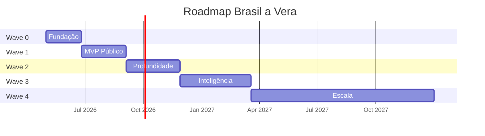
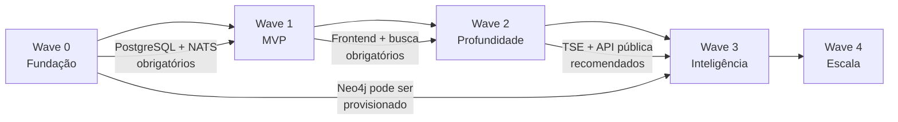

# Roadmap

> Brasil a Vera · Produto · v0.1
> Última atualização: 2026-04-14
> Status: accepted

---

## Sumário

- [Estratégia de Waves](#estratégia-de-waves)
- [Wave 0 — Fundação](#wave-0--fundação)
- [Wave 1 — MVP Público](#wave-1--mvp-público)
- [Wave 2 — Profundidade](#wave-2--profundidade)
- [Wave 3 — Inteligência](#wave-3--inteligência)
- [Wave 4 — Escala](#wave-4--escala)
- [Dependências entre Waves](#dependências-entre-waves)

---

## Estratégia de Waves

O roadmap segue **waves incrementais**, onde cada wave entrega valor autónomo e valida hipóteses antes de avançar. Nenhuma wave depende do sucesso comercial das anteriores.

| Wave | Nome | Personas Atendidas | Duração Estimada |
|------|------|--------------------|------------------|
| 0 | Fundação | Nenhuma (infraestrutura) | 6-8 semanas |
| 1 | MVP Público | Cidadão, Jornalista | 8-10 semanas |
| 2 | Profundidade | Todos | 10-12 semanas |
| 3 | Inteligência | Jornalista, Ativista, Pesquisador | 12-16 semanas |
| 4 | Escala | Cidadão (mobile), Todos | Contínuo |

---

## Wave 0 — Fundação

> **Pergunta validada**: "Conseguimos ingerir, normalizar e servir dados legislativos de forma confiável?"

### Escopo

- Pipelines de ingestão: Câmara API + Senado API
- Modelo de domínio: bounded contexts core (Parlamentares, Proposições, Votações, Gastos)
- PostgreSQL com schema por bounded context
- NATS JetStream para domain events
- API interna (não pública) para validação
- Docker Compose para desenvolvimento local
- CI/CD básico (lint, testes, build)
- Trust Metadata como shared kernel implementado

### Critérios de Done

- [ ] Pipeline da Câmara ingere 100% dos deputados da legislatura atual
- [ ] Pipeline da Câmara ingere votações nominais dos últimos 2 anos
- [ ] Pipeline da Câmara ingere gastos CEAP dos últimos 12 meses
- [ ] Pipeline do Senado ingere senadores em exercício
- [ ] Pipeline do Senado ingere votações do último ano
- [ ] Todos os registros persistidos com `trust_level: L1` e `source_url`
- [ ] Domain events publicados para Votações e Proposições
- [ ] Bounded contexts Coerência e Grafo consomem eventos com sucesso
- [ ] `docker-compose up` sobe todo o stack localmente
- [ ] Cobertura de testes > 70% no domínio
- [ ] Reconciliação manual confirma dados vs. fonte oficial

### Entregáveis de Arquitetura

- ADRs implementados (ver [ADRs](../architecture/ADR/))
- Monorepo estruturado conforme [ADR-001](../architecture/ADR/001-monorepo-strategy.md)
- Clean Architecture em cada bounded context conforme [ADR-002](../architecture/ADR/002-backend-language-and-framework.md)

---

## Wave 1 — MVP Público

> **Pergunta validada**: "O cidadão consegue encontrar seu parlamentar e entender o que ele faz?"
>
> **Pergunta-chave do MVP**: "O que meu deputado/senador anda fazendo?"

### Escopo

- Web app Next.js (ver [ADR-006](../architecture/ADR/006-frontend-stack.md))
- Página 360° do parlamentar (ver [Parlamentar 360°](../features/PARLAMENTAR-360.md))
- Página da proposição (tipo, ementa, tramitação, votos)
- Busca unificada (ver [Busca](../features/SEARCH.md))
- Pares contraditórios básicos (apenas verbos inequívocos)
- Top 5 parlamentares com maior afinidade de voto
- Compartilhamento social com cards OG
- Export CSV básico

### Critérios de Done

- [ ] Página 360° funcional para todos os deputados e senadores
- [ ] Busca por nome, proposição e tema retorna resultados em < 500ms
- [ ] Pares contraditórios exibidos com contexto temporal
- [ ] Trust level renderizado em toda a UI (badges L1/L2)
- [ ] Cards OG dinâmicos por parlamentar
- [ ] Export CSV com `trust_level` e `source_url` por linha
- [ ] WCAG 2.1 AA em todas as páginas
- [ ] Performance: LCP < 2.5s em 3G, CLS < 0.1
- [ ] 5.000 usuários ativos mensais (target)

### Personas atendidas

- **Cidadão Consciente**: página 360°, busca simples, compartilhamento
- **Jornalista Investigativo**: busca avançada, export, página de proposição

---

## Wave 2 — Profundidade

> **Pergunta validada**: "ONGs e desenvolvedores usam a plataforma como infraestrutura?"

### Escopo

- API pública REST com documentação OpenAPI
- Índice de coerência temática completo (ver [Motor de Coerência](../features/COHERENCE-ENGINE.md))
- Alinhamento governo/oposição
- Alertas por email/push (parlamentar, tema)
- Comparativo entre parlamentares
- Integração TSE (candidaturas, doações, bens)
- Bulk download de datasets
- Webhooks para desenvolvedores
- Rate limiting e API keys

### Critérios de Done

- [ ] API pública com documentação OpenAPI publicada
- [ ] Índice de coerência calculado para todos os parlamentares com dados suficientes
- [ ] Alertas configuráveis por parlamentar e por tema
- [ ] Dados TSE vinculados a parlamentares (CPF ou heurística nome+partido+UF)
- [ ] Bulk download em CSV e Parquet
- [ ] 10 desenvolvedores com API keys ativas
- [ ] 50.000 usuários ativos mensais (target)
- [ ] 5 citações em mídia (target)

---

## Wave 3 — Inteligência

> **Pergunta validada**: "O grafo legislativo revela padrões não visíveis a olho nu?"

### Escopo

- Grafo legislativo interativo (ver [Grafo Legislativo](../features/LEGISLATIVE-GRAPH.md))
- Neo4j populado com dados históricos
- Detecção de comunidades (Louvain/Leiden)
- Métricas de centralidade (betweenness, closeness, degree)
- Correlação doações × votos (L3, seção isolada com disclaimer)
- Timeline de impacto (L3/L4)
- NLP avançado para classificação de direção de proposições
- Evolução temporal do grafo

### Critérios de Done

- [ ] Grafo interativo renderiza todos os parlamentares com filtros por tipo de aresta
- [ ] Detecção de comunidades com parâmetros documentados e ajustáveis
- [ ] Correlações L3 exibidas com disclaimer permanente
- [ ] Performance: grafo interativo > 30fps no desktop
- [ ] 50 matérias jornalísticas citando o Brasil a Vera (target)
- [ ] 100 API keys ativas (target)

---

## Wave 4 — Escala

> **Pergunta validada**: "A plataforma escala para além do Congresso Nacional?"

### Escopo

- Mobile app nativa (React Native ou similar)
- Integração com redes sociais (notificações via Telegram/WhatsApp)
- Expansão para assembleias legislativas estaduais
- Brasil a Vera Labs (L4) — correlações de impacto com especialistas
- Internacionalização da plataforma (interface multilíngue para pesquisadores internacionais)

### Critérios de Done

- Definidos conforme Waves 0-3 validem hipóteses

---

## Dependências entre Waves

| Dependência | De | Para | Tipo |
|-------------|-----|------|------|
| PostgreSQL + schemas | Wave 0 | Wave 1 | Obrigatória |
| NATS + domain events | Wave 0 | Wave 1 | Obrigatória |
| Pipelines de ingestão | Wave 0 | Wave 1 | Obrigatória |
| Frontend Next.js | Wave 1 | Wave 2 | Obrigatória |
| Busca unificada | Wave 1 | Wave 2 | Obrigatória |
| API pública | Wave 2 | Wave 3 | Recomendada |
| TSE integration | Wave 2 | Wave 3 | Recomendada (para correlação doações × votos) |
| Neo4j setup | Wave 0 | Wave 3 | Pode ser antecipado |
