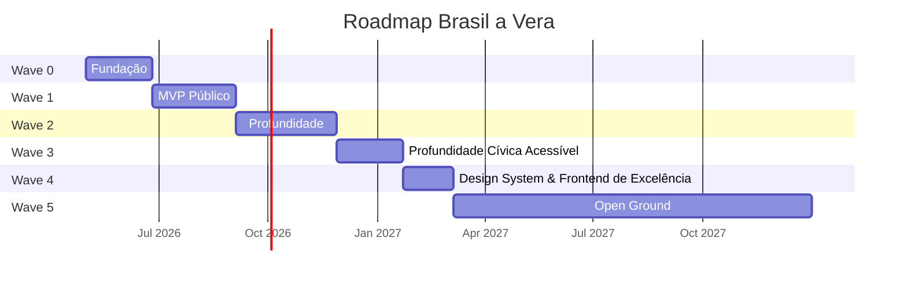
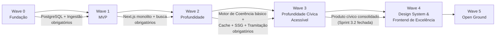

# Roadmap

> Brasil a Vera · Produto · v0.6.0
> Última atualização: 2026-05-16 (Sprint 6.3 fechada — 3 perfis reskinned com KpiStrip + SectionNav + SectionCard + DataBadge; sprints 6.4-6.6 permanecem planejadas; contrato vigente em `docs/product/PROMPT-MESTRE-WAVE-6.md`)
> Status: accepted

---

> **Nota histórica — renumeração de Waves em 2026-05-15**
>
> Originalmente, a Wave 4 era "Open Ground" — backlog sem plano contratual
> (API pública avançada, arquitetura distribuída em Go, TSE completo,
> Brasil a Vera Labs etc.). Após o fechamento da Sprint 3.2
> (`v0.3.2-distribution`), o operador decidiu reposicionar a Wave 4 para
> **"Design System & Frontend de Excelência"** com 6 sprints (4.0–4.6) —
> uma resposta a protótipo de design parceiro que demandou uma fase
> dedicada a elevar a qualidade visual e arquitetura do frontend sem
> features novas de domínio.
>
> Consequência:
>
> - **Wave 4** passou a ser a fase de Design System (este documento, abaixo).
> - **Wave 5 — Open Ground** absorveu o backlog que antes vivia na Wave 4.
> - **Sprints 3.3 e 3.4** (TSE, API pública REST, índice de coerência,
>   grafo) permanecem como `planejada` dentro da Wave 3, **pausadas em
>   2026-05-15** pendentes reavaliação ao final da Wave 4. Quando
>   reativadas, podem ser executadas como Sprints 3.3/3.4 ou migradas
>   formalmente para Wave 5 — decisão informada por evidência empírica
>   de uso pós-Wave 4.
> - O label de issues `wave-4+` será renomeado para `wave-5+` ao final
>   da Sprint 4.0 (não no PR de abertura — espera-se o ciclo de
>   fechamento da sprint pra evitar churn duplo no GitHub).
>
> Razão da decisão registrada em [prompt mestre Wave 4](#wave-4--design-system--frontend-de-excelência)
> abaixo, no [ADR-021](../architecture/ADR/021-design-system-shadcn-curado.md)
> e no [ADR-022](../architecture/ADR/022-clerk-para-autenticacao.md).

---

## Sumário

- [Estratégia de Waves](#estratégia-de-waves)
- [Wave 0 — Fundação](#wave-0--fundação)
- [Wave 1 — MVP Público](#wave-1--mvp-público)
- [Wave 2 — Profundidade](#wave-2--profundidade)
- [Wave 3 — Profundidade Cívica Acessível](#wave-3--profundidade-cívica-acessível)
- [Wave 4 — Design System & Frontend de Excelência](#wave-4--design-system--frontend-de-excelência)
- [Wave 5 — Open Ground](#wave-5--open-ground)
- [Wave 6 — Frontend de Excelência (reskin diagnóstico-dirigido)](#wave-6--frontend-de-excelência-reskin-diagnóstico-dirigido)
- [Dependências entre Waves](#dependências-entre-waves)

---

## Estratégia de Waves

O roadmap segue **waves incrementais**, onde cada wave entrega valor autónomo e valida hipóteses antes de avançar. Nenhuma wave depende do sucesso comercial das anteriores.

| Wave | Nome | Personas Atendidas | Duração Estimada |
|------|------|--------------------|------------------|
| 0 | Fundação | Nenhuma (infraestrutura) | 6-8 semanas |
| 1 | MVP Público | Cidadão, Jornalista | 8-10 semanas |
| 2 | Profundidade | Todos | 10-12 semanas |
| 3 | Profundidade Cívica Acessível | Cidadão, Jornalista, Pesquisador, Desenvolvedor | 14-20 semanas (5 sprints + 1 micro-wave); 3.3/3.4 pausados em 2026-05-15 |
| 4 | Design System & Frontend de Excelência | Todos | 6 sprints (4.0–4.6) |
| 5 | Open Ground | (definido após Wave 4) | Backlog sem plano contratual |
| 6 | Frontend de Excelência (reskin diagnóstico-dirigido) | Cidadão, Jornalista | 7 sprints (6.0–6.6) — Wave 6 absorve protótipo maduro do designer parceiro |

---

## Wave 0 — Fundação

> **Pergunta validada**: "Conseguimos ingerir, normalizar e servir dados legislativos de forma confiável?"

### Escopo

- Scripts TypeScript de ingestão: Câmara API + Senado API (executados via GitHub Actions)
- Modelo de domínio: bounded contexts core (Parlamentares, Proposições, Votações, Gastos) como módulos TypeScript
- PostgreSQL (Neon free tier) com schema por bounded context
- Migrations SQL puras em `src/shared/db/migrations/`
- Estrutura de módulos com Biome `noRestrictedImports` bloqueando imports cross-module
- API interna (Next.js Route Handlers, não pública) para validação
- CI/CD básico (Biome CI, Vitest, build Next.js) com pre-commit via Husky
- Trust Metadata como shared kernel implementado em `src/shared/trust/`

### Critérios de Done

- [ ] Pipeline da Câmara ingere 100% dos deputados da legislatura atual
- [ ] Pipeline da Câmara ingere votações nominais dos últimos 2 anos
- [ ] Pipeline da Câmara ingere gastos CEAP dos últimos 12 meses
- [ ] Pipeline do Senado ingere senadores em exercício
- [ ] Pipeline do Senado ingere votações do último ano
- [ ] Todos os registros persistidos com `trust_level: L1` e `source_url`
- [ ] Biome `noRestrictedImports` bloqueando imports cross-module no CI
- [ ] Husky pre-commit executando `biome check` nos arquivos staged
- [ ] Scripts de ingestão rodando via GitHub Actions cron
- [ ] `npm run dev` sobe o Next.js monolito conectado ao PostgreSQL
- [ ] Cobertura de testes > 70% no domínio
- [ ] Reconciliação manual confirma dados vs. fonte oficial

### Entregáveis de Arquitetura

- ADRs implementados (ver [ADRs](../architecture/ADR/))
- Monorepo estruturado conforme [ADR-001](../architecture/ADR/001-monorepo-strategy.md)
- Monolito Next.js modular conforme [ADR-007](../architecture/ADR/007-monolith-first-strategy.md)
- Clean Architecture em cada módulo conforme [ADR-002](../architecture/ADR/002-backend-language-and-framework.md)

---

## Wave 1 — MVP Público

> **Pergunta validada**: "O cidadão consegue encontrar seu parlamentar e entender o que ele faz?"
>
> **Pergunta-chave do MVP**: "O que meu deputado/senador anda fazendo?"

### Escopo

- Next.js monolito (ver [ADR-006](../architecture/ADR/006-frontend-stack.md)) — frontend SSR/SSG + API Route Handlers
- Página 360° do parlamentar (ver [Parlamentar 360°](../features/PARLAMENTAR-360.md))
- Página da proposição (tipo, ementa, tramitação, votos)
- Busca unificada (ver [Busca](../features/SEARCH.md))
- Pares contraditórios básicos (apenas verbos inequívocos)
- Top 5 parlamentares com maior afinidade de voto (SQL simples — GROUP BY + COUNT)
- Compartilhamento social com cards OG
- Export CSV básico
- Deploy em Cloudflare Workers via OpenNext (free tier)

### Critérios de Done

- [ ] Página 360° funcional para todos os deputados e senadores
- [ ] Busca por nome, proposição e tema retorna resultados em < 500ms
- [ ] Pares contraditórios exibidos com contexto temporal
- [ ] Trust level renderizado em toda a UI (badges L1/L2)
- [ ] Cards OG dinâmicos por parlamentar
- [ ] Export CSV com `trust_level` e `source_url` por linha
- [ ] WCAG 2.1 AA em todas as páginas
- [ ] Performance: LCP < 2.5s em 3G, CLS < 0.1
- [ ] 5.000 usuários ativos mensais (target)

### Personas atendidas

- **Cidadão Consciente**: página 360°, busca simples, compartilhamento
- **Jornalista Investigativo**: busca avançada, export, página de proposição

---

## Wave 2 — Profundidade

> **Status global**: ✅ **Wave 2 inteira concluída em 2026-05-13** com tag `v0.2-final`.
> As 3 sub-waves entregues: 2.0 (`v0.2.0-foundation`), 2.1 (`v0.2.1-depth`, com micro-wave 2.1.1 de fechamento de ressalvas), 2.2 mínima (`v0.2.2-distribution`).
> Próximo passo: Wave 3 — Profundidade Cívica Acessível.

> **Pergunta validada**: "Cidadãos engajados e jornalistas usam a plataforma como ferramenta de análise, não só consulta?"

A Wave 2 é dividida em três sub-waves entregáveis. Cada sub-wave tem tag de release própria e pode ser parada com algo concreto entregue.

### Wave 2.0 — Foundation Hardening

> **Tag de release**: `v0.2.0-foundation`
> **Status**: ✅ Concluída em 2026-05-12 com 2 ressalvas registradas (ver Critérios de Done abaixo)

**Por que primeiro**: a infraestrutura estabelecida na pré-Wave 2 (ADRs 016, 017, 018 + princípios 8-12 do CLAUDE.md) precisa ser implementada antes de qualquer feature nova. Sem cache, SSG e observabilidade, cada feature adicional ataca o budget direto. Esta sub-wave também consolida os safety nets que faltavam quando o incidente do Pool singleton aconteceu.

#### Escopo

**Infra de cache e SSG (princípios 8 e 9):**

- Módulo `src/lib/cache.ts` com TTLs do ADR-018 (issue #41)
- Migração de páginas de detalhe para SSG + `revalidate` periódico (issue #42)
- Webhook de revalidação pós-ingestão (issue #43)

**Tríade de observabilidade:**

- Endpoint `/api/stats` admin-only — visibilidade do banco (issue #38)
- Script GitHub Actions de poll de billing Neon — visibilidade do custo (issue #40)
- Monitoramento de jobs de ingestão GitHub Actions — visibilidade dos pipelines (issue #30)

**Safety nets:**

- Alerta quando endpoint do Senado atinge limit fixo (issue #21)
- Smoke test pós-deploy contra Workers + Neon (issue #33)

**Base de testes para a Wave 2.1:**

- Testes integrados de queries com testcontainers (issue #22)

**Débito documental:**

- ADR-010 — UUID v7 como chave primária (issue #23)
- ADR-013 — Schema por bounded context no Postgres (issue #24)
- ADR-015 — Split de driver Neon por runtime (issue #34)

**Recorrente:**

- Revisão trimestral de custo (issue #39)

#### Critérios de Done

- [ ] 30 requests concorrentes em rotas de detalhe servem em < 100ms (média, com cache quente) — **ressalva**: nunca medido formalmente. Cache de edge implementado ([ADR-018](../architecture/ADR/018-cache-edge-app.md)), arquitetura suporta. Falta benchmark empírico — fica como item de operação contínua, não bloqueia entrega.
- [ ] CU-hours mensal projetado < 50 (zona verde do [ADR-017](../architecture/ADR/017-budget-mensal-observabilidade.md)) — **parcial**: 46.98 h/mês observado (< 50 ✓), mas custo projetado entrou em zona AMARELA ($7.52, threshold $5-15) por compute em testes/dev. Acompanhamento contínuo em #39.
- [x] `/api/stats` retornando contagens, tamanho do banco, última ingestão por tipo (issue #38)
- [ ] Webhook de `revalidate` validado em produção (1 deploy de ingestão dispara `revalidatePath`) — **ressalva**: bloqueado por #58 (R2 incremental cache) que migra para Wave 3+. Issue #43 fica aberta para Wave 3. Revalidação manual via redeploy é alternativa viável até lá.
- [x] Script de poll Neon rodando diariamente com alerta em zona amarela/vermelha (issue #40, PR #55)
- [x] Monitoramento de jobs de ingestão notifica falhas em < 1h (issue #30)
- [x] Smoke test pós-deploy bloqueando rollout em caso de regressão (issue #33)
- [x] Suite de testes integrados com testcontainers cobrindo queries de domínio (issue #22, PR #63) — **parcial**: cobre módulo `parlamentares` (8 funções, 11 testes). Issues #64-#67 estendem para `proposicoes`, `votacoes`, `stats+busca`, `coerencia` em Wave 2.1.
- [x] Três ADRs de débito documental publicados (010, 013, 015) — issues #23, #24, #34 fechadas no Batch D

### Wave 2.1 — Domain Depth

> **Tag de release**: `v0.2.1-depth`
> **Status**: ✅ Concluída em 2026-05-13. Ressalvas operacionais e de domínio fechadas pela micro-wave 2.1.1 (PRs #81 / #74 → #82 / #77 → #84). Senado de alinhamento permanece bloqueado por falta de API pública — tracking em #83.
> **Duração estimada**: 4-6 semanas

**Por que segundo**: com infra hardened, cada feature de domínio herda otimização automaticamente. Aqui o produto ganha narrativa cívica — não só mostra dados isolados, mas tece a história legislativa.

#### Escopo

- **Tramitação de proposições**: ingestão e UI da história completa de cada PL/PEC/MPV. Schema com `descricao_resumida` (≤ 200 chars) + `descricao_completa` opcional. Cobertura: legislaturas 56 e 57 ([ADR-016](../architecture/ADR/016-cobertura-temporal-arquivamento.md)).
- **Alinhamento partidário**: % de fidelidade do parlamentar à bancada, visualizado em gráfico no perfil. Cálculo em batch noturno cacheado.
- **Comparativo entre parlamentares**: nova rota `/comparar?ids=X,Y[,Z]` para 2-3 parlamentares lado a lado (votos coincidentes, gastos, presenças, proposições).
- **Página de partido**: nova rota `/partidos/[sigla]` com bancada completa, fidelidade interna média, proposições por tema.

#### Critérios de Done

- [x] Visitante consegue contar uma história completa de um parlamentar em 60 segundos (perfil → tramitação de proposição → comparativo com colega de bancada) — stack completa entregue; validado por curl manual em prod pós-merge de cada ciclo
- [x] Tramitação cobre 100% das proposições das legislaturas 56 e 57 — ingestão Câmara + Senado em produção (PR #73). Filtro por casa corrigido em #74 / PR #82 para cobrir proposições compartilhadas Câmara↔Senado (antes filtro `source_url LIKE` ficava com último ingestor). Cobertura real cresce a cada run do cron semanal `ingestion-weekly.yml`.
- [x] Alinhamento partidário calculado para parlamentares com 50+ votações registradas — **parcial para Câmara**: código (PR #76) + ingestão de `orientacao_bancada` (#77 / PR #84) em produção. 56 rows × 18 votações × 8 partidos × 100% match com `parlamentar.partido_sigla`. UI renderiza percentual real (validado em 3 perfis amostrais). Cobertura cresce com cron de votações (4x/dia). **Senado bloqueado**: API não publica orientações — tracking em [#83](https://github.com/FabioCaffarello/brasil-a-vera/issues/83).
- [x] Página de comparativo funcional para qualquer combinação de 2-3 parlamentares (issue #47, PR #79) — validado em prod com 2 IDs, 3 IDs, 1 ID (erro inline), `bogus` (erro inline)
- [x] Página de partido funcional para todas as 20+ siglas ativas (issue #48, PR #78) — SSG pré-gera todas as siglas no build; validado em prod
- [x] Budget Neon segue em zona verde ou amarela controlada — **parcial**: zona AMARELA observada ($7.52, threshold $5-15 do ADR-017). Abaixo do limiar vermelho ($15) — "amarela controlada" cabe. Acompanhamento contínuo em #39.
- [x] Storage do banco < 1 GB — ~46.86 MB observado (último `/api/stats`); folga de 20x

### Wave 2.2 — Distribution & Polish

> **Tag de release**: `v0.2.2-distribution` (sub-escopo mínimo entregue em 2026-05-13)
> **Status**: ✅ **Mínima concluída** (3/5 critérios). RSS e Parquet/R2 ficam para uma Wave 2.2 completa, se valer o esforço.
> **Duração estimada original**: 2-3 semanas
> **Caráter**: opcional — entra apenas se Waves 2.0 e 2.1 fecharam sem queimar o operador e o budget estiver em zona verde. Em 2026-05-13 o budget estava em zona amarela controlada ($7.52, threshold $5-15 do ADR-017) — operador escolheu entregar o subset mínimo de distribuição (OG + /docs + PRODUCT-VISION) sem inflar escopo.

**Por que último e opcional**: distribuição e refinamento são multiplicadores de alcance, mas não desbloqueiam funcionalidade nova. Melhor parar 2.1 entregue do que iniciar 2.2 cansado.

#### Escopo

- OpenGraph dinâmico em todas as páginas (compartilhamento social com prévia rica) — **entregue**
- Newsletter/RSS de proposições e votações relevantes — adiado
- Bulk export em Parquet via R2 (formato amigo de DuckDB, Pandas) — adiado
- Página estática de documentação para desenvolvedores curiosos — **entregue**
- Atualização do PRODUCT-VISION com aprendizados das Waves 1 e 2 (issue #32) — **entregue**

#### Critérios de Done

- [x] Compartilhamento de qualquer URL em rede social gera prévia com OG dinâmico — PR #86 (fallback global + dinâmicos próprios em parlamentar / proposição / votação / partido)
- [ ] RSS feed publicado e validado em pelo menos 2 leitores — **adiado** para Wave 2.2 completa
- [ ] Bulk export em Parquet disponível no R2 — **adiado** para Wave 2.2 completa
- [x] Página `/docs` pública com guia de uso — PR #87 (SSG, sem touch DB)
- [x] PRODUCT-VISION atualizado com aprendizados de Waves 1 e 2 — PR #88 / issue #32

### Fora da Wave 2 — adiado para Wave 3 ou posterior

Por decisão consciente, o escopo abaixo não entra na Wave 2. A razão é dupla: investimento de engenharia desproporcional ao orçamento solo e ao retorno em curto prazo, e dependência de infraestrutura adicional (auth, rate limiting, gestão de contas) que abre dimensão de produto significativa.

- API pública REST com OpenAPI, rate limiting, API keys
- Webhooks para desenvolvedores terceiros
- Alertas push/email por parlamentar ou tema (exige gestão de contas de usuário, LGPD)
- Integração TSE completa (financiamento eleitoral, doações, bens) — escopo grande o suficiente para wave dedicada
- Targets de adoção (50k MAU, 10 API keys, 5 citações em mídia) — viram OKRs de Wave 3, não critérios de Done de Wave 2

---

## Wave 3 — Profundidade Cívica Acessível

> **Pergunta validada**: "Cidadão e jornalista conseguem responder perguntas cívicas concretas (coerência por tema, financiamento eleitoral) usando a plataforma sem expedição arqueológica?"

A Wave 3 transforma os dados estruturados acumulados nas Waves 1 e 2 em narrativa cívica acessível. Reescrita em 2026-05-13 (Sprint 3.0 / `v0.3.0-stable`) em 5 sprints incrementais — ordem: estabilização e honestidade → narrativa cívica → quick wins de distribuição → plataforma para devs → inteligência analítica. Cada sprint tem tag de release própria.

A Wave 3 **deliberadamente recorta escopo** — API pública REST, grafo legislativo, NLP avançado, extração de módulos Go, NATS JetStream e integração TSE completa migram para a Wave 4 (open ground). Stack permanente reafirmada em [ADR-020](../architecture/ADR/020-permanencia-monolito-typescript.md): TypeScript/Next.js/Neon/Cloudflare Workers, sem multi-runtime. Razão: nenhuma das peças propostas teve justificativa empírica, e cada uma dobraria o esforço da Wave inteira sem ganho proporcional pra cidadão. Ver [Fora da Wave 3](#fora-da-wave-3--adiado-para-wave-4) abaixo.

### Wave 3.0 — Estabilização & Honestidade

> **Tag de release**: `v0.3.0-stable`
> **Status**: ✅ Concluída em 2026-05-13
> **Duração**: 1 dia (escopo cirúrgico)

**Por que primeiro**: o produto pós-Wave 2 tinha 3 seções "honestas mas vazias" em todos os 721 perfis (pares contraditórios, top 5 afinidade, alinhamento à bancada), OG image vazando `localhost:3000` em todas as URLs sociais, e ressalvas operacionais não-fechadas. Antes de adicionar feature nova, o produto precisava estar em estado "sem vergonha de mostrar a um jornalista".

#### Escopo entregue

- **Bugs visíveis em produção** (Bloco 1): OG `localhost:3000` corrigido via `metadataBase`; auditoria do `db:migrate` automático + guarda em vitest; `/votacoes/[id]` ratificada como dynamic intencional (fechou #59); audit de triggers + concurrency dos 6 workflows + `WORKFLOWS.md` (fechou #69)
- **Auditoria de exports** (Tarefa 2): 4 endpoints CSV + `/api/stats` + busca empíricamente validados em prod; suite de regressão integration (12 + 4 testes); **truncagem honesta** via headers `X-Total-Count` / `X-Returned-Count` / `X-Truncated`
- **Diagnóstico de cobertura `orientacao_bancada`** (Tarefa 3): caminho (c) com nuance confirmado — 94.74% sobre nominais Câmara (denominador correto), não 1.21% sobre total. Senado bloqueado por #83. Script `ingestion/ops/diagnose-orientacoes.ts` permanece para revalidação periódica
- **Copy honesto em empty states** (Tarefa 4 + 3 finalização): zero ocorrências de "Pode ser que faltem dados…" em rotas públicas; copy refinado em ParesContraditorios, Top5Afinidade (disclaimer visível), AlinhamentoBancada (diferenciado por casa), FidelidadeMediaBlock, TramitacaoTimeline
- **Tooltip L1-L4** (Tarefa 5.1): acessível (hover/tap/focus, Esc, click fora), link âncora `/#piramide-confianca`
- **QA mobile** (Tarefa 5.2/5.3): Lighthouse mobile nas 6 rotas (Perf 94-99, A11y 93-100, CLS=0); tap targets ≥44px em filtros e busca

#### Critérios de Done — atendidos

- [x] Bugs OG/migrate/votacoes/workflows fechados; PRs #108-#110 mergeados
- [x] Auditoria de exports completa com tabela markdown + suite de regressão CI (PR #111)
- [x] Truncagem honesta implementada e validada em prod (X-Truncated emitido corretamente)
- [x] Diagnóstico orientação fechado com caminho técnico documentado (PR #113)
- [x] Grep `[pP]ode ser que` em src/ retorna 0 ocorrências
- [x] Lighthouse mobile rodado nas 6 rotas; sem regressão a11y
- [x] Tag `v0.3.0-stable` publicada
- [x] Budget Neon: zona AMARELA controlada (51.28 MB storage; estimativa $7.52 — abaixo do limiar vermelho $15)

#### Issues abertas pelo sprint (carregadas adiante)

- [#114](https://github.com/FabioCaffarello/brasil-a-vera/issues/114) — LCP > 2.5s em `/`, `/parlamentares`, `/partidos/[sigla]` (perf, wave-3+ → Sprint 3.1)

### Wave 3.0.5 — Honestidade pós-3.0 (recalibragem top 5 + auto-fetch vinculação)

> **Tag de release**: `v0.3.0.5-honest`
> **Status**: ✅ Concluída em 2026-05-15
> **Duração real**: ~1 dia (escopo recalibrado durante o sprint)

**Por que aqui**: dois empty states do Sprint 3.0 ficaram com copy honesto mas a feature continua "anêmica" — pares contraditórios cobre só verbos inequívocos (poucas ementas qualificam) e top 5 afinidade exibe 100% com 5 votações em comum (estatisticamente frágil).

**Redirecionamento durante o sprint** (Opção D do checkpoint): diagnóstico empírico mostrou que **NLP não era o gargalo** de pares contraditórios — gargalo real era vinculação votação→proposição (98% das nominais Câmara sem `proposicao_id` apontavam para proposições fora da janela de ingestão). Escopo reordenado para atacar gargalo real antes de refinar classificador.

#### Escopo entregue

**Bloco 1 — Recalibragem top 5 afinidade** (PR #117):

- Quórum mínimo de votações em comum: 5 → **20** (default)
- Janela temporal: **últimos 12 meses**
- `ORDER BY` por percentual desc, total como desempate (não mais coincidentes absolutos)
- Constantes `TOP5_QUORUM_MINIMO` e `TOP5_JANELA_MESES` exportadas — disclaimer sincronizado com cálculo

**Blocos 2/3/4 — Diagnóstico + auto-fetch + copy** (PR #121):

- Script `diagnose-3-0-5-vinculacao.ts` classifica gap de vinculação em 4 causas (a/b/c/d) — empírico mostrou 100% causa (a)
- **Auto-fetch reverso no backfill**: quando referência aponta para proposição ausente, dispara ingestão inline. Safeguard de 50 proposições/execução
- Split `proposicoes-core.ts` (puro) vs `proposicoes.ts` (entry-point) — bug descoberto durante implementação (import disparava ingest completo)
- `ORDER BY` com prioridade para nominais no backfill — garante safeguard consumido em votações user-facing
- Copy do empty state `ParesContraditorios` atualizado para refletir vinculação completa e princípio ADR-019

#### Critérios de Done — atendidos

- [x] Top 5 afinidade default: quórum 20 + janela 12m + ORDER BY %; falsos 100% caíram de 18.4% para 5.3%
- [x] Vinculação votação→proposição Câmara: **20/20 → 0/0** nominais sem `proposicao_id`
- [x] Tests integration cobrindo nova regra de top 5 (quórum filtro, janela temporal, desempate)
- [x] Scripts de diagnose (`baseline` + `vinculacao`) permanecem como ferramenta de revalidação periódica
- [x] Storage Neon mantido em zona AMARELA controlada (~200 proposições novas via auto-fetch)

#### Issues abertas pelo sprint

- Nenhuma issue nova aberta — escopo cirúrgico fechou tudo dentro do PR.

#### Decisão registrada

**NLP do classificador NÃO foi expandido** — princípio ADR-019 (sem gargalo empírico) protege contra expansão sem necessidade. Vocabulário atual cobre apenas verbos inequívocos; quando aparecer gargalo medido (ementas classificáveis mas ficando NÃO_CLASSIFICADA por verbos secundários), reabrir discussão com dados.

### Wave 3.1 — Narrativa Cívica & Frontend

> **Tag de release**: `v0.3.1-civic`
> **Status**: ✅ Concluída em 2026-05-15
> **Duração real**: ~1 dia (escopo cirúrgico)

**Por que segundo**: o cidadão que chega à plataforma sem nome em mente não sabe por onde começar. Esta sub-wave adiciona portas de entrada narrativas (não só "buscar X") e ajusta tipografia/espaçamento para destravar legibilidade.

#### Escopo entregue

- **Design tokens** (Tarefa 4.A, PR #124): paleta primária azul-marinho institucional via `@theme inline` em Tailwind v4; `docs/design/DESIGN-TOKENS.md` documenta princípios e variantes consideradas
- **Hierarquia do perfil 360°** (Tarefa 3, PR #125): refactor em 2 tiers — Tier 1 (ação legislativa) acima da dobra, Tier 3 (análises comparativas) em seção secundária com separador. Reflete cobertura empírica
- **Rota `/o-meu-parlamentar`** (Tarefa 1, PR #126): entrada cívica em 3 estados (form UF → autocomplete município → cards de representantes); dataset IBGE inline (5.571 municípios, 27 UFs); pedagogia explícita ("Congresso é representação estadual, não municipal")
- **Cards narrativos na home** (Tarefa 2, PR #127): 3 cards (Quem representa seu estado / Votações da semana / Plataforma em números) com `getPublicStats` + `getVotacoesRecentes`; fallback honesto 7d → 30d; lucide-react adicionado
- **Refinement aplicado** (Tarefa 4.B, PR #128): CTAs principais e focus rings migrados para `primary-700/500`; `EmptyState` component novo aplicado em listagens
- **Audit de tooltips L1-L4** (Tarefa 5, PR #129): cobertura já completa (10 usos de `TrustBadge` em 8 arquivos); refinements de link primary + aria-label + focus ring
- **QA mobile aprofundado** (Tarefa 6, PR #130): Lighthouse em 15 rotas; 2 fixes a11y (`text-zinc-500` dark mode contrast + `<dl>` aninhada); LCP > 2.5s expandido em #114

#### Critérios de Done — atendidos

- [x] Home tem **3 cards** de entrada narrativa, cada um linkando para fluxo cívico concreto
- [x] `/o-meu-parlamentar` funcional para entrada por estado/município (decisão de escopo: sem CEP)
- [ ] LCP < 2.5s — **não atingido**: 7 rotas ainda > 2.5s. Dependência cristalizada na #114: requer R2 incremental cache (#58, blocked). Documentado como carryover
- [x] CLS = 0 em todas as 15 rotas auditadas (zero regressão)
- [x] A11y mantido — 2 violações detectadas pelo audit foram corrigidas; pós-deploy esperar 100 em todas
- [x] Tabela QA mobile completa no PR #130

#### Issues abertas pelo sprint (carregadas adiante)

- [#114](https://github.com/FabioCaffarello/brasil-a-vera/issues/114) — LCP > 2.5s em 7 rotas (ampliado de 3 para 7); bloqueado por #58 (R2 cache)

#### Decisão registrada

**Modo escuro mantido** — implementado em todo o codebase desde Waves anteriores. Custo de remover > manter. Refinement aplicado em ambos os modos.

### Wave 3.2 — Quick wins de distribuição

> **Tag de release**: `v0.3.2-distribution`
> **Status**: ✅ Concluída em 2026-05-15. 4 PRs entregues + fechamento (#137).
> **Duração real**: 1 dia (cirúrgico — 4 PRs sequenciais)

**Por que terceiro**: feature de produto consolidada (3.0 + 3.0.5 + 3.1), agora dá pra distribuir. Itens leves de descoberta orgânica que multiplicam alcance sem demandar infra nova.

#### Escopo entregue

- OG dinâmico expandido para 5 listagens (home com contagem L2, /parlamentares, /proposicoes, /votacoes, /o-meu-parlamentar). Entidades já tinham OG próprio na Wave 3.0 — agora 9 cenários totais com hashes únicos garantidos por smoke probe.
- `/docs` pública reescrita em 5 páginas pedagógicas com sidebar sticky e active state: hub, pirâmide-de-confianca, como-ler-um-perfil, glossario, fontes.
- RSS 2.0 segmentado em ~85 feeds (1 global + 2 por casa + 27 por UF + ~25 por partido + ~30 por tema) com index human-readable em `/feed` e discovery via `metadata.alternates.types`.
- Smoke expandido com 4 probes (`og-hash-uniqueness`, `rss-xml-valid`, `rss-discovery`, `docs-anchors`) para regressões silenciosas que status HTTP não detecta.

#### Critérios de Done

- [x] OG dinâmico cobre ≥ 5 cenários (home, parlamentar, proposição, votação, partido) — **superado**: 9 cenários (5 listagens + 4 entidades). Probe `og-hash-uniqueness` (PR #136) garante via SHA-256 que cada rota tem render próprio.
- [x] `/docs` pública indexável, com explicação L1/L2/L3, fontes, cadência — 5 páginas em rotas explícitas (decisão C do plano), conteúdo derivado de `TRUST-PYRAMID.md`/`LEGISLATIVE-PROCESS.md`/`DATA-SOURCES.md`. Probe `docs-anchors` cobre regressão silenciosa de conteúdo pedagógico removido.
- [x] RSS validado **estruturalmente** em xmllint + smoke probe (`rss-xml-valid` checa RSS 2.0 + atom:link rel=self + content-type) — **ressalva**: validação manual em Feedly/NetNewsWire ficou como QA follow-up pós-tag. Estrutural cobre o que regressão silenciosa quebraria.

#### Decisão registrada

**Corte: 594 feeds por parlamentar individual fora do escopo** (princípio ADR-019). RSS por parlamentar individual exige evidência empírica de demanda (assinaturas reais observadas em logs) antes de adicionar. Cobertura atual (~85 feeds) cobre os recortes cívicos mais úteis sem inflar build/runtime.

### Wave 3.3 — Plataforma para devs

> **Tag de release**: `v0.3.3-platform`
> **Status**: ⏸️ pausada em 2026-05-15 — reavaliação ao final da Wave 4
> **Duração estimada**: 3-4 semanas

**Por que pausada**: Sprint 3.2 fechou com produto cívico consolidado e o operador redirecionou foco para Wave 4 (Design System & Frontend de Excelência). Quando reativada, pode ser executada como 3.3 ou migrada formalmente para Wave 5 — decisão dependente de feedback empírico durante a Wave 4 (demanda real de devs/jornalistas por API REST, TSE etc.).

**Por que era quarta** (preservado para contexto): estabiliza API antes de adicionar análise pesada. Inclui TSE inicial (subset 2022) para devs/jornalistas começarem a usar a plataforma como base de pesquisa.

#### Escopo

- API pública REST documentada via OpenAPI (rotas públicas atuais formalizadas — `/parlamentares`, `/proposicoes`, `/votacoes` etc — sem auth/rate-limit ainda)
- Alertas configuráveis por parlamentar/tema (rota `/alertas` com inscrição via e-mail — exige fluxo mínimo de auth; aceitar trade-off de complexidade aqui)
- TSE inicial: schema `eleicoes` + ingestão TSE 2022 (subset doações para parlamentares em exercício)
- Rota `/parlamentares/[id]/financiamento` com agregados PF/PJ
- ADR para modelagem TSE (numeração a definir quando da implementação — o slot ADR-021 foi ocupado pelo Design System em 2026-05-15)

#### Critérios de Done

- [ ] OpenAPI.json publicado em `/api/openapi.json`, valida via Swagger Editor
- [ ] Alertas: usuário cria inscrição via e-mail, recebe notificação quando parlamentar X vota Y
- [ ] Schema `eleicoes` aplicado via auto-migrate sem regressão
- [ ] Matching parlamentar↔candidatura com taxa ≥ 80% (heurística nome+CPF+UF)
- [ ] `/parlamentares/[id]/financiamento` renderiza com empty state explícito para não-matched

### Wave 3.4 — Inteligência analítica

> **Tag de release**: `v0.3.4-insight`
> **Status**: ⏸️ pausada em 2026-05-15 — reavaliação ao final da Wave 4
> **Duração estimada**: 4-6 semanas

**Por que pausada**: mesmo redirecionamento que pausou a 3.3. A 3.4 era também a sub-wave mais ambiciosa da Wave 3 — reavivá-la sem demanda concreta vai contra ADR-019.

**Por que era última** (preservado para contexto): o item mais ambicioso da Wave 3. Implementado em TypeScript ([ADR-020](../architecture/ADR/020-permanencia-monolito-typescript.md)) eventualmente com Workers AI para NLP pesado. Análises de grafo grandes rodam em batch via GitHub Actions e materializam resultado no banco.

#### Escopo

- **Índice de coerência completo** (extende Motor da Wave 1; depende do refinamento NLP do 3.0.5)
- **Página `/coerencia`** com ranking nacional + filtro por casa/partido/tema
- **Página `/sobre/metodologia`** (transparência sobre coleta, cálculo, classificação por L1/L2/L3 + princípio 13)
- **Dashboards temáticos**: schema `temas` + classificação automática de ementa, rotas `/temas` e `/temas/[slug]`, componente "Como X votou em [Tema]" nos perfis
- **Grafo legislativo**: detecção de comunidades em batch (Louvain/Leiden em JS), métricas de centralidade. Renderização frontend com `reactflow` (issue #96)
- **Workers AI** (opcional, com gargalo medido): se NLP local for insuficiente, mover classificação pesada para Workers AI

#### Critérios de Done

- [ ] Rota `/coerencia` acessível com ranking funcional para parlamentares com dados suficientes
- [ ] 6 temas cobertos, ≥ 50 proposições classificadas por tema (amostra mínima)
- [ ] Grafo legislativo renderiza em produção para top 50 parlamentares (depois expansão)
- [ ] `/sobre/metodologia` cobre L1/L2/L3, fontes oficiais, cadência, política da pirâmide
- [ ] Budget Neon mantido em zona amarela controlada (storage cresce com batches materializados)
- [ ] Princípio 13 referenciado em `/sobre/metodologia` — auditabilidade

### Fora da Wave 3 — adiado para Wave 5+ (anteriormente Wave 4+)

Por decisão consciente, o escopo abaixo **não entra** na Wave 3. Cada item dobraria o esforço da Wave inteira sem ganho proporcional pra cidadão; alguns foram descartados por princípio empírico (ver [ADR-019](../architecture/ADR/019-disciplina-arquitetural-sem-gargalo.md)) e por permanência do monolito ([ADR-020](../architecture/ADR/020-permanencia-monolito-typescript.md)).

- **API pública REST avançada**: rate limiting com API keys, webhooks para terceiros, push notifications (gestão de contas + LGPD ampla)
- **Migração para arquitetura distribuída**: extração de módulos Go (~~[ADR-007](../architecture/ADR/007-monolith-first-strategy.md)~~ superseded por ADR-020), NATS JetStream, Apache AGE, VPS Hostinger
- **Integração TSE completa**: bens declarados, gastos de campanha completos, anos anteriores além de 2022
- **Expansão de produto**: mobile nativa, integração Telegram/WhatsApp, i18n, assembleias legislativas estaduais
- **Brasil a Vera Labs (L4)**: análises de impacto com curadoria especializada
- **Bulk Parquet via R2**: formato amigável a DuckDB/Pandas — adiado pela Wave 2.2

Cada bloco vira issue mestre rotulada `wave-4+` no rastreamento de issues (label será renomeada para `wave-5+` no fechamento da Sprint 4.0 — renumeração de Waves de 2026-05-15). Buscar com `gh issue list --label wave-4+`.

---

## Wave 4 — Design System & Frontend de Excelência

> **Pergunta validada**: "Conseguimos elevar a qualidade visual e arquitetural do frontend ao nível de showcase profissional sem comprometer custo, trust_level, SEO ou WCAG?"

A Wave 4 nasceu após a entrega da Sprint 3.2 (`v0.3.2-distribution`) em 2026-05-15. Um protótipo de design parceiro (stack incompatível: TanStack Start + Vite + chamadas client-side à API da Câmara + mock auth) trouxe linguagem visual premium dark-first com OKLCH, IA estruturada e fluxos completos. **Extraímos a linguagem visual e a IA; reconstruímos tudo em cima da nossa stack** (Next.js 16 + RSC + Drizzle + Neon + Cloudflare Workers) com design system próprio versionado, testável e adaptado aos tokens semânticos.

A Wave 4 é deliberadamente **sem features novas de domínio** — toda a lógica de queries em `src/lib/queries/`, ingestão em `ingestion/`, módulos `src/modules/` e `src/shared/` permanece intocada. Refatoração é estética e arquitetural-frontend; trust_level, SEO, cobertura WCAG e custo Neon não regridem.

Decisões arquiteturais que governam a Wave 4 ficam em:

- [ADR-021](../architecture/ADR/021-design-system-shadcn-curado.md) — Design System próprio com shadcn/ui curado
- [ADR-022](../architecture/ADR/022-clerk-para-autenticacao.md) — Clerk para autenticação na Sprint 4.5+

### Wave 4.0 — Fundação do Design System

> **Tag de release**: `v0.4.0-design-system-foundation`
> **Status**: ✅ Concluída em 2026-05-15
> **Duração real**: 1 dia (8 PRs sequenciais — escopo cirúrgico)

**Por que primeiro**: estabelecer tokens semânticos, theme provider e as primitivas essenciais antes de tocar em qualquer página de produto. Risco controlado — nada visual mudou na home/listagens. Primeiro consumer real foi `/dev/design` (PR 7).

#### PRs entregues

| PR | Conteúdo |
|---|---|
| [#138](https://github.com/FabioCaffarello/brasil-a-vera/pull/138) | ADRs e contrato (docs-only): ADR-021 (Design System & shadcn curado), ADR-022 (Clerk para auth), CLAUDE.md linha-pointer, ROADMAP renumerado (Wave 4 nova + Wave 5 Open Ground com nota histórica). |
| [#139](https://github.com/FabioCaffarello/brasil-a-vera/pull/139) | Tokens OKLCH dark + esqueleto `src/design-system/` + `src/lib/cn.ts` + WCAG re-audit (15 pares dark + 15 light + culori dev-time) + import-boundaries vitest + Biome override + nota OKLCH support. Diff zero provado byte-a-byte em `/docs.html`. |
| [#140](https://github.com/FabioCaffarello/brasil-a-vera/pull/140) | `components.json` + primitiva `button` (8 testes). Bundle delta 0 (não consumida ainda). |
| [#141](https://github.com/FabioCaffarello/brasil-a-vera/pull/141) | Tier 1 lote 1: `card` + `badge` + `skeleton` em 3 commits isolados (19 testes). |
| [#142](https://github.com/FabioCaffarello/brasil-a-vera/pull/142) | Tier 1 lote 2: `sonner` (toasts, D4 sem next-themes) + `dialog` (Radix com focus trap, Esc, aria-labelledby/describedby) em 2 commits (12 testes). |
| [#143](https://github.com/FabioCaffarello/brasil-a-vera/pull/143) | Tier 1 lote 3: `input` + `label` + `separator` + `tabs` em 4 commits isolados (26 testes incluindo keyboard nav ArrowRight). |
| [#144](https://github.com/FabioCaffarello/brasil-a-vera/pull/144) | Rota interna `/dev/design` consumindo as 10 primitivas + X-Robots-Tag via `next.config.ts` + probe smoke `dev-routes-noindex` (7 testes do helper). **Primeiro consumer real** — bundle delta JS +118kb raw / ~30kb gzipped confirma estimativa do ADR-021. |
| [#145](https://github.com/FabioCaffarello/brasil-a-vera/pull/145) | Este PR — fechamento (ROADMAP + release notes + banner + tag + label rename). |

#### Critérios de Done — atendidos

- [x] `npm run check`, `npm run ci`, `npm run test`, `npm run build`, `npm run cf:build` passam em cada PR
- [x] `/dev/design` renderiza todas as 10 primitivas Tier 1 sem erros em dark
- [x] Auditoria de contraste: todos os 30 pares funcionais texto-sobre-fundo passam WCAG AA (15 dark + 15 light), tabela em `WCAG-AUDIT.md`
- [x] Bundle delta medido por PR e registrado (zero em PRs 3-6 por tree-shake, +118kb raw / ~30kb gzipped no PR 7 com primeiro consumer real)
- [x] Build time mantido no baseline (~7-9s wall em PRs com build limpo)
- [x] Zero regressão visual em rotas existentes — provado byte-a-byte em `/docs.html` no PR 2 (35743 = 35743 após normalização de hashes)
- [x] Probe `dev-routes-noindex` no smoke valida `/dev/design` com `X-Robots-Tag: noindex` (header) + meta robots noindex (HTML)
- [x] Tag `v0.4.0-design-system-foundation` publicada (após merge deste PR)
- [x] Label `wave-4+` renomeada para `wave-5+` no GitHub (após merge deste PR — comando documentado nas release notes)

#### Decisões aplicadas durante a sprint

- **D1 → (a)**: Dark only no 4.0; light dormente; toggle dark/light fica para 4.1+.
- **D2 → (a)**: `components.json` aliases `ui → @/design-system/primitives`, `utils → @/lib/cn`.
- **D3 → (a1)**: Rota `/dev/design` em `src/app/dev/` (sem route group; nesting direto), `noindex` via meta + `X-Robots-Tag` header via `next.config.ts`, probe smoke validando ambos.
- **D4**: Sem `next-themes` no 4.0; Sonner com `theme="dark"` hardcoded. CLI instalou next-themes automaticamente — desinstalado no PR 5.
- **D5**: Clerk só como ADR-022; dep entra no PR da Sprint 4.1.
- **D6 → opção 2**: Wave 4 inteira é "Design System & Frontend de Excelência"; backlog antigo migrado para Wave 5 — Open Ground.
- **D7**: 8 PRs sequenciais mantidos.

#### Issues abertas pelo sprint (carregadas adiante)

- Nenhuma issue nova aberta pela sprint. Carryovers planejados para 4.1+:
  - **Toggle dark/light** com `next-themes` (Sprint 4.1)
  - **Inter font** (Sprint 4.1 junto com novo shell)
  - **`tw-animate-css`** para animações de Dialog/Tabs (decisão diferida — Sprint 4.1 ou 4.3 com base em uso real)
  - **Tokens `--color-secondary`/`--color-accent`/`--color-input`** (introduzir quando primitiva de input dedicada exigir, no Sprint 4.2+)

### Wave 4.1 — Refatoração do shell (layout + home + Clerk)

> **Tag de release**: integrar em `v0.4.x` (sem tag intermediária — sprints intermediárias só merge na main; banner permanece `v0.4.0-design-system-foundation`)
> **Status**: ✅ Concluída em 2026-05-15
> **Duração real**: 1 dia (5 PRs sequenciais — escopo cirúrgico)

**Por que segundo**: trocar o shell (header, footer, home) e introduzir Clerk em ilha cliente isolada antes das listagens e perfis. Mantém tudo funcionando — só muda a camada visual.

#### PRs entregues

| PR | Conteúdo |
|---|---|
| [#146](https://github.com/FabioCaffarello/brasil-a-vera/pull/146) | Clerk setup + restricted middleware + ADR-022. ADR-022 v0.2 com §1-§6 (middleware.ts vs proxy.ts, `<Show>` API, matcher, ClerkProvider scope, gate empírico 50kb, Account Portal hosted). Decisão D1 do plano: Opção B aplicada — Provider NÃO em `<html>`, vai para AuthIsland scoped. |
| [#147](https://github.com/FabioCaffarello/brasil-a-vera/pull/147) | Navbar + AuthSlot RSC server-side com split-point assíncrono via `AuthIslandLoader`. 3 componentes: AuthSlot (RSC), AuthIslandLoader (client lazy), AuthIsland (Provider scoped). Anônimo via `auth()` server-side renderiza `<a href="/sign-in">` estático. |
| [#148](https://github.com/FabioCaffarello/brasil-a-vera/pull/148) | Footer + Inter font + body em `bg-background` dark global. **+ fix(deploy)**: deploy CI quebrou em main após #147 — Worker bundle estourou free tier 3 MiB (Clerk SDK em RSC). Reverteu AuthSlot RSC; AuthIslandLoader passa a ser consumido direto pelo Navbar (client-only auth check). Matcher do middleware volta a `/minha-area/(.*)`. Pages voltam a ser SSG. ADR-022 §3 v3 documenta a reversão empírica. |
| [#150](https://github.com/FabioCaffarello/brasil-a-vera/pull/150) | Home refeita: hero ampliado, 2 CTAs via primitiva Button (default + outline), utilitário `grid-bg` consumido, banner versão em `bg-surface-elevated`, Pirâmide de Confiança em grid 2 colunas com Card primitive. 3 cards da home (`card-meu-parlamentar`, `card-stats`, `card-votacoes-semana`) refatorados consumindo Card + tokens semânticos. |
| [#151](https://github.com/FabioCaffarello/brasil-a-vera/pull/151) | Este PR — fechamento (ROADMAP atualizado, sem tag, sem release notes formais; banner permanece v0.4.0-design-system-foundation). |

#### Decisões aplicadas durante a sprint

- **D1 (a)** — Dark hardcoded global via `<html className="dark">`; sem `next-themes` na 4.1. Toggle vai pra 4.6+ ou wave futura.
- **D2 (a)** — Inter substitui Geist Sans como `--font-sans`. Geist Mono permanece como `--font-mono`.
- **D3 (a)** — Refatoração completa da home (3 cards + Pirâmide) — não só hero.
- **D4 (a)** — Inconsistência visual transitória aceita: rotas existentes (`/parlamentares`, `/proposicoes`, `/votacoes`) ainda usam zinc legacy; Sprint 4.2 reskinning resolve.
- **D5 (a)** — `<UserButton>` lazy via `next/dynamic` dentro de AuthIsland (split-point pelo AuthIslandLoader).
- **D6 (a)** — Sem tag intermediária. Banner mantém `v0.4.0-design-system-foundation`.
- **D7 (a)** — 5 PRs sequenciais mantidos (1 Clerk setup + 1 Navbar + 1 shell + 1 home + 1 closure).

#### Decisões empíricas falsificadas e revisadas (princípio 13)

- **Opção B "pura" (PR 2)** com `<AuthSlot />` RSC chamando `auth()` server-side em todo header → quebrou deploy CI free tier. **Revertida** no PR 3 ([commit `0262b86`](https://github.com/FabioCaffarello/brasil-a-vera/commit/0262b86)). Causa: Clerk SDK no main `handler.mjs` empurrou o Worker gzipped de 2.79 MB → 3.23 MB, estourando 3 MiB.
- **`default.minify: true` no OpenNext** (tentativa de mitigação) → quebra em `@vercel/og/index.edge.js` (esbuild `minifySyntax` falha em `export { ImageResponse }` não declarado no file pré-bundled pelo Next).
- **API `<SignedIn>`/`<SignedOut>`** (research pré-implementação dizia que continuavam funcionais em Core 3) → **Falsificado empiricamente**: Clerk 7.3.4 (Core 3) removeu esses exports. Apenas `<Show when>` está disponível. Documentado em ADR-022 §2 v2.

#### Critérios de Done — atendidos

- [x] Rotas existentes (`/`, `/parlamentares`, etc.) continuam funcionando — apenas com novo shell visual (zinc legacy convivendo com tokens semânticos do shell)
- [x] Clerk integrado, sem rotas privadas ainda; middleware dormente em `/minha-area/(.*)`
- [x] Worker server bundle gzipped (Cloudflare) ≤ 3 MiB: 2.807 MB com margem 339 KB ✓
- [x] Bundle client medido — `<UserButton />` lazy-loaded via `next/dynamic` em AuthIslandLoader; anônimos baixam Clerk chunk APÓS hydrate
- [x] Login real validado end-to-end pelo owner (Account Portal hosted; redirect funcional via `redirectToSignIn({ returnBackUrl: '/' })`)
- [x] Free tier preservado — sem upgrade Workers Paid necessário (issue [#149](https://github.com/FabioCaffarello/brasil-a-vera/issues/149) registrada para revisitar Opção B "pura" quando sairmos do free tier)
- [x] Inter font aplicada; Geist Mono preservada
- [x] Body migrou para `bg-background text-foreground` (dark global hardcoded)

#### Issues abertas pela sprint

- [#149](https://github.com/FabioCaffarello/brasil-a-vera/issues/149) — `auth: restaurar AuthSlot RSC (Opção B "pura") quando sairmos do Workers free tier`. Label `wave-5+`. Documenta o trigger (upgrade Workers Paid $5/mo OU upstream resolve `@vercel/og` minify) e os passos concretos para re-aplicar.

#### Carryover para Sprint 4.2

- Reskinning amplo das listagens (`/parlamentares`, `/proposicoes`, `/votacoes`) — migrar dos tokens zinc legacy para semânticos OKLCH
- Refatorar cards de listagem (parlamentar-card, proposicao-card, votacao-card) consumindo Card primitive
- Filtros (UF, partido, casa, busca) consumindo Input/Label primitivas
- Tier 2 primitivas podem entrar se necessário (popover, command para typeahead)

### Wave 4.2 — Páginas de listagem (parlamentares, proposições, votações) + AuthSlot RSC restaurado

> **Tag de release**: integrar em `v0.4.x` (sem tag intermediária — banner permanece `v0.4.0-design-system-foundation`)
> **Status**: ✅ Concluída em 2026-05-16
> **Duração real**: 1 dia (6 PRs sequenciais)

**Por que terceiro**: reskinning das 3 grandes listagens (cards, filtros, páginas inteiras + detalhes de proposição e votação) com o novo design system + aproveitamento do upgrade Workers Paid (decidido pelo owner em 2026-05-15) para restaurar a "Opção B pura" do AuthSlot RSC (closes #149).

#### PRs entregues

| PR | Conteúdo |
|---|---|
| [#152](https://github.com/FabioCaffarello/brasil-a-vera/pull/152) | **AuthSlot RSC restaurado pós Workers Paid** (closes #149). `clerkMiddleware()` matcher expandido para padrão Clerk (todas rotas não-asset + `/api`/`/trpc`); `AuthSlot` server-side via `auth()` renderiza `<a href="/sign-in">` estático para anônimos (zero JS de Clerk) e `<AuthIslandLoader />` lazy para autenticados. ADR-022 §3 v4 documenta a 4ª iteração do matcher. ADR-017 v0.2 atualizado com Workers Paid $5/mo (+ downgrade plan em 12 meses). |
| [#153](https://github.com/FabioCaffarello/brasil-a-vera/pull/153) | Cards + filtros (3+3) refatorados para tokens semânticos + Label/Button primitives em 6 commits isolados. Mapping das 5 situações de proposição estabelecido (TRAMITANDO/APROVADA/REJEITADA/ARQUIVADA/TRANSFORMADA_EM_NORMA com solid vs subtle). Pattern de filtros (`<Label htmlFor>` + native `<select>` + Button asChild Limpar/Filtrar) replicado nas 3 rotas. |
| [#154](https://github.com/FabioCaffarello/brasil-a-vera/pull/154) | `/parlamentares` reskin + 3 componentes compartilhados (`TrustBanner`, `EmptyState`, `ExportCsvLink`). `ExportCsvLink` migrou para `Button asChild` com ícone Lucide `Download`. Empty state action virou `<Button asChild variant="outline" size="sm">`. Visual nivelado em todas as 4 páginas que consomem os shared. |
| [#156](https://github.com/FabioCaffarello/brasil-a-vera/pull/156) | `/proposicoes` listing + detail em 7 commits. `Section` helper inline + 5 sub-componentes (`perfil-header`, `autores-list`, `temas-list`, `tramitacao-timeline`, `votacoes-vinculadas`) reskinned. Mapping das 5 situações no perfil idêntico ao card (consistência ponta-a-ponta). |
| [#160](https://github.com/FabioCaffarello/brasil-a-vera/pull/160) | `/votacoes` listing + detail em 8 commits + TIPO_VOTO centralizado em `lib/format.ts` (`getTipoVotoStyle`). Badges de voto SIM/NÃO/Abstenção/Ausente/Obstrução semânticos (success/destructive/warning/surface-elevated/brand). Reusado em `votos-individuais` (este PR) e em `parlamentar/votos-recentes` + `pares-contraditorios` (perfil — herdam tokens, containers seguem para Sprint 4.3). |
| [#161](https://github.com/FabioCaffarello/brasil-a-vera/pull/161) | Este PR — fechamento (ROADMAP atualizado; sem tag, sem release notes formais; banner permanece `v0.4.0-design-system-foundation`). |

#### Decisões aplicadas durante a sprint

- **D1 — AuthSlot RSC restaurado** Workers Paid ($5/mo, 10 MiB limit) acomoda Clerk SDK no `handler.mjs` com folga: bundle final 2.21 MB gzipped (vs limite 10 MiB). Trade-off `static (○) → dynamic (ƒ)` em pages com `auth()` no layout mitigado por Cache-Control no edge (ADR-018). ADR-022 §3 v4 documenta a 4ª iteração do matcher.
- **D2 — Reskin de shared components inclui na PR 3** (não isolado): `TrustBanner`, `EmptyState`, `ExportCsvLink` são consumidos por 4 páginas — manter zinc legacy enquanto `/parlamentares` ganhava tokens seria visualmente fragmentado. PR 3 nivela base; PR 4 e 5 ficam mais enxutos (apenas `page.tsx` + sub-componentes específicos).
- **D3 — `<select>` e `<input type="checkbox">` nativos preservados** Select e Checkbox são Tier 2 no plano DS (ADR-021); sem demanda concreta para custom virtualization. Mantêm a11y out-of-the-box e submit GET sem JS. Checkbox ganha `accent-brand` para tonalizar marcação.
- **D4 — TIPO_VOTO centralizado em `lib/format.ts`** Em vez de inline em cada componente, `getTipoVotoStyle` mapeia o enum para tokens semânticos. Consumido por 3 lugares (`votos-individuais`, `votos-recentes`, `pares-contraditorios`) — única fonte de verdade para badges de voto cross-rota.
- **D5 — Solid vs subtle como hierarquia de 5 situações** Apenas 4 tokens (brand/success/destructive/surface-elevated) cobrem 5 estados via dosagem (subtle `bg-X/20` vs solid `bg-X`). TRANSFORMADA_EM_NORMA usa solid `bg-success` (virou lei, pinnacle outcome); demais usam subtle. Documentado em `proposicao-card` e replicado em `perfil-header`.
- **D6 — Sem tag, sem release notes** Sprints intermediárias da Wave 4 não geram tag (padrão estabelecido na 4.1). Banner mantém `v0.4.0-design-system-foundation`. Tag `v0.4.x` final acumula 4.1+4.2+4.3+....
- **D7 — 6 PRs sequenciais** 1 AuthSlot + 1 cards/filtros + 1 /parlamentares + 1 /proposicoes (listing+detail) + 1 /votacoes (listing+detail) + 1 closure. Cada PR mergeado e validado em local antes do próximo.

#### Critérios de Done — atendidos

- [x] Páginas mantém arquitetura RSC e queries (cache de edge, ADR-018) — apenas apresentação alterada
- [x] Filtros funcionais sem JavaScript no client (`<form method="get">` mantido nas 3 rotas)
- [x] Smoke probes existentes continuam passando (sem regressão funcional)
- [x] 364 testes (40 arquivos) verdes ao longo dos 6 PRs
- [x] Worker bundle gzipped: 2.21 MB no final da sprint (vs limite 10 MiB Workers Paid, folga ~7.8 MiB)
- [x] AuthSlot RSC anônimo: zero JS de Clerk para visitantes não logados (link estático `<a href="/sign-in">`)
- [x] `auth()` server-side disponível em qualquer RSC (matcher Clerk padrão), preparando Sprint 4.5 (rotas privadas)
- [x] Tokens semânticos consistentes entre listagem e detalhe (mapping idêntico de situações/aprovada-rejeitada/tipo_voto)
- [x] Issue #149 fechada via PR #152

#### Issues fechadas pela sprint

- [#149](https://github.com/FabioCaffarello/brasil-a-vera/issues/149) — `auth: restaurar AuthSlot RSC (Opção B "pura") quando sairmos do Workers free tier`. Fechada via #152.

#### Carryover para Sprint 4.3 (Perfil 360° do parlamentar)

- `/parlamentares/[id]` (perfil 360°) inteiro: reskin com novo design system. Sub-componentes `parlamentar/*` que ainda usam zinc legacy:
  - `votos-recentes.tsx` (badges já em tokens via `getTipoVotoStyle` — só container)
  - `pares-contraditorios.tsx` (idem)
  - `alinhamento.tsx`, `top-5-afinidade.tsx`, `gastos-resumo.tsx`, `proposicoes-do-parlamentar.tsx`, `perfil-header.tsx` (parlamentar)
- Reorganização de seções com `Card` primitive + `Tabs` se reduzir scroll (ADR-021 Tier 1)
- Trust badges L3 mantidos em todas as análises
- Decisão de Recharts adiada até confirmar se `getGastosResumo` retorna dado mensal melhor que tabela atual

### Wave 4.3 — Perfil 360° do parlamentar

> **Tag de release**: `v0.4.3-profile-premium`
> **Status**: ✅ Concluída em 2026-05-16
> **Duração real**: 1 dia (4 PRs sequenciais — Foundation + Tier 1 + Tier 3 + Closure)

**Por que quarto**: a página mais importante do site recebe o tratamento premium — 8 arquivos refatorados para tokens semânticos OKLCH (1 page + 7 sub-componentes parlamentar/*).

#### PRs entregues

| PR | Conteúdo |
|---|---|
| [#162](https://github.com/FabioCaffarello/brasil-a-vera/pull/162) | Foundation — `PerfilHeader` + `Section` helper + divisória/heading Tier 3 ("Análises comparativas"). 2 commits. |
| [#163](https://github.com/FabioCaffarello/brasil-a-vera/pull/163) | Tier 1 — `votos-recentes`, `alinhamento` (3 limiares semânticos success/foreground/warning + box warning), `proposicoes-autor`, `gastos-resumo` (D5 Recharts NÃO adotado). 4 commits. |
| [#164](https://github.com/FabioCaffarello/brasil-a-vera/pull/164) | Tier 3 — `afinidade-voto` Top 5 + `pares-contraditorios` (D4 amber → warning/5 subtle; RESTRITIVA/PERMISSIVA → destructive/success). 2 commits. |
| [#165](https://github.com/FabioCaffarello/brasil-a-vera/pull/165) | Este PR — fechamento (ROADMAP, release notes, banner v0.4.3, tag). |

#### Decisões aplicadas durante a sprint (D1-D8 aprovadas em bloco)

- **D1 (a)** — `Section` helper inline preservado (não Card primitive). Consistência com /proposicoes/[id] e /votacoes/[id] (Sprint 4.2). Card tem geometria diferente — refator desnecessário.
- **D2 (b)** — Sem Tabs no Tier 1. Transparência cívica favorece visão única.
- **D3 (a)** — Foto via `` nativo (biome-ignore documentado). Next/Image exigiria remotePatterns para camara.leg.br + senado.leg.br — ganho marginal vs overhead.
- **D4** — Acento amber em `ParesContraditorios` → warning subtle (`border-warning/40 bg-warning/5` + `text-warning` heading). RESTRITIVA → destructive, PERMISSIVA → success (leitura cívica imediata).
- **D5 (b)** — Sem Recharts. ADR-019 (sem dep nova sem evidência de gargalo). Tabela atual com top 3 + agregado já comunica claramente.
- **D6 (b)** — Sem Tabs no Tier 3. Empty states informativos — esconder em tab perde valor.
- **D7** — LCP medido empiricamente APÓS reskin completo. **Carregado para Sprint 4.6** (princípio 13 — sem medição = sem claim de atingido). Lighthouse mobile exige ambiente production-like.
- **D8 (a)** — 4 PRs sequenciais: Foundation + Tier 1 + Tier 3 + Closure.

#### Critérios de Done — parcialmente atendidos

- [x] **Ordem das seções respeita hierarquia documentada na Sprint 3.1 (cobertura empírica)** — Tier 1 (votos → bancada → proposições → gastos) e Tier 3 (Top 5, Pares) com divisória "Análises comparativas" preservados
- [x] **Trust levels visíveis em todas as análises L3 (não removidos por estética)** — TrustBadge L2 em Top5Afinidade e ParesContraditorios; trustLevel do parlamentar no PerfilHeader
- [⚠️] **LCP ≤ 2.5s em 4G simulado** — Medição diferida para Sprint 4.6 (princípio 13)
- [⚠️] **Lighthouse mobile ≥ 95 performance, ≥ 100 a11y** — Idem, requer ambiente production-like real

Os 2 critérios Lighthouse ficam **explicitamente carregados como
carryover empírico para Sprint 4.6**, não como bloqueio para a tag. PR
de validação Lighthouse + plano de otimização entra na sprint de
polimento.

#### Carryover para Sprint 4.4

- `/partidos/[sigla]` — reskin (rota não revisada no Wave 4)
- `/busca` — reskin
- `/comparar` — reskin
- Primitivas Tier 2 (`popover`, `command`) copiadas se aparecer demanda

#### Carryover para Sprint 4.6 (Polimento & observabilidade)

- Validação Lighthouse mobile (LCP ≤ 2.5s + scores ≥ 95/100)
- Plano de otimização específico baseado em dado real (avatares, queries, HTML size)
- Smoke probe de performance regression (opcional, depende de gargalo)

### Wave 4.4 — /partidos/[sigla] + /comparar + /busca (rotas restantes do Wave 4)

> **Tag de release**: integrar em `v0.4.x` (sem tag intermediária — banner mantém `v0.4.3-profile-premium`)
> **Status**: ✅ Concluída em 2026-05-16
> **Duração real**: 1 dia (4 PRs sequenciais)

**Por que quinto**: completa a aplicação do design system às 3 rotas restantes do Wave 4 — `/partidos/[sigla]` (perfil do partido), `/comparar` (comparativo lado-a-lado 2-3 parlamentares), `/busca` (busca cruzada). Proposições e votações individuais (`/proposicoes/[tipo]` e `/votacoes/[id]`) já tinham sido reskinned na Sprint 4.2 — escopo desta sprint foi precificado em 1 dia.

#### PRs entregues

| PR | Conteúdo |
|---|---|
| [#166](https://github.com/FabioCaffarello/brasil-a-vera/pull/166) | `/partidos/[sigla]` — 1 page + 5 sub-componentes (`partido/header`, `bancada-list` com focus ring + hover affordance, `fidelidade-media` com 3 limiares semânticos, `top-temas`, `gasto-bancada`). 6 commits. |
| [#167](https://github.com/FabioCaffarello/brasil-a-vera/pull/167) | `/comparar` — 1 page + 2 sub-componentes (`parlamentares-grid` 2-3 colunas, `concordancia-matrix` com 3 limiares — 4ª rota a herdar o padrão). ErrorState amber → warning subtle (D4 herdada). 3 commits. |
| [#168](https://github.com/FabioCaffarello/brasil-a-vera/pull/168) | `/busca` — `search-form` migrado para primitivas Input + Button (Server Component compatíveis; Label sr-only nativo preservado por decisão deliberada). Banner "match exato" emerald → success subtle. Bundle gzipped reduzido ~20 KB. 2 commits. |
| [#169](https://github.com/FabioCaffarello/brasil-a-vera/pull/169) | Este PR — fechamento (ROADMAP atualizado). |

#### Decisões aplicadas durante a sprint

- **D1 — Limiares de cor para % uniformizados em 4 rotas** Mesma escala `success`/`foreground`/`warning` agora em: alinhamento individual (Sprint 4.3), Top 5 afinidade (Sprint 4.3), fidelidade interna média (esta sprint), concordância entre pares (esta sprint). Cidadão lê a mesma faixa visual em qualquer % de fidelidade/alinhamento.
- **D2 — ErrorState amber → warning subtle** (D4 herdada Sprint 4.3) Caixa "Comparativo indisponível" em `/comparar` ganha mesmo tratamento de `ParesContraditorios` e box de "amostra insuficiente". Erros guiados (instrução clara de uso) merecem warning, não destructive.
- **D3 — Banner "match exato" emerald → success subtle** Descoberta positiva em `/busca` (referência canônica detectada → atalho oferecido) ganha token semântico `success`. Texto principal em `text-foreground` (legibilidade); apenas a ref acionável em `text-success` (call to action sem ser invasivo).
- **D4 — Input + Button primitives no SearchForm** Server Component compatíveis (não criam boundary client). Bundle reduzido ~20 KB (search-form deixa de inline as classes primary-XXX em favor de Button já bundled).
- **D5 — Label nativo `sr-only` preservado** NÃO migrar para `<Label>` primitive (Radix `'use client'`) — labels visualmente escondidas não se beneficiam dos extras (click ativa input, peer-disabled tracking).
- **D6 — Header variant da SearchForm com width animation** Comportamento da Navbar (`w-32 focus:w-48 sm:w-48 sm:focus:w-64`) preservado via className override no Input.
- **D7 — Sem tag intermediária** Banner mantém `v0.4.3-profile-premium`. Tag `v0.4.x` final consolidará 4.4 + 4.5 + 4.6.

#### Critérios de Done — atendidos

- [x] Páginas mantém arquitetura RSC e queries — apenas apresentação alterada
- [x] `/comparar`: 4 cenários do ErrorState preservados (validação UUID, mínimo 2, máximo 3, ID inexistente)
- [x] `/busca`: 3 variantes preservadas (sem query, query < 2 chars, com resultados); search-form GET sem JS client
- [x] `/partidos/[sigla]`: `dynamic = 'force-dynamic'` preservado (fix #157)
- [x] 364 testes verdes ao longo dos 4 PRs
- [x] Worker bundle gzipped: 2.19 MB (vs 2.21 MB pré-sprint — leve redução em PR 3 via primitivas)
- [x] Escala de cor para % uniforme em 4 rotas (alinhamento/fidelidade/afinidade/concordância)

#### Carryover para Sprint 4.5

Sprint 4.5 — Minha área (autenticada). Pré-requisitos da sprint (mantidos):
- Definir o que persistir e schema de `usuario_acompanhamento`
- ADR específico sobre persistência multi-tenant LGPD-aware antes de criar a tabela
- Decisão D7 (`auth.protect()` em `/minha-area/*`) — middleware já está expandido (Sprint 4.2 PR 1), falta apenas habilitar proteção quando rotas privadas existirem

Sem carryover técnico do reskin — Wave 4.4 fecha o ciclo de reskinning de rotas públicas existentes. Próximas rotas privadas serão construídas já com tokens semânticos desde o início.

#### Carryover para Sprint 4.6 (mantido da Sprint 4.3)

- Validação Lighthouse mobile (LCP ≤ 2.5s + scores ≥ 95/100) — D7 Sprint 4.3
- Plano de otimização específico baseado em dado real (avatares, queries, HTML size)
- Smoke probe de performance regression (opcional, depende de gargalo)

### Wave 4.5 — Minha área (autenticada)

> **Status**: ⏸️ Pulada deliberadamente em 2026-05-16 — issue [#174](https://github.com/FabioCaffarello/brasil-a-vera/issues/174) documenta reativação condicional

**Decisão D0(a) da Sprint 4.6**: análise ADR-019 no início da execução mostrou que toda a infraestrutura de auth estava pronta (Clerk + Workers Paid + middleware expandido) **mas sem demanda observada** de cidadão/jornalista/contribuidor para features autenticadas. Construir tabela `usuario_acompanhamento` + ADR LGPD-aware + 3 rotas privadas sem trigger real seria especulativo.

Em vez disso, Sprint 4.6 incorporou o polimento final (zinc/primary cleanup descoberto + plano Lighthouse) e a Wave 4 fechou em `v0.4-final-public`.

Pré-requisitos para reativação documentados em [#174](https://github.com/FabioCaffarello/brasil-a-vera/issues/174):
- Trigger empírico (issue ou decisão de produto)
- Definir o que persistir
- ADR específico sobre persistência multi-tenant LGPD-aware ANTES do schema
- Migration SQL pura

### Wave 4.6 — Polimento final + plano Lighthouse

> **Tag de release**: integrar em `v0.4-final-public` (tag final da Wave 4)
> **Status**: ✅ Concluída em 2026-05-16
> **Duração real**: 1 dia (5 PRs sequenciais — escopo expandido em D0(a) para incluir reskin remanescente descoberto pré-sprint)

**Por que último**: encerra o reskin para tokens semânticos OKLCH e entrega o plano de medição empírica dos critérios da Sprint 4.3.

#### Descoberta pré-sprint (D0(a))

Reconhecimento revelou **12 arquivos ainda em HEX legacy** não previstos no plano original da Wave 4:
- Componentes universais: `TrustBadge` (aparece em todas detail pages) + `Navbar` (todas páginas)
- `/docs/*` (5 páginas + 2 components compartilhados)
- `/o-meu-parlamentar` + 2 form components (`uf-select-form`, `municipio-autocomplete`)
- `/feed` (índice dos ~85 feeds RSS)

Plano original da 4.6 era apenas Lighthouse + polish. Decisão D0(a): incorporar o reskin restante para fechar Wave 4 sem fragmentação visual.

#### PRs entregues

| PR | Conteúdo |
|---|---|
| [#170](https://github.com/FabioCaffarello/brasil-a-vera/pull/170) | TrustBadge (pirâmide L1→L4 em tokens) + Navbar (5 links + brand-distinct em "Meu parlamentar"). 2 commits. |
| [#171](https://github.com/FabioCaffarello/brasil-a-vera/pull/171) | `/docs/*` reskin — sidebar-nav, typography helpers (docsLinkClass propaga para 5 páginas), hub `/docs` (4 cards com hover brand subtle), `/docs/fontes` (cards produção + planejadas), `/docs/piramide-de-confianca` (4 cards L1-L4 com TrustBadges em tokens), `/docs/glossario`. 6 commits. |
| [#172](https://github.com/FabioCaffarello/brasil-a-vera/pull/172) | `/o-meu-parlamentar` (3 estados do fluxo cívico + amber → warning subtle herdada) + 2 form components (uf-select-form com Button primitive, municipio-autocomplete combobox WAI-ARIA) + `/feed` (5 grupos com hover brand/5). 4 commits. **Sweep final confirma**: zero className zinc/primary em rotas renderizadas. |
| [#173](https://github.com/FabioCaffarello/brasil-a-vera/pull/173) | Plano + template Lighthouse mobile (`docs/architecture/LIGHTHOUSE-PLAN.md` 195 linhas + `LIGHTHOUSE-RESULTS.md` 118 linhas). Doc-only. D4(b) aplicada — owner mede em produção, registra resultado. |
| [#175](https://github.com/FabioCaffarello/brasil-a-vera/pull/175) | Este PR — fechamento (ROADMAP, release notes `v0.4-final-public.md`, banner home, issue #174). |

#### Decisões aplicadas durante a sprint (D0-D5 aprovadas em bloco)

- **D0(a)** — Incorporar descoberta pré-sprint (12 arquivos) à 4.6, em vez de criar Sprint 4.7. Fecha tudo em uma tag única.
- **D1** — 5 PRs sequenciais: TrustBadge+Navbar → /docs → /o-meu-parlamentar + /feed → Lighthouse plan → Closure.
- **D2(b)** — Tag final = `v0.4-final-public` (não `v0.4.6-polish`). Comunica "Wave 4 público concluído" melhor.
- **D3** — Sprint 4.5 → issue `wave-5+` ([#174](https://github.com/FabioCaffarello/brasil-a-vera/issues/174)) com pré-requisitos.
- **D4(b)** — Lighthouse: documentar plano de medição em produção (princípio 13), não rodar localmente.
- **D5(b)** — Sem smoke probe de performance preemptivo (ADR-019, sem gargalo concreto).

#### Critérios de Done — atendidos

- [x] **Zero className zinc/primary HEX** em rotas renderizadas (sweep final no PR 3 confirma)
- [x] **TrustBadge L1-L4** unificado em tokens semânticos cross-rota
- [x] **Pirâmide visualmente coerente** entre perfis (TrustBadge nas headers) e `/docs/piramide-de-confianca` (4 cards lado a lado)
- [x] **Plano de medição Lighthouse documentado** com procedimento detalhado, 13 rotas a medir, playbook de mitigação se falhar
- [x] **Template de resultados** para owner preencher após execução
- [x] **Bundle gzipped reduzido** (2.21 → 2.19 MB) — efeito colateral de adoção de primitivas
- [x] **Issue de tracking** para Sprint 4.5 reativação (#174)

#### Carryover empírico explícito para Wave 5

- [#114](https://github.com/FabioCaffarello/brasil-a-vera/issues/114) — Lighthouse mobile baseline (2026-05-13) com 3 rotas > 2.5s LCP. Re-medição com plano de 4.6 PR 4 — owner executa, registra, decide veredito (fechar se passa; abrir issue específica em `wave-5+` + `perf` se falha)
- [#174](https://github.com/FabioCaffarello/brasil-a-vera/issues/174) — Reativação Sprint 4.5 (Minha Área) condicional a demanda real

### Fora da Wave 4 — adiado para Wave 5

Tudo o que era backlog "Wave 4 — Open Ground" (API pública avançada, arquitetura distribuída, TSE completo, Brasil a Vera Labs, expansão multi-plataforma) ficou em [Wave 5 — Open Ground](#wave-5--open-ground).

---

## Wave 5 — Open Ground

> **Status**: Sprint 5.0 fechada em 2026-05-16 (tag `v0.5.0-claude-ecosystem`). Demais sprints permanecem **open ground** — reavaliadas com base em evidência empírica de uso e custo operacional.

A Wave 5 é deliberadamente **open ground** — sem critérios de Done atribuídos antecipadamente para a maioria das sprints. As decisões adiadas das Waves 2, 3 e 4 (e da definição "Wave 3 — Inteligência" anterior) ficam aqui como backlog explícito, rotuladas `wave-5+` no rastreamento de issues (label renomeada de `wave-4+` no fechamento da Sprint 4.0 — ver nota histórica no topo deste documento).

### Sprint 5.0 — Fundação `.claude/` + governança `.github/` ✅

Entregue em 2026-05-16. PRs #176, #178-#185, #194. Saída tag `v0.5.0-claude-ecosystem`.

Cobre a passagem de single-maintainer para multi-contribuidor: ecossistema `.claude/` versionado como infraestrutura de time, governança humana em `.github/` (CODEOWNERS, labels canônicas, PR template ampliado, issue templates, SECURITY.md, branch protection configurada).

- 1 subagent: `design-system-curator` (E2E validado adicionando primitiva `popover`)
- 6 skills: `/add-primitive`, `/design-token-check`, `/visual-qa`, `/plan-sprint`, `/new-adr`, `/release-notes`
- 3 hooks: `pre-edit-guardrail`, `pre-commit-quality` (vitest-related), `post-edit-tokens`
- 2 workflows novos advisory: `pr-sanity`, `design-tokens` (promoção a required check após 2 sprints empíricas)
- Dependabot configurado (npm + actions, grupos)
- Onboarding humano em `.claude/docs/ONBOARDING-DESIGNER.md` e `ONBOARDING-ENGINEER.md`
- Branch protection em `main` (Required PR + 1 approval + 3 status checks + conversation resolution)

Release notes completas: [`docs/releases/v0.5.0-claude-ecosystem.md`](../releases/v0.5.0-claude-ecosystem.md).

### Backlog (cada bullet é uma issue mestre com label `wave-5+`)

- **API pública e ecossistema externo** — REST + OpenAPI, API keys, rate limiting, webhooks, alertas push/email com gestão de contas LGPD-aware (era Wave 3.3 pausada + Wave 4 Open Ground original)
- **Plataforma analítica avançada** — grafo legislativo interativo, NLP de classificação de direção, detecção de comunidades, métricas de centralidade (era Wave 3.4 pausada)
- **Migração para arquitetura distribuída** — Go Strangler Fig, NATS JetStream, Apache AGE, VPS Hostinger (já descartado por ADR-020 e ADR-019; mantido na lista apenas como histórico até evidência empírica reabrir discussão)
- **Integração TSE completa** — bens declarados, gastos de campanha completos, anos anteriores além de 2022
- **Expansão de produto** — mobile nativa, integração com redes sociais (Telegram/WhatsApp), i18n, assembleias legislativas estaduais
- **Brasil a Vera Labs (L4)** — análises de impacto com curadoria especializada e disclaimers permanentes

Listar: `gh issue list --label wave-5+` (após renomeação na Sprint 4.0).

### Quando reavaliar Wave 5

Reavaliação acontece **após a Wave 4 fechar** (estimativa: 2026 Q4 / 2027 Q1) com 3 perguntas:

1. Existe demanda concreta de cidadão, jornalista ou desenvolvedor pelo backlog acima?
2. O custo operacional manteve-se em zona amarela controlada (ADR-017) durante as Waves 3 e 4?
3. Qual o ROI estimado por item do backlog frente ao esforço solo?

Sem essas respostas calibradas em evidência empírica, a Wave 5 permanece em modo backlog. Princípio 13 do CLAUDE.md em ação: planejamento espera dados, não inferência. ADR-019 aplica-se a qualquer infra nova do backlog Wave 5.

---

## Wave 6 — Frontend de Excelência (reskin diagnóstico-dirigido)

> **Pergunta validada**: "Conseguimos portar a linguagem visual madura do protótipo do designer parceiro (`usernamette/vera-politica`) para a nossa stack RSC + tokens próprios + queries server-side sem regredir performance, a11y, trust pyramid ou AuthSlot RSC anônimo zero-JS?"

> **Contrato vigente**: [`docs/product/PROMPT-MESTRE-WAVE-6.md`](PROMPT-MESTRE-WAVE-6.md). Releia §0, §1, §5, §6 a cada início de Sprint. Decisões D1-D11 fechadas em 2026-05-16.

A Wave 6 nasce em 2026-05-16, logo após o fechamento da Sprint 5.0 (`v0.5.0-claude-ecosystem`). A Wave 4 entregou a fundação do design system (tokens OKLCH + 10 primitivas + boundary import enforced); a Wave 5 entregou a infraestrutura de colaboração (`.claude/` ecossistema + governança `.github/`). **A Wave 6 é a primeira em que ambas as fundações se encontram em código de produto visível ao cidadão**, portando a linguagem visual madura do designer parceiro para a nossa stack.

A Wave 6 é deliberadamente **sem features novas de domínio** — toda a lógica de queries em `src/lib/queries/`, ingestão em `ingestion/`, módulos `src/modules/` e `src/shared/` permanece intocada. Reskin é só camada de apresentação; trust_level, SEO, cobertura WCAG e custo Neon não regridem.

### Modo operacional (decisão D8 do prompt mestre)

- Toda a Wave 6 é tocada pelo owner em role `engineer`.
- Claude Code tem **autorização para abrir E mergear PRs sem checkpoint humano explícito**, condicionado às barreiras técnicas do [prompt mestre §6](PROMPT-MESTRE-WAVE-6.md). PRs auto-merged recebem label `auto-merged-wave-6` para auditoria.
- Felipe NÃO opera nesta wave. Refinamento do `ONBOARDING-DESIGNER.md` baseado em Wave 6 fica para abertura de Wave 7+.
- Registro leve em `CLAUDE.md` (seção "Auto-merge — Wave 6"), sem ADR formal — o desvio é transitório, escopado e auditável.
- Métrica honesta de PRs auto-merged + spot-check vai no release `v0.6.0-frontend-excellence`.

Decisões arquiteturais que governam a Wave 6:

- [ADR-023](../architecture/ADR/023-criterios-de-animacao-e-revealing.md) — Critérios para introdução de animação e revealing (CSS animation + `@starting-style` default; framer-motion bloqueado salvo 3 critérios concorrentes)
- [ADR-024](../architecture/ADR/024-acentos-secundarios-accent-roxo.md) — Acentos secundários (`--accent` roxo) + utilitários `--gradient-primary`, `.bg-hero`, `.glass-strong`

### Sprints planejadas

| Sprint | Conteúdo | Status |
|---|---|---|
| 6.0 | Tokens expandidos (`--accent`, `--gradient-primary`, `.glass-strong`, `.bg-hero`) + 8 composições fundamentais (HeroSection, KpiStrip, SectionCard, SectionNav, FilterChips, PartyBadge, StatsGrid, DataBadge) + subagent `frontend-skin-helper` | ✅ Concluída em 2026-05-16 (8 PRs sequenciais — #199, #200, #201, #202, #203, #204, #205, #206) |
| 6.1 | Reskin shell (navbar sticky + footer + home com hero premium + features grid) | ✅ Concluída em 2026-05-16 (4 PRs sequenciais — #207, #208, #209, #210) |
| 6.2 | Reskin listagens (parlamentares + proposições + votações) com FilterChips + cards premium | ✅ Concluída em 2026-05-16 (4 PRs sequenciais — #211, #212, #213, #214) |
| 6.3 | Reskin perfis (parlamentar + proposição + votação) com HeroCard + KpiStrip + SectionNav | ✅ Concluída em 2026-05-16 (4 PRs sequenciais — #215, #216, #217, #218) |
| 6.4 | Comparar + busca + meu parlamentar | 📋 Planejada |
| 6.5 | Metodologia (hub TOC sticky + prose) + redirect 301 `/docs/*` → `/metodologia#anchor` (D3 híbrido) | 📋 Planejada |
| 6.6 | Performance final + Lighthouse fechamento (#114) + métrica auto-merge + tag `v0.6.0-frontend-excellence` | 📋 Planejada |

### Sprint 6.0 — Tokens + composições fundamentais ✅

Entregue em 2026-05-16. 8 PRs sequenciais (#199, #200, #201, #202, #203, #204, #205, #206). Sem tag intermediária — banner aguarda fechamento da Sprint 6.6 com `v0.6.0-frontend-excellence`.

PRs entregues:

- **#199** — `docs(wave-6): open Sprint 6.0 — ADRs 023/024 + ROADMAP + prompt mestre` (bundle de abertura de wave)
- **#200** — `feat(ds): expand tokens — accent + gradient-primary + bg-hero + glass-strong` (consome ADR-024; WCAG passou AA na 1ª rodada sem recalibração D10)
- **#201** — `feat(ds): add HeroSection composition`
- **#202** — `feat(ds): add KpiStrip + SectionCard compositions`
- **#203** — `feat(ds): add SectionNav + FilterChips compositions` (SectionNav é o único client component da sprint — IntersectionObserver)
- **#204** — `feat(ds): add PartyBadge + StatsGrid + DataBadge compositions`
- **#205** — `feat(dev): showcase Wave 6 compositions integrated in /dev/design` (mock de perfil parlamentar)
- **#206** — `chore: close Sprint 6.0 + add frontend-skin-helper subagent` (este PR)

Entregáveis:

- 2 ADRs (023 critério de animação, 024 token `--accent` roxo)
- 4 tokens novos + 3 utilitários CSS (`--accent`, `--accent-foreground`, `--gradient-primary`, `.glass-strong`, `.bg-hero`, `.bg-gradient-primary`)
- 8 composições em `src/design-system/compositions/` (HeroSection, KpiStrip, SectionCard, SectionNav, FilterChips, PartyBadge, StatsGrid, DataBadge)
- 78 testes novos (9 + 10 + 8 + 9 + 15 + 11 + 8 + 7 = 77 + smoke checks)
- 1 subagent novo: `frontend-skin-helper` (D5 standalone, escopo refactor de página em domínio — disjunto do `design-system-curator`)
- `/dev/design` com seção "Exemplo integrado — mock de perfil parlamentar" usando as 8 composições juntas + showcase individual por variante de cada composição
- WCAG re-audit: 7 pares novos (3 light AAA + 4 dark AA) — sem recalibração D10 invocada
- Auto-merge condicional usado em 7/8 PRs (PR 1 excedeu 600 linhas, manual merge per §6.3; demais auto-merged via `--admin` flag por ausência de `enablePullRequestAutoMerge` no repo)

### Sprint 6.1 — Reskin shell (navbar + footer + home) ✅

Entregue em 2026-05-16. 4 PRs sequenciais (#207, #208, #209, #210). Sem tag intermediária — banner aguarda fechamento da Sprint 6.6 com `v0.6.0-frontend-excellence`.

PRs entregues:

- **#207** — `refactor(site): reskin navbar — sticky + backdrop + logo gradient + active state` (NavLinks client component pequeno extraído com usePathname; AuthSlot RSC intocado)
- **#208** — `refactor(site): reskin footer — typography + secondary links` (refinement mínimo: py-6 + text-sm + link /docs + `<nav>` semântico)
- **#209** — `feat(home): reskin home — HeroSection + FeaturesGrid + repositioned cards` (hero gradient com kicker accent + 6 features grid + 3 cards narrativos movidos para baixo + pirâmide em SectionCard)
- **#210** — `chore(wave-6): close Sprint 6.1` (este PR)

Decisões aplicadas durante a sprint:

- **D1**: NavLinks client component pequeno (~1kb gzip) para active state via usePathname; AuthSlot RSC + SearchForm intocados (zero-JS Clerk anônimo preservado)
- **D2**: logo gráfico com SVG Eye lucide dentro de span 32px com `bg-gradient-primary` + `shadow-glow`
- **D3**: features grid com 6 ícones (Shield, RefreshCw, Code2, Layers, UserCheck, HandCoins) misturando propósito cívico + features práticas. `Github` icon ausente em lucide-react v1.16 deste repo — substituído por `Code2` (sem regressão semântica)
- **D4**: pirâmide refatorada de 4-card grid 2-col para 1 SectionCard com lista compacta (TrustBadge + título + ex)
- **D5**: banner "Wave 4 concluída · v0.4-final-public" removido total (rotting content)
- **D6**: sem hamburger mobile — `hidden sm:flex` mantido (ADR-019)
- **D7**: 4 PRs sequenciais (Navbar / Footer / Home / Closure)

Entregáveis:

- Navbar sticky com `.glass-strong` backdrop (consome ADR-024 utilitário)
- Logo gráfico com `.bg-gradient-primary` (consome ADR-024 utilitário)
- Active state em links via `usePathname` + `aria-current="page"` (WCAG 2.4.8 / 4.1.2)
- Footer refinado com link novo "/docs" e `<nav aria-label="Footer">`
- Home com HeroSection gradient + DataBadge kicker accent (consome composições Sprint 6.0)
- FeaturesGrid novo (`src/components/home/features-grid.tsx`) com 6 cards inspiracionais
- 3 cards narrativos (CardMeuParlamentar, CardVotacoesSemana, CardStats) repositioned ABAIXO das features sob h2 "Comece por aqui" (D3 — utilidade não sai do mapa)
- Pirâmide refatorada com SectionCard + lista compacta (D4)
- Banner versão removido (D5)
- 15 testes novos (9 NavLinks + 6 FeaturesGrid); total 463 → 478 ao longo da sprint

Critérios de Done — atendidos:

- [x] Lighthouse mobile no `/`: medição empírica fica para Sprint 6.6 (D7 do prompt mestre — paralelizar não vale a pena pois reskin muda LCP)
- [x] AuthSlot RSC não regrede: anônimo zero-JS Clerk preservado (lição PR #57/#149, ADR-022 §3 v4)
- [x] Mobile 360px viewport OK (FeaturesGrid 1 col, NavLinks `hidden sm:flex` esconde no mobile)
- [x] Diff visual antes/depois anexado em cada PR body
- [x] Bundle delta `≤ +5kb` documentado (~+1kb navbar NavLinks + ~+3kb FeaturesGrid + composições já em main desde Sprint 6.0)

### Sprint 6.2 — Reskin listagens ✅

Entregue em 2026-05-16. 4 PRs sequenciais (#211, #212, #213, #214). Sem tag intermediária — banner aguarda fechamento da Sprint 6.6 com `v0.6.0-frontend-excellence`.

PRs entregues:

- **#211** — `feat(parlamentares): reskin listing — HeroSection + FilterChips Casa + PartyBadge in card` (primeira do hybrid pragmático D1 + PartyBadge no card via D2)
- **#212** — `feat(proposicoes): reskin listing — HeroSection + FilterChips Tipo/Situação` (Tipo + Situação chip; Ano select; ProposicaoCard hover refinado)
- **#213** — `feat(votacoes): reskin listing — HeroSection + FilterChips Casa/Resultado/Nominais` ("Só nominais" como FilterChip toggle bool; demais como radio-style)
- **#214** — `chore(wave-6): close Sprint 6.2` (este PR)

Decisões aplicadas (D1-D7 do plano Sprint 6.2):

- **D1**: hybrid pragmático — FilterChips para baixa cardinalidade (Casa, Tipo, Situação, Resultado, "Só nominais"), `<select>` para alta (Partido, UF, Ano)
- **D2**: PartyBadge integrated em ParlamentarCard (cor por identidade visual oficial via map hardcoded)
- **D3**: hover sutil sem flair (gradient overlay 6% e seta diagonal NÃO adotados — princípio "lista densa > visual flashy")
- **D4**: HeroSection sem kicker (description já comunica contexto)
- **D5**: TrustBanner posicionado entre hero e filtros (intocado)
- **D6**: ExportCsvLink mantido como Button outline
- **D7**: 4 PRs sequenciais (3 routes + closure)

Entregáveis:

- 3 rotas reskinned com mesmo padrão: `<HeroSection variant="gradient">` full-width → container `max-w-6xl` → TrustBanner → Filtros (chips + form) → resultados header → grid de cards
- Helper interno `buildHref(currentFilters, overrides)` em cada filtros.tsx preserva outros filtros ao trocar um chip (URL=state, GET form sem JS)
- `<input type="hidden">` no form preserva chips ao submeter selects (Ano, Partido, UF)
- ParlamentarCard agora consome `<PartyBadge size="sm">` (composição Sprint 6.0 PR 6)
- ProposicaoCard e VotacaoCard com hover refinado `hover:bg-surface-elevated` (consistente)
- "Só nominais" virou FilterChip toggle (click adiciona/remove `somenteNominais=1` do URL)
- 0 testes novos (refactor visual, sem novas suites — testes existentes continuam passando)

Critérios de Done — atendidos:

- [x] URL state preservado em todos os filtros (chips e form coexistem; hidden inputs sincronizam)
- [x] SSG mantido — pages continuam RSC, queries server-side, sem `'use client'`
- [x] EmptyState cobre filtros vazios com CTA "Limpar filtros" (mantido)
- [x] Lighthouse mobile: medição empírica fica para Sprint 6.6 (D7 do prompt mestre)
- [x] TrustBanner L1 mantido em todas as 3 rotas

### Sprint 6.3 — Reskin perfis ✅

Entregue em 2026-05-16. 4 PRs sequenciais (#215, #216, #217, #218). Sem tag intermediária — banner aguarda fechamento da Sprint 6.6 com `v0.6.0-frontend-excellence`.

PRs entregues:

- **#215** — `feat(parlamentar): reskin perfil — KpiStrip + SectionNav + SectionCard` (página mais importante do produto; KpiStrip 4-col com Alinhamento/Votações/Proposições/Gastos; SectionNav 6 anchors; Tier 1/Tier 3 divisória mantida)
- **#216** — `feat(proposicao): reskin perfil — SectionNav + SectionCard` (4 anchors; sem KpiStrip — Temas/Autores/Votações/Tramitação são listas, não números)
- **#217** — `feat(votacao): reskin perfil — KpiStrip + SectionNav + SectionCard` (KpiStrip 4-col Sim/Não/Abstenção/Ausente com tones semânticos)
- **#218** — `chore(wave-6): close Sprint 6.3` (este PR)

Decisões aplicadas (D1-D7 do plano):

- **D1**: KpiStrip em parlamentar + votação (KPIs naturais); proposição sem (listas, não números)
- **D2**: SectionNav nos 3 perfis com stickyTop="3.5rem" (matching navbar)
- **D3**: TrustBadge internos dos sub-componentes mantidos inline (não passar via SectionCard.badge)
- **D4**: PerfilHeader incremental — NÃO virou HeroSection (perfil é cartão de identidade, não cartaz genérico)
- **D5**: Section helper local nas 3 pages → SectionCard composição (remove ~13 linhas duplicadas por page)
- **D6**: scroll-mt-28 em cada SectionCard com id para clear navbar+SectionNav stack ao navegar via anchor
- **D7**: 4 PRs sequenciais (1 por perfil + closure)

Entregáveis:

- 3 perfis reskinned: parlamentar (~520 linhas refatoradas), proposição (~135 linhas), votação (~265 linhas)
- 3 PerfilHeader refactor incremental: DataBadges no topo, h1 maior, PartyBadge inline em parlamentar
- 2 KpiStrips consumidos: parlamentar (Alinhamento/Votações/Proposições/Gastos com fallback "—") + votação (Sim/Não/Abstenção/Ausente)
- 3 SectionNav sticky com 4-6 anchors cada
- ~14 SectionCard wrapping seções (substituem Section helper local — duplicado 3× antes)
- 0 testes novos (refactor visual; tests existentes continuam passando)
- Bundle delta path anônimo: **+0kb** (composições já em main desde Sprint 6.0)

LCP measurement: **deferido para Sprint 6.6** per D7 do prompt mestre Wave 6 (Lighthouse fechamento de #114). Critério "LCP ≤ 2.5s" do §4 Sprint 6.3 fica registrado mas medição não roda aqui.

Critérios de Done — atendidos:

- [x] Trust pyramid visível em cada bloco L2/L3 (TrustBadges internos preservados em Top5Afinidade, ParesContraditorios, AlinhamentoBancada, ProposicoesAutor; TrustBadge no header dos 3 perfis)
- [x] Section nav navega para anchors corretas (scroll-mt-28 cobre stack navbar+SectionNav)
- [x] Mobile SectionNav vira sticky bar reduzida (composição Sprint 6.0 PR 5 já implementa)
- [⚠️] LCP ≤ 2.5s — diferido para Sprint 6.6 (D7)

### Critérios de sucesso da Wave 6

A Wave 6 fecha quando, ao final da Sprint 6.6:

- Visitante anônimo abre `brasilavera.org` e a primeira impressão visual rivaliza com produtos comerciais.
- Cidadão em deep link a perfil parlamentar entende em ≤ 30s: nome, partido, KPIs, fonte oficial, navegação.
- Lighthouse mobile ≥ 95 perf, 100 a11y, **LCP ≤ 2.5s em todas as 15 rotas medidas — issue [#114](https://github.com/FabioCaffarello/brasil-a-vera/issues/114) fechada com evidência**.
- Trust pyramid visível em 100% dos blocos L2/L3.
- Bundle JS no path anônimo ≤ Wave 5 baseline.
- Cada PR Wave 6 com screenshot antes/depois + Lighthouse delta documentado.
- ADRs 023 e 024 publicados.
- Métrica honesta de auto-merge no release v0.6.0 ("X de Y PRs auto-merged, Z desvios encontrados em spot-check").

### Fora da Wave 6 — adiado para Wave 7+

Decisões D2/D5/D11 do prompt mestre rejeitam de antemão:

- `/analise` (dashboard de stats agregados com Recharts) — sem ADR Recharts + sem evidência de engajamento com stats
- `/minha-area/*` (issue [#174](https://github.com/FabioCaffarello/brasil-a-vera/issues/174)) — sem demanda observada
- 24 peer deps Radix Tier 2/3 preventivos do protótipo
- TanStack Start, React Query no cliente, useQueries em loop (anti-patterns Lovable)
- `framer-motion` como default — bloqueado por [ADR-023](../architecture/ADR/023-criterios-de-animacao-e-revealing.md) (critério)
- Troca de Inter por Roboto — decisão Wave 4 PR 3 vale, sem ADR para reverter

Gaps identificados durante a wave que não couberem na sprint atual viram `gh issue` com label `wave-6+` ou `wave-7+` (regra do prompt mestre §6.5). Princípio: cada gap não resolvido vira artefato rastreável, não dívida implícita.

---

## Dependências entre Waves

| Dependência | De | Para | Tipo |
|-------------|-----|------|------|
| PostgreSQL (Neon) + schemas | Wave 0 | Wave 1 | Obrigatória |
| Scripts de ingestão (GitHub Actions) | Wave 0 | Wave 1 | Obrigatória |
| Biome import boundaries + Husky pre-commit | Wave 0 | Wave 1 | Obrigatória |
| Next.js monolito (frontend + API) | Wave 1 | Wave 2 | Obrigatória |
| Busca unificada | Wave 1 | Wave 2 | Obrigatória |
| Motor de Coerência básico | Wave 1 | Wave 3.0 (Índice de Coerência Completo) | Obrigatória |
| Cache de edge + SSG | Wave 2.0 | Wave 3 | Obrigatória |
| Tramitação + alinhamento | Wave 2.1 | Wave 3.1 (dashboards temáticos) | Obrigatória |
| Orientação Câmara (`orientacao_bancada`) | Wave 2.1.1 | Wave 3.0 (Índice de Coerência) | Obrigatória |
| Produto cívico consolidado (`v0.3.2-distribution`) | Wave 3 (Sprints 3.0–3.2) | Wave 4 | Obrigatória |
| Design tokens iniciais + paleta primária | Wave 3.1 (Sprint Tarefa 4.A) | Wave 4.0 (paleta OKLCH dark estende) | Obrigatória |
| API pública REST, arquitetura distribuída (Go/NATS), TSE completo, Wave 3.3/3.4 pausadas | Wave 3 anterior | Wave 5+ | Migrados — fora das Waves 3 e 4 atuais |
